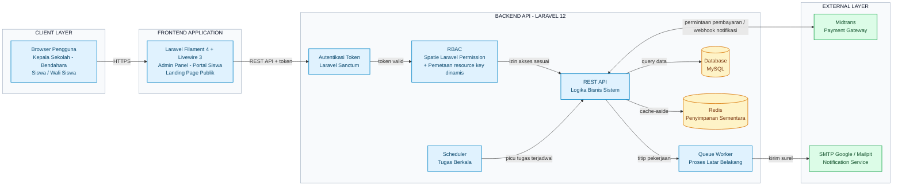

# Gambar 3.2 — Arsitektur Sistem (Mermaid Architecture, versi implementasi nyata)

> Sumber kebenaran: `backend/routes/api.php`, `backend/app/Services/Midtrans/`, `backend/app/Http/Middleware/EndpointPermission.php`, `frontend-v2/app/Helpers/PermissionHelper.php`, `docker-compose.yml`, `backend/database/seeders/RbacSeeder.php`, `document/tracking-perubahan.md` (§1.1 Midtrans, §1.3 RBAC resource_key, §1.4 Notifikasi, §8.3(d) Redis/endpoint gabungan dashboard, §8.5 Dockerisasi), `document/komparasi-proposal-vs-implementasi.md` (baris "Performa aplikasi", "Dockerisasi environment", "Sanctum authentication", "RBAC — cakupan & mekanisme").
>
> **Menggantikan** diagram arsitektur lama versi proposal (Client/Application/External sederhana, tanpa Sanctum/Redis/RBAC dinamis/Docker/Queue — lihat catatan TODO #5 di `document/plan-laporan-ta.md`). **Docx laporan TIDAK disentuh** — file ini murni referensi mermaid.
>
> **Kenapa berubah dari diagram proposal:** proposal cuma gambar RBAC "Spatie" polos dan auth generik. Implementasi nyata pakai Sanctum (bukan token custom), tambah lapisan `resource_key` dinamis (2 tabel terpisah, lihat `document/diagram-3.5-proses-bisnis.md` Gambar 3.5.5), Redis cache-aside buat dashboard, dan seluruh stack sudah di-Dockerisasi (9 service) — semua ini **tambahan di luar rencana proposal** menurut tabel komparasi, jadi diagram lama gak lagi merepresentasikan sistem yang sebenarnya jalan.

**Catatan bentuk diagram:** dipakai `flowchart LR` (bukan `architecture-beta`) karena versi `architecture-beta` menghasilkan label yang saling tumpang tindih begitu jumlah komponen di grup Backend bertambah jadi tujuh. Warna kotak: biru = komponen proses aplikasi, kuning = penyimpanan data, hijau = layanan pihak ketiga. Urutan komponen di grup Backend sengaja disusun mengikuti urutan pemeriksaan tiap permintaan masuk: Sanctum -> RBAC -> REST API, biar diagram terbaca sejalan dengan penjelasan komponen di sub-bab 3.2 laporan.

Render: `docker run --rm -v "$(pwd -W):/data" minlag/mermaid-cli:latest -i /data/sistem.mmd -o /data/export/sistem.png -b white -s 3` (dijalankan dari `document/aset-laporan/mermaid-architecture/`).

---

## Penjelasan tiap komponen (vs proposal)

| Komponen | Proposal | Implementasi nyata | Status |
|---|---|---|---|
| **Client** | Browser generik | Browser, dipakai 3 permukaan: Admin Panel (Kepala Sekolah/Pimpinan, Bendahara), Portal Siswa (Siswa/Wali), dan Landing publik (info lembaga + peta interaktif, tanpa login) | Landing publik = tambahan di luar rencana |
| **Frontend** | "Laravel Filament pada domain terpisah" | `frontend-v2/`: Filament 4 + Livewire 3, headless — tidak simpan data sendiri, semua panggil `backend` lewat `ApiService`, token Sanctum disimpan di session | Sesuai rencana (pola dua-app) |
| **Backend / REST API** | Laravel API, auth tidak dirinci | `backend/`: Laravel 12, headless API, autentikasi **Sanctum** (`personal_access_tokens`) — proposal tidak merinci mekanisme auth secara eksplisit, implementasi pakai cara standar Laravel | Sesuai rencana (implisit) |
| **RBAC** | Spatie Laravel Permission standar (role→permission→user) | Spatie tetap dipakai sebagai fondasi, TAPI ditambah lapisan **`resource_key`** dinamis (2 tabel terpisah: `permission_endpoints` utk endpoint API, `page_permissions` utk visibilitas UI) yang di-bind via halaman admin `RbacDashboard`, bukan hardcode. Detail alur: `document/diagram-3.5-proses-bisnis.md` Gambar 3.5.5 | **Berubah/menyimpang** — jauh melampaui rancangan awal |
| **Database** | MySQL, satu skema | MySQL, satu database bersama, migrasi seluruhnya dimiliki `backend` (frontend tidak punya migrasi sendiri) | Sesuai rencana |
| **Cache (Redis)** | Tidak disebut | Redis cache-aside (`ApiService::cachedGet()`), dipakai al. buat endpoint gabungan `GET /dashboard/overview` (9 endpoint jadi 1) + cache resource RBAC (`/rbac/user-resources`, TTL ~60 detik) — waktu render dashboard turun ~8 detik jadi ~700ms | **Tambahan di luar rencana** — perbaikan performa murni |
| **Queue Worker** | Tidak disebut | `backend-queue` (`queue:listen --queue=notifications,default`) — proses async utk notifikasi email approval workflow & job export data, supaya request HTTP tidak nunggu proses lambat | Tambahan infrastruktur, mendukung fitur notifikasi yang sesuai rencana |
| **Scheduler** | Tidak disebut | `backend-scheduler` (cron-loop) — jalanin `notifications:send-reminders` (pengingat SPP terjadwal) & `midtrans:prune-logs` (housekeeping) | Tambahan infrastruktur |
| **Midtrans** | "Integrasi payment gateway Midtrans" | Modul lengkap `backend/app/Services/Midtrans/`, webhook publik `POST /api/midtrans/notification` (sengaja tanpa auth, diverifikasi via signature — lihat Gambar 3.5.1), plus dukungan **batch payment** yang tidak disebut proposal | Inti sesuai rencana; batch payment tambahan |
| **Notifikasi Email** | "Google SMTP" | SMTP asli di production; di lingkungan dev diganti **Mailpit** (mail catcher lokal, container terpisah) supaya tidak kirim email sungguhan saat testing | Sesuai rencana (mekanisme), beda hanya di layer dev-environment |
| **Deployment / Dev Environment** | Tidak dibahas | Seluruh stack di-**Dockerisasi**: 9 service (`mysql`, `redis`, `mailpit`, `backend`, `backend-queue`, `backend-scheduler`, `frontend`, `frontend-vite`, `ngrok`) via `docker-compose.yml`; RBAC di-sync otomatis saat boot container lewat `RbacSeeder`; `ngrok` dipakai buat tunnel HTTPS publik supaya webhook Midtrans & testing mobile bisa diakses dari luar jaringan lokal saat dev | **Tambahan di luar rencana** — murni infrastruktur, tidak mengubah fitur yang terlihat pengguna |

**Catatan:** diagram di atas menyajikan level arsitektur logis (komponen & jalur komunikasi), bukan topologi container Docker secara harfiah — tiap "service" mermaid mewakili proses/peran aplikasi, sebagian di antaranya (`api`, `queue`, `scheduler`) sebenarnya berjalan sebagai container Docker terpisah di lingkungan dev (lihat tabel di atas baris "Deployment / Dev Environment").
