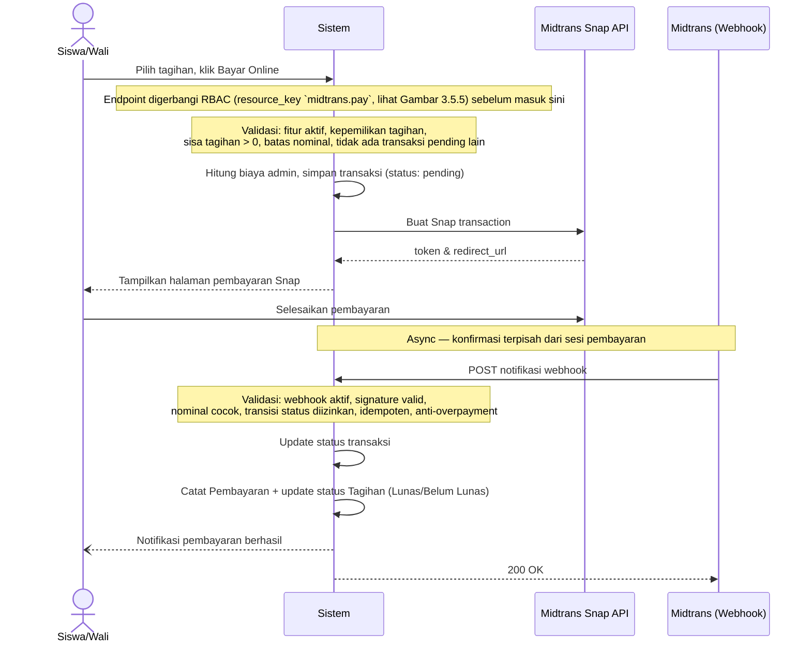
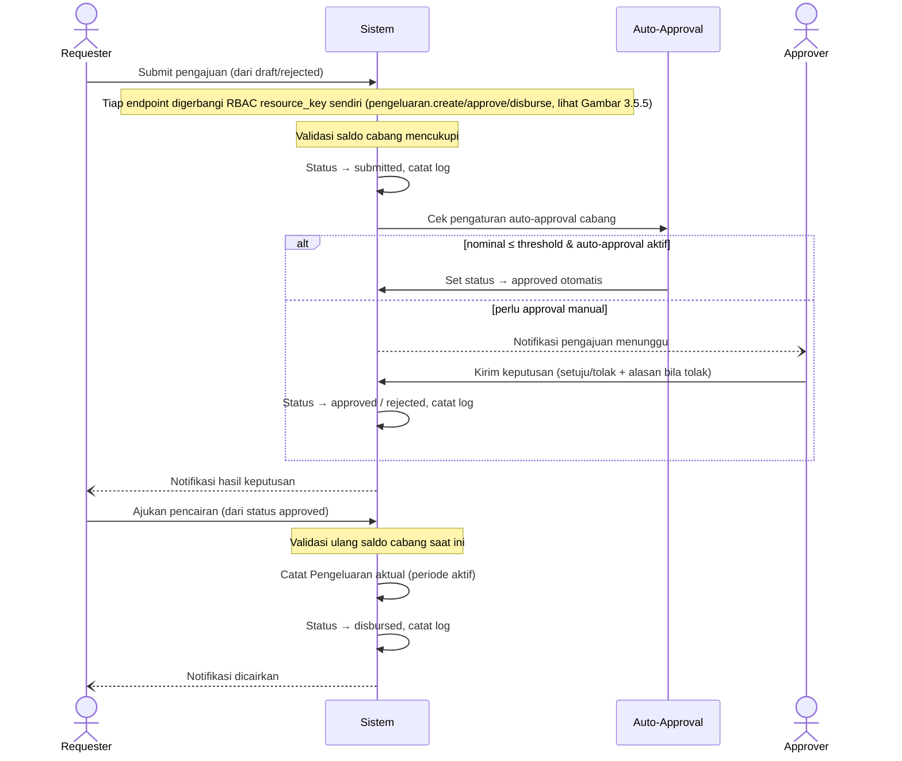
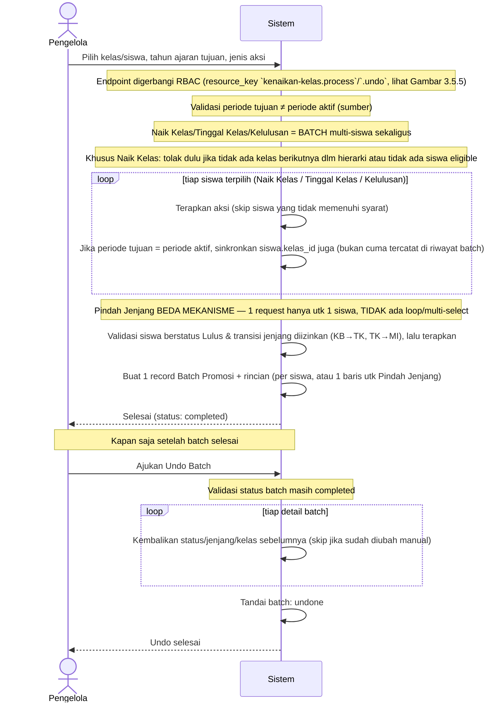
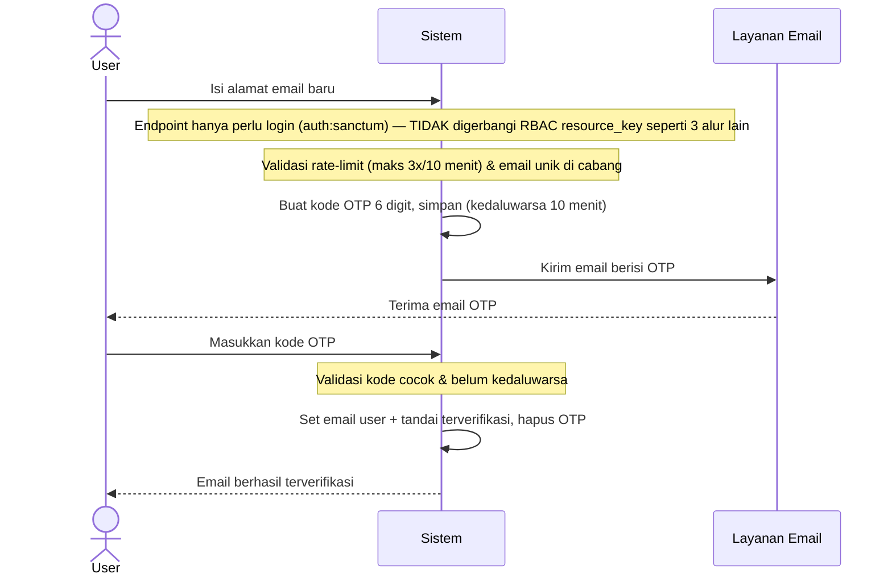
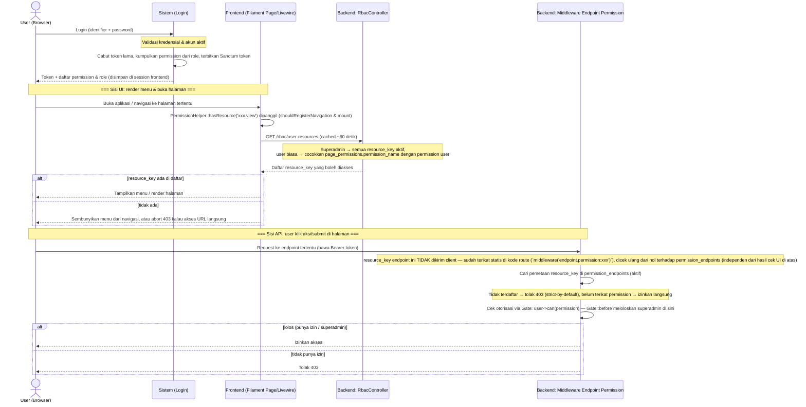

# Gambar 3.5 — Perancangan Algoritma / Proses Bisnis (Mermaid, Sequence Diagram)

> Sumber kebenaran: kode aktual di `backend/app/Services/Midtrans/`, `backend/app/Services/WorkflowService.php`, `backend/app/Services/AutoApprovalService.php`, `backend/app/Services/KenaikanKelasService.php`, `backend/app/Http/Controllers/UserController.php` (OTP), `backend/app/Http/Controllers/AuthController.php` (login), `backend/app/Http/Controllers/RbacController.php` (`userResources`/`userGroups`), `backend/app/Http/Middleware/EndpointPermission.php`, `frontend-v2/app/Helpers/PermissionHelper.php`, `backend/routes/api.php`. Ikut diperiksa silang terhadap `document/tracking-perubahan.md` dan `document/komparasi-proposal-vs-implementasi.md`. Menggantikan Gambar 3.26-3.30 (versi Pillow box+panah) di `document/plan-laporan-ta.md` §Task 3.5.
>
> **Docx laporan TIDAK disentuh** — file ini murni referensi mermaid untuk sub-bab 3.5. Validasi/guard ditulis singkat sebagai `Note` (bukan bercabang `alt/else`) supaya diagram fokus ke alur utama; daftar penolakan lengkap ada di teks penjelasan tiap diagram.

---

## Gambar 3.5.1 — Alur Pembayaran Daring (Midtrans)

**Penjelasan singkat:** Dua fase — inisiasi Snap (ditolak kalau fitur nonaktif, bukan pemilik tagihan, sudah lunas, nominal di luar batas, atau masih ada transaksi pending; kalau Snap API gagal transaksi ditandai *Failure*) dan konfirmasi webhook (ditolak kalau webhook nonaktif, signature invalid, nominal tidak cocok, transisi status tidak valid, sudah pernah dicatat/idempoten, atau nominal melebihi sisa tagihan/*overpayment*). Pembayaran baru tercatat setelah semua guard lolos.

---

## Gambar 3.5.2 — Alur Persetujuan Pengeluaran (Approval Workflow)

**Penjelasan singkat:** Submit dan pencairan sama-sama ditolak kalau saldo cabang tidak mencukupi. Request yang ditolak approver (wajib isi alasan) bisa direvisi dan disubmit ulang oleh requester. Tiap transisi status hanya sah dari status sebelumnya yang tepat dan selalu tercatat di log approval.

---

## Gambar 3.5.3 — Alur Kenaikan Kelas / Kelulusan (Batch, dengan Undo)

**Penjelasan singkat:** Naik Kelas, Tinggal Kelas, dan Kelulusan menerima daftar siswa (`array $siswaIds`) dan diproses sebagai satu batch — Naik Kelas ditolak di muka kalau tidak ada kelas berikutnya dalam hierarki atau tidak ada siswa eligible sama sekali, lalu per-siswa di-skip kalau sudah punya penempatan di periode tujuan (Naik Kelas), tidak punya kelas di periode sumber (Tinggal Kelas), atau berstatus non-aktif/bukan kelas tertinggi (Kelulusan). **Pindah Jenjang berbeda mekanisme** — service-nya (`processCrossLevelTransfer`) hanya menerima satu `siswa_id` per pemanggilan, bukan array, jadi tidak ada loop multi-siswa; ditolak kalau siswa bukan berstatus Lulus atau transisi jenjangnya tidak diizinkan. Semua 4 aksi tetap dibungkus record Batch Promosi yang sama (agar bisa di-*undo* kolektif lewat mekanisme yang sama); undo melewati siswa yang datanya sudah diubah manual setelah batch berjalan. Kolom `siswa.kelas_id` ikut disinkronkan hanya kalau periode tujuan = periode tahun ajaran aktif — kalau tidak, perubahan cuma tercatat di riwayat (`siswa_kelas`/`batch_promosi_details`) tanpa mengubah kelas siswa yang sedang berjalan (`kelas_id` yang tidak ikut ter-update pernah jadi bug, sudah diperbaiki di commit `55352e9`).

---

## Gambar 3.5.4 — Alur Verifikasi Email via OTP

**Penjelasan singkat:** Ditolak kalau melebihi rate-limit, email sudah dipakai user lain di cabang, atau kode OTP salah/kedaluwarsa. OTP langsung dihapus setelah verifikasi berhasil agar tidak bisa dipakai ulang. Pola sama dipakai untuk verifikasi email orang tua/wali.

---

## Gambar 3.5.5 — Alur Pengaturan Hak Akses (RBAC Dinamis)

Sistem punya **dua jalur proteksi resource_key yang berdiri sendiri-sendiri**, masing-masing dengan tabel pemetaannya sendiri — bukan satu mekanisme tunggal:

| | Sisi UI (Filament/Livewire) | Sisi Endpoint API |
|---|---|---|
| Tabel pemetaan | `page_permissions` (kolom `permission_name` string) | `permission_endpoints` (kolom `permission_id` FK) |
| Titik cek | `PermissionHelper::hasResource()` dipanggil dari `shouldRegisterNavigation()` (sembunyikan menu) & `mount()` (abort 403 akses langsung via URL) tiap Filament Page | Middleware `endpoint.permission:{resource_key}` di route API |
| Sumber data | Hasil `GET /rbac/user-resources` (`RbacController::userResources()`), di-cache ~60 detik (request-static + Redis via `ApiService::cachedGet()`) | Query langsung `PermissionEndpoint` tiap request, tidak di-cache |
| Superadmin bypass | Eksplisit: `hasRole('superadmin')` → semua `resource_key` aktif dikembalikan | Implisit: lewat `Gate::before` saat `user->can()` dipanggil |

**Penjelasan singkat:** Alur dimulai dari login (kredensial diverifikasi, token lama dicabut, Sanctum token baru diterbitkan bawa daftar permission). Setelahnya proteksi RBAC jalan di **dua tempat independen**: (1) **UI** — tiap Filament Page manggil `PermissionHelper::hasResource()` yang ambil daftar `resource_key` yang boleh diakses dari endpoint `/rbac/user-resources` (di-cache, dicocokkan lewat tabel `page_permissions`), dipakai buat sembunyiin menu dan nge-block akses URL langsung; (2) **API** — tiap endpoint data (create/update/delete/aksi) digerbangi ulang oleh middleware `endpoint.permission` yang cek independen ke tabel `permission_endpoints` + Gate `can()`. Dua tabel ini **terpisah** dan bisa saja tidak sinkron sesaat (mis. UI cache 60 detik belum refresh) — tapi karena API selalu cek ulang dari nol tiap request, keamanan data tetap terjaga meski UI sempat menampilkan menu yang telat di-hide. Superadmin bypass eksplisit di sisi UI (query langsung semua resource aktif) dan implisit di sisi API (`Gate::before`).
