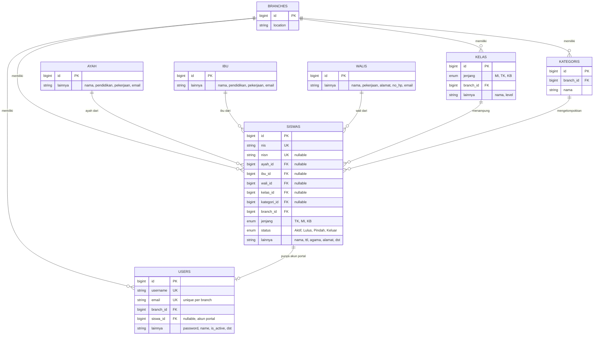
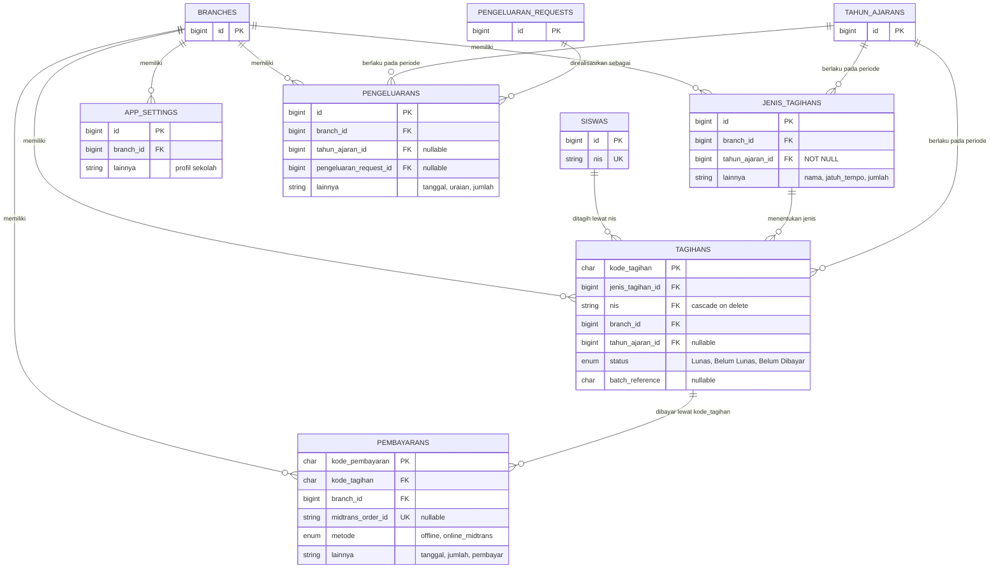
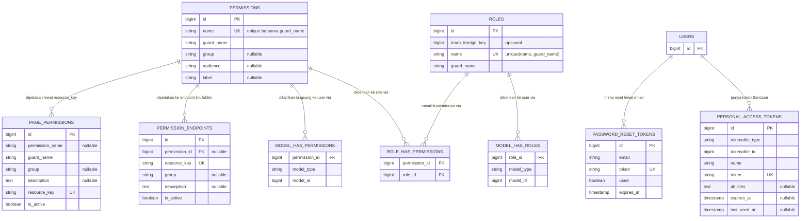
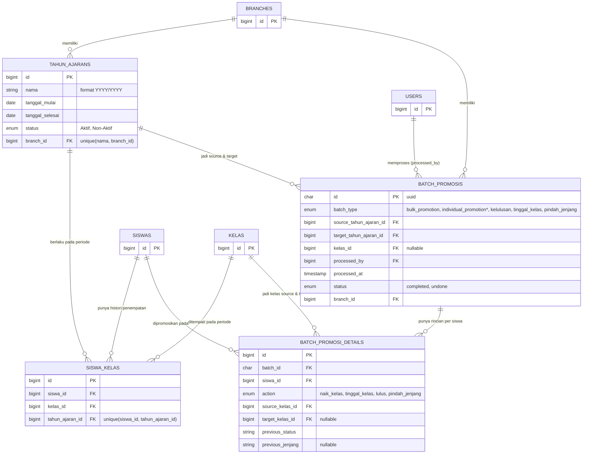
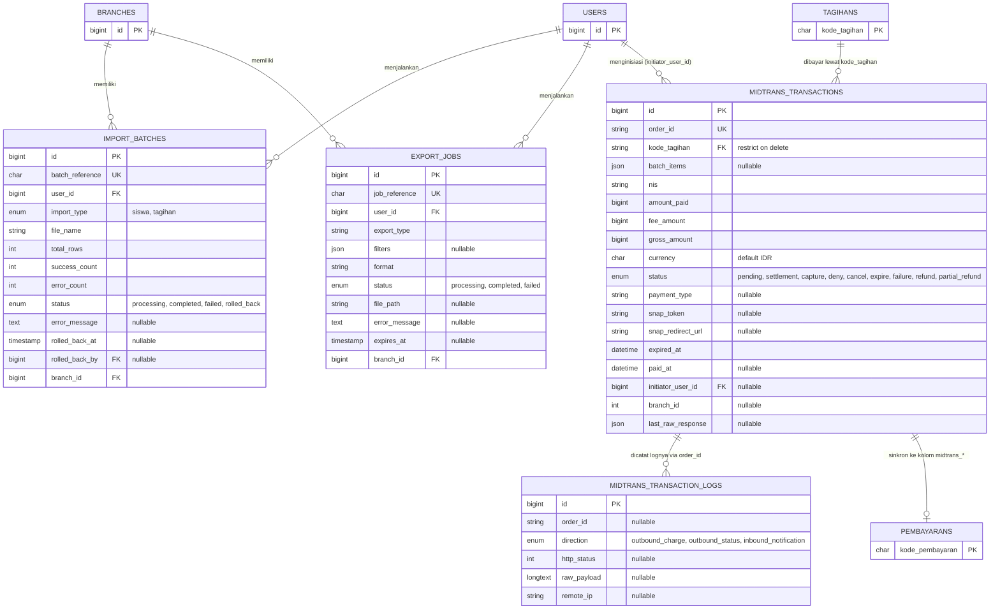

# ERD Lengkap dengan Atribut (untuk 3.3 Perancangan Basis Data)

Beda dengan `document/erd-modul-diagram.md` (hanya relasi entitas, tanpa kolom), dokumen ini adalah **ERD klasik lengkap**: tiap kotak entitas berisi daftar atribut (PK/FK/UK) sesuai notasi `erDiagram` Mermaid, dan tiap garis relasi diberi label makna hubungan. Sumber kolom: `document/erd-modul-diagram.md` bagian "Struktur Tabel — 38 Tabel Aplikasi" (diverifikasi dari migrasi real), dikurangi `permission_resources` (transisi) dan `filament_notifications` (drop commit `26e9339`).

Render tiap blok mermaid di viewer yang mendukung (VS Code + extension Mermaid, GitHub, Obsidian) lalu zoom/screenshot per modul untuk dokumen laporan.

---

## 1a. Modul Inti — Data Master (Branch, User, Orang Tua, Siswa)

> Atribut dipangkas ke kolom kunci (PK/FK/UK) — kolom generik non-relasional diringkas jadi baris `...`. Kolom lengkap tetap ada di `document/erd-modul-diagram.md` §Struktur Tabel.



---

## 1b. Modul Inti — Transaksi Keuangan (Tagihan, Pembayaran, Pengeluaran)



---

## 2. Modul RBAC Dinamis & Auth



---

## 3. Modul Tahun Ajaran & Kenaikan Kelas



---

## 4. Modul Approval Pengeluaran & Notifikasi

> Catatan: `email_opt_outs` dan `notification_sent_records` tidak punya FK (lookup by string), tetap ditampilkan sebagai entitas mandiri dengan atribut lengkap.

```mermaid

erDiagram
    PENGELUARAN_REQUESTS {
        bigint id PK
        text uraian
        decimal jumlah
        date tanggal_kebutuhan
        string kategori_pengeluaran "nullable"
        string lampiran "nullable"
        enum status "draft, submitted, approved, rejected, disbursed"
        bigint requester_id FK
        bigint branch_id FK
    }
    APPROVAL_LOGS {
        bigint id PK
        bigint pengeluaran_request_id FK
        string previous_status
        string new_status
        bigint user_id FK
        text note "nullable"
    }
    BRANCH_APPROVAL_SETTINGS {
        bigint id PK
        bigint branch_id FK "1:1"
        boolean auto_approval_enabled
        decimal auto_approval_threshold
    }
    NOTIFICATIONS {
        bigint id PK
        bigint user_id FK
        string type
        string title
        text message
        json data "nullable"
        boolean is_read
    }
    NOTIFICATION_SETTINGS {
        bigint id PK
        bigint branch_id FK UK
        boolean tagihan_baru_enabled
        boolean reminder_enabled
        boolean kwitansi_enabled
        boolean overdue_enabled
        json reminder_days_before "nullable"
        int overdue_interval_days
    }
    NOTIFICATION_LOGS {
        bigint id PK
        bigint branch_id FK
        string recipient_email
        enum notification_type "tagihan_baru, reminder, kwitansi, overdue, workflow"
        string tagihan_kode "nullable"
        bigint pengeluaran_request_id FK "nullable"
        string workflow_event "nullable"
        enum status "sent, failed, skipped"
        string reason "nullable"
        text error_message "nullable"
        timestamp sent_at "nullable"
    }
    EMAIL_OPT_OUTS {
        bigint id PK
        string email
        enum notification_type "tagihan_baru, reminder, kwitansi, overdue, workflow, all"
        string token UK
    }
    NOTIFICATION_SENT_RECORDS {
        bigint id PK
        string tagihan_kode
        enum notification_type "tagihan_baru, reminder, kwitansi, overdue"
        date sent_date
    }
    USERS { bigint id PK }
    BRANCHES { bigint id PK }

    USERS ||--o{ PENGELUARAN_REQUESTS : "mengajukan (requester_id)"
    BRANCHES ||--o{ PENGELUARAN_REQUESTS : "memiliki"
    PENGELUARAN_REQUESTS ||--o{ APPROVAL_LOGS : "dicatat riwayat statusnya di"
    USERS ||--o{ APPROVAL_LOGS : "melakukan aksi approval"
    BRANCHES ||--o| BRANCH_APPROVAL_SETTINGS : "punya pengaturan auto-approval"
    USERS ||--o{ NOTIFICATIONS : "menerima"
    BRANCHES ||--o| NOTIFICATION_SETTINGS : "punya pengaturan notifikasi"
    BRANCHES ||--o{ NOTIFICATION_LOGS : "memiliki"
    PENGELUARAN_REQUESTS ||--o{ NOTIFICATION_LOGS : "memicu notifikasi (nullable)"
```

---

## 5. Modul Import/Export & Midtrans



---

**File ini:** `document/erd-lengkap-atribut.md` — pelengkap `document/erd-modul-diagram.md` (yang hanya relasi entitas tanpa atribut). Cara pakai untuk BAB III laporan: render tiap blok mermaid, screenshot per modul, tempel sebagai Gambar 3.x "ERD Modul [nama]".
