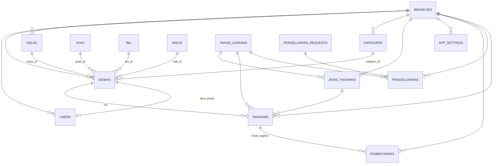
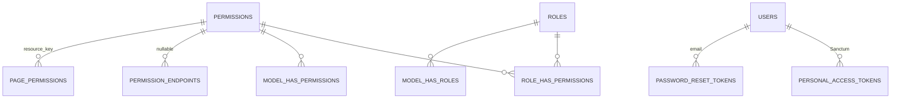
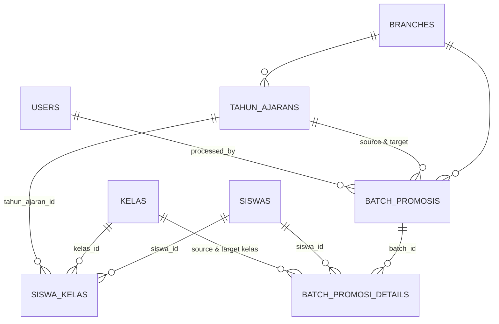
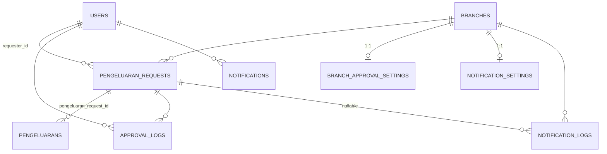
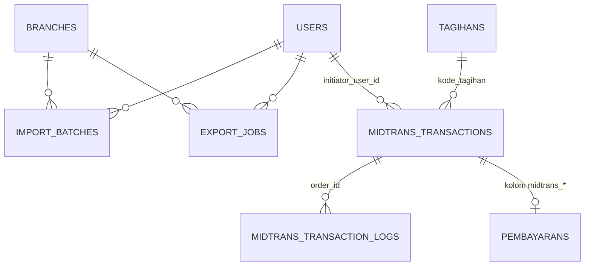

# ERD Modul — Relasi Entitas (untuk 3.3 Perancangan Basis Data)

Sumber: `document/tracking-perubahan.md` §9.1/9.2 (diverifikasi dari migrasi real), dikurangi `permission_resources` (transisi, sudah dilebur) dan `filament_notifications` (di-drop commit `26e9339`). Hanya relasi entitas (PK/FK), tanpa detail kolom — detail kolom lengkap ada di sub-bab 3.3 dokumen (Tabel 3.3-3.40).

Render mermaid ini di viewer markdown apa pun yang mendukung mermaid (VS Code + extension Mermaid, GitHub, Obsidian, dll) untuk di-zoom lalu screenshot per modul.

---

## 1. Modul Inti (Baseline)

---

## 2. Modul RBAC Dinamis & Auth

---

## 3. Modul Tahun Ajaran & Kenaikan Kelas

---

## 4. Modul Approval Pengeluaran & Notifikasi

> Catatan: `email_opt_outs` dan `notification_sent_records` tidak muncul di diagram ini — keduanya tidak punya FK (lookup by string `email`/`tagihan_kode`), bukan relasi entitas.

---

## 5. Modul Import/Export & Midtrans

---

# Struktur Tabel — 38 Tabel Aplikasi

Kolom lengkap per tabel, dikelompokkan per modul yang sama dengan ERD di atas. Sumber: `document/tracking-perubahan.md` §9.3/9.4, dikurangi `permission_resources` (transisi) dan `filament_notifications` (di-drop commit `26e9339`).

## 1. Modul Inti (Baseline)

### `branches`

| Kolom | Tipe | Keterangan |
|---|---|---|
| id | bigint PK | auto-increment |
| location | string |  |
| created_at, updated_at | timestamp |  |

### `users`

| Kolom | Tipe | Keterangan |
|---|---|---|
| id | bigint PK |  |
| username | string(100) | unique |
| password | string(100) |  |
| name | string | nullable |
| email | string | unique bersama branch_id |
| email_verified_at | timestamp | nullable |
| branch_id | bigint FK → branches.id |  |
| siswa_id | bigint FK → siswas.id | nullable, akun portal siswa |
| is_active | boolean | default true |
| must_change_password | boolean | default false |
| created_at, updated_at | timestamp |  |

### `ayah`

| Kolom | Tipe | Keterangan |
|---|---|---|
| id | bigint PK |  |
| nama | string(100) | nullable |
| pendidikan_terakhir | string(50) | nullable |
| pekerjaan | string(100) | nullable |
| email | string(255) | nullable |
| email_verified_at | timestamp | nullable |
| created_at, updated_at | timestamp |  |

### `ibu`

| Kolom | Tipe | Keterangan |
|---|---|---|
| id | bigint PK |  |
| nama | string(100) | nullable |
| pendidikan_terakhir | string(50) | nullable |
| pekerjaan | string(100) | nullable |
| email | string(255) | nullable |
| email_verified_at | timestamp | nullable |
| created_at, updated_at | timestamp |  |

### `walis`

| Kolom | Tipe | Keterangan |
|---|---|---|
| id | bigint PK |  |
| nama | string(100) |  |
| pekerjaan | string(100) | nullable |
| alamat | text |  |
| no_hp | string(100) |  |
| keterangan | text | nullable |
| email | string(255) | nullable |
| email_verified_at | timestamp | nullable |
| created_at, updated_at | timestamp |  |

### `kategoris`

| Kolom | Tipe | Keterangan |
|---|---|---|
| id | bigint PK |  |
| nama | string(100) |  |
| branch_id | bigint FK → branches.id |  |
| created_at, updated_at | timestamp |  |

### `kelas`

| Kolom | Tipe | Keterangan |
|---|---|---|
| id | bigint PK |  |
| jenjang | enum(MI,TK,KB) |  |
| nama | string(100) |  |
| branch_id | bigint FK → branches.id |  |
| level | unsignedInteger | nullable |
| created_at, updated_at | timestamp | unique(jenjang, branch_id, level) |

### `siswas`

| Kolom | Tipe | Keterangan |
|---|---|---|
| id | bigint PK |  |
| nis | string(20) | unique |
| nisn | string(20) | unique, nullable |
| nama | string(100) |  |
| jenis_kelamin | enum(Laki-laki,Perempuan) |  |
| tempat_lahir, tanggal_lahir | string / date |  |
| agama, alamat | string / text |  |
| ayah_id, ibu_id, wali_id | bigint FK | nullable |
| jenjang | enum(TK,MI,KB) |  |
| kelas_id | bigint FK → kelas.id | nullable |
| kategori_id | bigint FK → kategoris.id | nullable |
| asal_sekolah, kelas_diterima, tahun_diterima | string / string / year | nullable |
| status | enum(Aktif,Lulus,Pindah,Keluar) | default Aktif |
| keterangan | text | nullable |
| branch_id | bigint FK → branches.id |  |
| batch_reference | char(36) | nullable, index — jejak asal import massal |
| created_at, updated_at | timestamp |  |

### `jenis_tagihans`

| Kolom | Tipe | Keterangan |
|---|---|---|
| id | bigint PK |  |
| nama | string(100) |  |
| jatuh_tempo | date |  |
| jumlah | decimal(12,2) |  |
| branch_id | bigint FK → branches.id |  |
| tahun_ajaran_id | bigint FK → tahun_ajarans.id | NOT NULL, onDelete restrict |
| created_at, updated_at | timestamp |  |

### `tagihans`

| Kolom | Tipe | Keterangan |
|---|---|---|
| kode_tagihan | char(30) PK |  |
| jenis_tagihan_id | bigint FK → jenis_tagihans.id |  |
| nis | string(20) FK → siswas.nis | cascadeOnDelete (tidak lagi unique) |
| tmp | decimal(12,2) | default 0 |
| status | enum(Lunas,Belum Lunas,Belum Dibayar) | default Belum Dibayar |
| branch_id | bigint FK → branches.id |  |
| batch_reference | char(36) | nullable, index |
| tahun_ajaran_id | bigint FK → tahun_ajarans.id | nullable, onDelete set null |
| created_at, updated_at | timestamp |  |

### `pembayarans`

| Kolom | Tipe | Keterangan |
|---|---|---|
| kode_pembayaran | char(30) PK |  |
| kode_tagihan | char(30) FK → tagihans.kode_tagihan | index |
| tanggal | date | default now(), index |
| metode | enum(offline, online_midtrans) | default offline, index |
| jumlah | decimal(12,2) | default 0 |
| pembayar | string(100) |  |
| branch_id | bigint FK → branches.id |  |
| midtrans_order_id | string(64) | nullable, unique |
| created_at, updated_at | timestamp |  |

### `app_settings`

| Kolom | Tipe | Keterangan |
|---|---|---|
| id | bigint PK |  |
| nama_sekolah, lokasi, alamat | string / string / text |  |
| email, telepon | string / string(20) |  |
| kepala_sekolah, bendahara | string(100) |  |
| kode_pos, logo | string(15) / string(255) |  |
| branch_id | bigint FK → branches.id |  |
| created_at, updated_at | timestamp |  |

### `pengeluarans`

| Kolom | Tipe | Keterangan |
|---|---|---|
| id | bigint PK |  |
| tanggal | date | default now(), index |
| uraian | text |  |
| jumlah | decimal(12,2) |  |
| branch_id | bigint FK → branches.id |  |
| tahun_ajaran_id | bigint FK → tahun_ajarans.id | nullable, nullOnDelete |
| pengeluaran_request_id | bigint FK → pengeluaran_requests.id | nullable, nullOnDelete |
| created_at, updated_at | timestamp |  |

---

## 2. Modul RBAC Dinamis & Autentikasi

### `permissions`

| Kolom | Tipe | Keterangan |
|---|---|---|
| id | bigint PK |  |
| name | string | unique bersama guard_name |
| guard_name | string |  |
| group | string | nullable — grouping tampilan |
| audience | string | nullable — target role/audience |
| label | string | nullable — label tampilan |
| created_at, updated_at | timestamp |  |

### `roles`

| Kolom | Tipe | Keterangan |
|---|---|---|
| id | bigint PK |  |
| team_foreign_key | bigint | opsional, mode teams |
| name, guard_name | string | unique(name, guard_name) |
| created_at, updated_at | timestamp |  |

### `model_has_permissions`

| Kolom | Tipe | Keterangan |
|---|---|---|
| permission_id | bigint FK → permissions.id | PK komposit |
| model_type, model_id | string / bigint (morph) | PK komposit |

### `model_has_roles`

| Kolom | Tipe | Keterangan |
|---|---|---|
| role_id | bigint FK → roles.id | PK komposit |
| model_type, model_id | string / bigint (morph) | PK komposit |

### `role_has_permissions`

| Kolom | Tipe | Keterangan |
|---|---|---|
| permission_id | bigint FK → permissions.id | PK komposit |
| role_id | bigint FK → roles.id | PK komposit |

### `permission_endpoints`

| Kolom | Tipe | Keterangan |
|---|---|---|
| id | bigint PK |  |
| permission_id | bigint FK → permissions.id | nullable, nullOnDelete |
| resource_key | string(255) | unique, NOT NULL |
| group | string(100) | nullable |
| description | text | nullable |
| is_active | boolean | default true |
| created_at, updated_at | timestamp |  |

### `page_permissions`

| Kolom | Tipe | Keterangan |
|---|---|---|
| id | bigint PK |  |
| permission_name | string(255) | nullable |
| guard_name | string | default web |
| group | string(100) | nullable |
| description | text | nullable |
| resource_key | string(255) | unique, NOT NULL |
| is_active | boolean | default true |
| created_at, updated_at | timestamp |  |

### `personal_access_tokens`

| Kolom | Tipe | Keterangan |
|---|---|---|
| id | bigint PK |  |
| tokenable_type, tokenable_id | string / bigint (morph) |  |
| name | string |  |
| token | string(64) | unique |
| abilities | text | nullable |
| expires_at, last_used_at | timestamp | nullable |
| created_at, updated_at | timestamp |  |

### `password_reset_tokens`

| Kolom | Tipe | Keterangan |
|---|---|---|
| id | bigint PK |  |
| email | string | index |
| token | string(64) | unique |
| used | boolean | default false |
| created_at | timestamp | useCurrent |
| expires_at | timestamp |  |

---

## 3. Modul Tahun Ajaran & Kenaikan Kelas

### `tahun_ajarans`

| Kolom | Tipe | Keterangan |
|---|---|---|
| id | bigint PK |  |
| nama | string(9) | format YYYY/YYYY |
| tanggal_mulai, tanggal_selesai | date |  |
| status | enum(Aktif, Non-Aktif) | default Non-Aktif |
| branch_id | bigint FK → branches.id | unique(nama, branch_id) |
| created_at, updated_at | timestamp | index(branch_id, status) |

### `siswa_kelas`

| Kolom | Tipe | Keterangan |
|---|---|---|
| id | bigint PK |  |
| siswa_id | bigint FK → siswas.id |  |
| kelas_id | bigint FK → kelas.id |  |
| tahun_ajaran_id | bigint FK → tahun_ajarans.id | unique(siswa_id, tahun_ajaran_id) |
| created_at, updated_at | timestamp | histori kelas per periode |

### `batch_promosis`

| Kolom | Tipe | Keterangan |
|---|---|---|
| id | char(36) PK | uuid |
| batch_type | enum(bulk_promotion, individual_promotion*, kelulusan, tinggal_kelas, pindah_jenjang) | *individual_promotion tersisa untuk histori lama, alurnya sudah tidak dipakai |
| source_tahun_ajaran_id, target_tahun_ajaran_id | bigint FK → tahun_ajarans.id |  |
| kelas_id | bigint FK → kelas.id | nullable, set null |
| processed_by | bigint FK → users.id |  |
| processed_at | timestamp |  |
| status | enum(completed, undone) | default completed |
| branch_id | bigint FK → branches.id |  |
| created_at, updated_at | timestamp |  |

### `batch_promosi_details`

| Kolom | Tipe | Keterangan |
|---|---|---|
| id | bigint PK |  |
| batch_id | char(36) FK → batch_promosis.id |  |
| siswa_id | bigint FK → siswas.id |  |
| action | enum(naik_kelas, tinggal_kelas, lulus, pindah_jenjang) |  |
| source_kelas_id, target_kelas_id | bigint FK → kelas.id | target nullable |
| previous_status | string(20) |  |
| previous_jenjang | string(5) | nullable |
| created_at, updated_at | timestamp |  |

---

## 4. Modul Approval Pengeluaran & Notifikasi

### `pengeluaran_requests`

| Kolom | Tipe | Keterangan |
|---|---|---|
| id | bigint PK |  |
| uraian | text |  |
| jumlah | decimal(13,2) |  |
| tanggal_kebutuhan | date |  |
| kategori_pengeluaran, lampiran | string / string | nullable |
| status | enum(draft,submitted,approved,rejected,disbursed) | default draft |
| requester_id | bigint FK → users.id |  |
| branch_id | bigint FK → branches.id |  |
| created_at, updated_at | timestamp |  |

### `approval_logs`

| Kolom | Tipe | Keterangan |
|---|---|---|
| id | bigint PK |  |
| pengeluaran_request_id | bigint FK → pengeluaran_requests.id | cascade |
| previous_status, new_status | string |  |
| user_id | bigint FK → users.id |  |
| note | text | nullable |
| created_at | timestamp | useCurrent |

### `branch_approval_settings`

| Kolom | Tipe | Keterangan |
|---|---|---|
| id | bigint PK |  |
| branch_id | bigint FK → branches.id | unique — 1:1 |
| auto_approval_enabled | boolean | default false |
| auto_approval_threshold | decimal(13,2) | default 0 |
| created_at, updated_at | timestamp |  |

### `notifications`

| Kolom | Tipe | Keterangan |
|---|---|---|
| id | bigint PK |  |
| user_id | bigint FK → users.id |  |
| type, title | string |  |
| message | text |  |
| data | json | nullable |
| is_read | boolean | default false |
| created_at | timestamp | useCurrent |

### `notification_settings`

| Kolom | Tipe | Keterangan |
|---|---|---|
| id | bigint PK |  |
| branch_id | bigint FK → branches.id | unique |
| tagihan_baru_enabled, reminder_enabled, kwitansi_enabled, overdue_enabled | boolean | default true |
| reminder_days_before | json | nullable |
| overdue_interval_days | int | default 7 |
| created_at, updated_at | timestamp |  |

### `notification_logs`

| Kolom | Tipe | Keterangan |
|---|---|---|
| id | bigint PK |  |
| branch_id | bigint FK → branches.id |  |
| recipient_email | string |  |
| notification_type | enum(tagihan_baru,reminder,kwitansi,overdue,workflow) |  |
| tagihan_kode | string | nullable |
| pengeluaran_request_id | bigint FK → pengeluaran_requests.id | nullable, nullOnDelete |
| workflow_event | string | nullable |
| status | enum(sent,failed,skipped) |  |
| reason, error_message | string / text | nullable |
| sent_at | timestamp | nullable |
| created_at, updated_at | timestamp |  |

### `email_opt_outs`

| Kolom | Tipe | Keterangan |
|---|---|---|
| id | bigint PK |  |
| email | string |  |
| notification_type | enum(tagihan_baru,reminder,kwitansi,overdue,workflow,all) | unique(email, notification_type) |
| token | string | unique |
| created_at, updated_at | timestamp |  |

### `notification_sent_records`

| Kolom | Tipe | Keterangan |
|---|---|---|
| id | bigint PK |  |
| tagihan_kode | string |  |
| notification_type | enum(tagihan_baru,reminder,kwitansi,overdue) | unique(tagihan_kode, notification_type, sent_date) |
| sent_date | date |  |
| created_at, updated_at | timestamp |  |

---

## 5. Modul Import/Export & Payment Gateway

### `import_batches`

| Kolom | Tipe | Keterangan |
|---|---|---|
| id | bigint PK |  |
| batch_reference | char(36) | unique |
| user_id | bigint FK → users.id |  |
| import_type | enum(siswa, tagihan) |  |
| file_name | string(255) |  |
| total_rows, success_count, error_count | unsignedInteger | default 0 |
| status | enum(processing,completed,failed,rolled_back) | default processing |
| error_message | text | nullable |
| rolled_back_at, rolled_back_by | timestamp / bigint FK → users.id | nullable |
| branch_id | bigint FK → branches.id |  |
| created_at, updated_at | timestamp |  |

### `export_jobs`

| Kolom | Tipe | Keterangan |
|---|---|---|
| id | bigint PK |  |
| job_reference | char(36) | unique |
| user_id | bigint FK → users.id |  |
| export_type | string(50) |  |
| filters | json | nullable |
| format | string(10) |  |
| status | enum(processing,completed,failed) | default processing |
| file_path | string(500) | nullable |
| error_message | text | nullable |
| expires_at | timestamp | nullable |
| branch_id | bigint FK → branches.id |  |
| created_at, updated_at | timestamp |  |

### `midtrans_transactions`

| Kolom | Tipe | Keterangan |
|---|---|---|
| id | bigint PK |  |
| order_id | string(64) | unique |
| kode_tagihan | string(64) FK → tagihans.kode_tagihan | restrict on delete; tagihan primer untuk batch |
| batch_items | json | nullable — breakdown per-tagihan pembayaran batch |
| nis | string(32) | index |
| amount_paid, fee_amount, gross_amount | unsignedBigInteger |  |
| currency | char(3) | default IDR |
| status | enum(pending,settlement,capture,deny,cancel,expire,failure,refund,partial_refund) | default pending, index |
| payment_type, snap_token, snap_redirect_url | string | nullable |
| expired_at | dateTime | index |
| paid_at | dateTime | nullable |
| initiator_user_id | bigint FK → users.id | nullable |
| branch_id | integer | nullable |
| last_raw_response | json | nullable |
| created_at, updated_at | timestamp |  |

### `midtrans_transaction_logs`

| Kolom | Tipe | Keterangan |
|---|---|---|
| id | bigint PK |  |
| order_id | string | nullable, index |
| direction | enum(outbound_charge,outbound_status,inbound_notification) |  |
| http_status | int | nullable |
| raw_payload | longText | nullable |
| remote_ip | string(45) | nullable |
| created_at | timestamp | useCurrent, index |

---
