# Panduan Admin & Operator Sekolah

Panduan ini untuk staf yang mengurus operasional harian: data siswa, tagihan, pembayaran, pengeluaran, dan laporan.

Sebelum membaca, pastikan Anda sudah bisa masuk ke aplikasi. Cara login dan mengganti password pertama kali ada di [README](README.md).

## Daftar isi

1. [Mengenal tampilan aplikasi](#1-mengenal-tampilan-aplikasi)
2. [Persiapan awal tahun ajaran](#2-persiapan-awal-tahun-ajaran)
3. [Mengelola data siswa](#3-mengelola-data-siswa)
4. [Membuat akun login untuk siswa](#4-membuat-akun-login-untuk-siswa)
5. [Menerbitkan tagihan](#5-menerbitkan-tagihan)
6. [Menerima pembayaran](#6-menerima-pembayaran)
7. [Mengajukan pengeluaran kas](#7-mengajukan-pengeluaran-kas)
8. [Laporan keuangan](#8-laporan-keuangan)
9. [Membaca dashboard](#9-membaca-dashboard)
10. [Akhir tahun ajaran: kenaikan kelas](#10-akhir-tahun-ajaran-kenaikan-kelas)
11. [Memantau pembayaran online](#11-memantau-pembayaran-online)
12. [Notifikasi email](#12-notifikasi-email)
13. [Mengatur profil sendiri](#13-mengatur-profil-sendiri)
14. [Troubleshooting](#14-troubleshooting)

---

## 1. Mengenal tampilan aplikasi

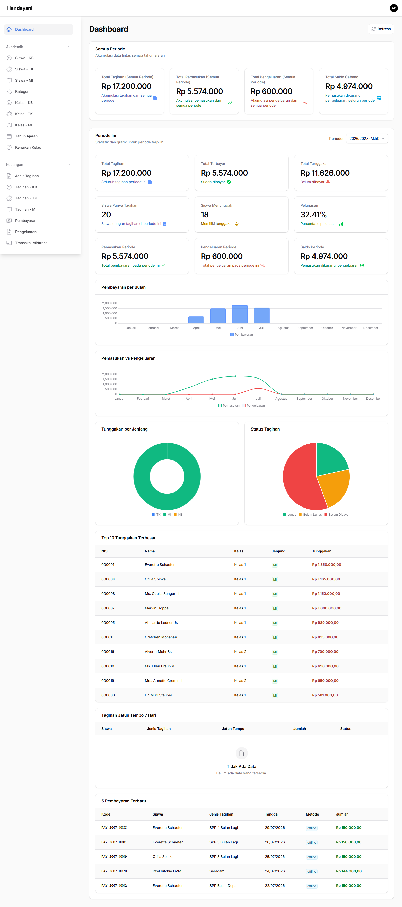

Bagian-bagian layar:

- **Menu samping (kiri)** — seluruh menu aplikasi, dikelompokkan menjadi **Akademik**, **Keuangan**, **Laporan**, dan **Pengaturan**.
- **Menu akun (kanan atas)** — klik untuk membuka **Profil Saya** atau **Logout**.

Menu yang tersedia untuk akun operator:

| Grup | Menu |
|---|---|
| — | Dashboard |
| **Akademik** | Siswa - KB / TK / MI · Kategori · Kelas - KB / TK / MI · Tahun Ajaran · Kenaikan Kelas |
| **Keuangan** | Jenis Tagihan · Tagihan - KB / TK / MI · Pembayaran · Pengeluaran · Transaksi Midtrans |
| **Laporan** | Kas Harian · Rekap Bulanan |
| **Pengaturan** | Manajemen Akun Siswa · Log Notifikasi |

> Akun operator terikat pada **satu cabang**. Pengelolaan lintas cabang dilakukan oleh Kepala Yayasan atau Superadmin.

### Soal jenjang KB / TK / MI

Menu **Siswa**, **Kelas**, dan **Tagihan** masing-masing punya tiga baris terpisah: satu untuk KB, satu untuk TK, satu untuk MI.

> Untuk berpindah jenjang, **klik menu jenjang tersebut di menu samping**. Tidak ada tombol ganti jenjang di dalam halaman.

---

## 2. Persiapan awal tahun ajaran

Lakukan berurutan sebelum menerbitkan tagihan apa pun.

### 2.1 Membuat tahun ajaran

Buka **Akademik → Tahun Ajaran**.

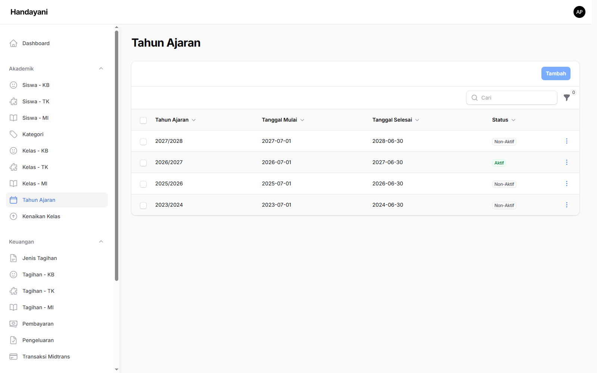

**Langkah 1 — Klik tombol Tambah** di kanan atas. Jendela **Tambah Tahun Ajaran** terbuka.

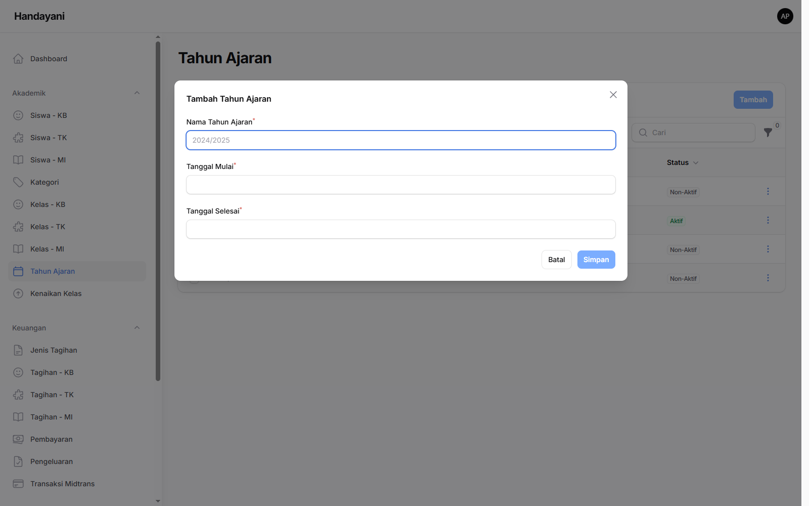

**Langkah 2 — Isi tiga kolom:**

| Kolom | Isi |
|---|---|
| **Nama Tahun Ajaran** | Format `2026/2027` (contoh isian sudah ditampilkan sebagai petunjuk di kolomnya) |
| **Tanggal Mulai** | Tanggal awal tahun ajaran, biasanya 1 Juli |
| **Tanggal Selesai** | Tanggal akhir tahun ajaran, biasanya 30 Juni tahun berikutnya |

**Langkah 3 — Klik Simpan.** Baris baru muncul di tabel dengan status **Non-Aktif**.

**Langkah 4 — Aktifkan tahun ajaran tersebut.** Klik ikon **titik tiga (⋮)** di ujung kanan barisnya. Menu akan terbuka berisi **Aktifkan**, **Edit**, dan **Hapus**.

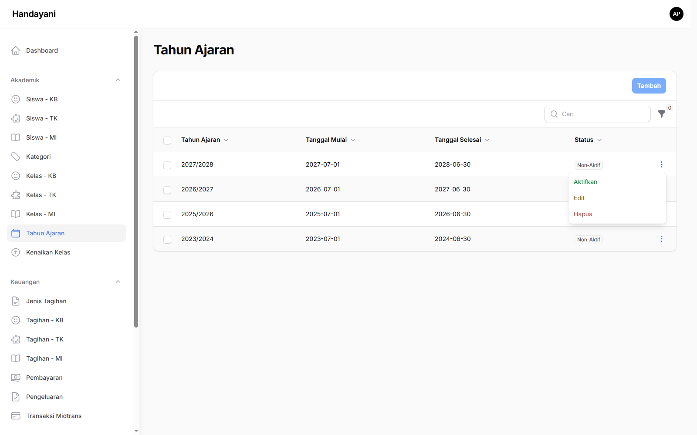

**Langkah 5 — Klik Aktifkan.** Status baris berubah menjadi **Aktif**, dan tahun ajaran yang sebelumnya aktif otomatis menjadi Non-Aktif.

> Hanya satu tahun ajaran yang boleh berstatus aktif. Tahun ajaran aktif inilah yang dipakai sebagai periode default di seluruh aplikasi.
>
> Tombol **Aktifkan**, **Edit**, dan **Hapus** tidak terlihat langsung di tabel — semuanya ada di dalam menu titik tiga.

### 2.2 Mengelola kelas

Buka **Akademik → Kelas - KB / TK / MI** sesuai jenjang.

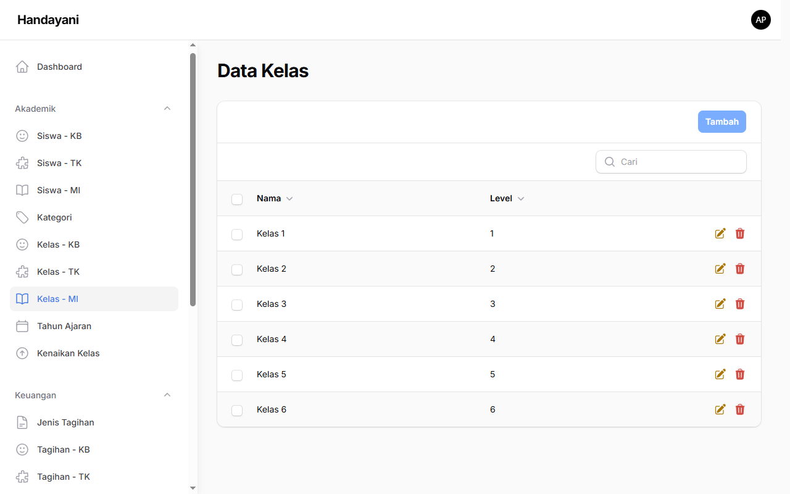

**Langkah 1 — Klik Tambah.** Jendela **Tambah Kelas** terbuka.

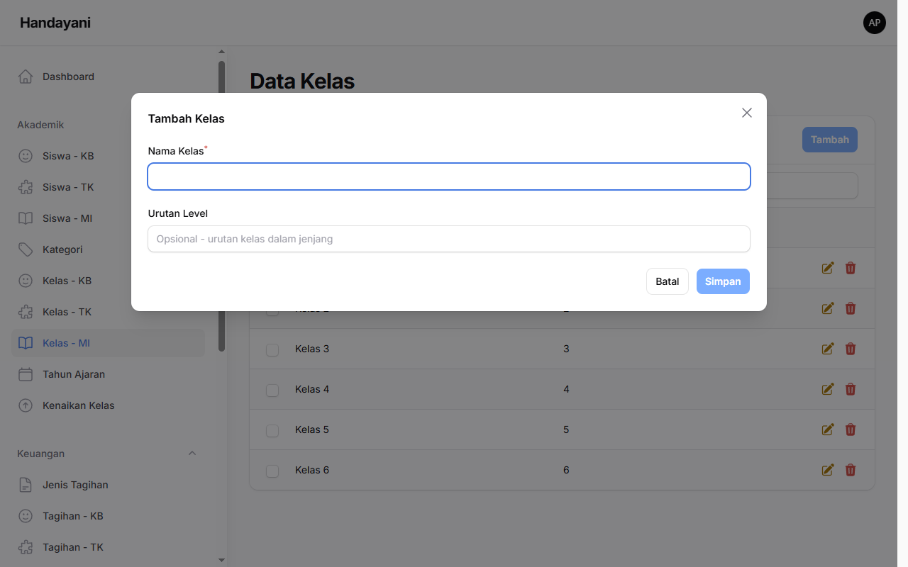

**Langkah 2 — Isi Nama Kelas** (contoh: `Kelas 1`) **dan Urutan Level** (angka urutan kelas, dipakai sistem untuk menentukan kelas berikutnya saat kenaikan kelas).

**Langkah 3 — Klik Simpan.**

Untuk mengubah atau menghapus, gunakan ikon pensil (Update) dan ikon tempat sampah (Delete) di kolom **Aksi** pada baris kelas tersebut.

### 2.3 Mengelola kategori

Buka **Akademik → Kategori**. Kategori dipakai untuk mengelompokkan siswa (misalnya berdasarkan keringanan biaya) dan bisa dipakai sebagai penyaring saat menerbitkan atau mengekspor tagihan.

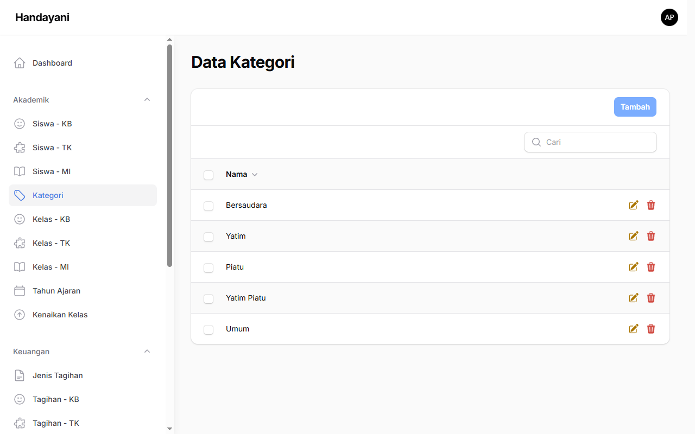

Klik **Tambah**, isi nama kategori, lalu **Simpan**. Caranya sama persis dengan menambah kelas di atas.

---

## 3. Mengelola data siswa

Buka **Akademik → Siswa - KB / TK / MI**.

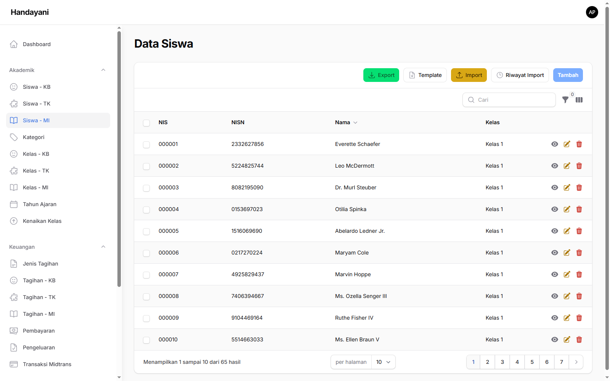

### 3.1 Mencari dan menyaring

- Ketik NIS atau nama di kotak pencarian.
- Gunakan penyaring **Kelas**, **Status** (Aktif / Lulus / Pindah / Keluar), **Jenis Kelamin**, dan **Agama**.
- Sebagian kolom disembunyikan agar tabel tidak terlalu lebar. Anda bisa menampilkannya lewat pengaturan kolom pada tabel.

### 3.2 Menambah siswa satu per satu

Klik **Tambah**. Formulir terbuka dalam bentuk **wizard** — beberapa langkah berurutan, ditandai nomor 01, 02, 03 di bagian atas jendela.

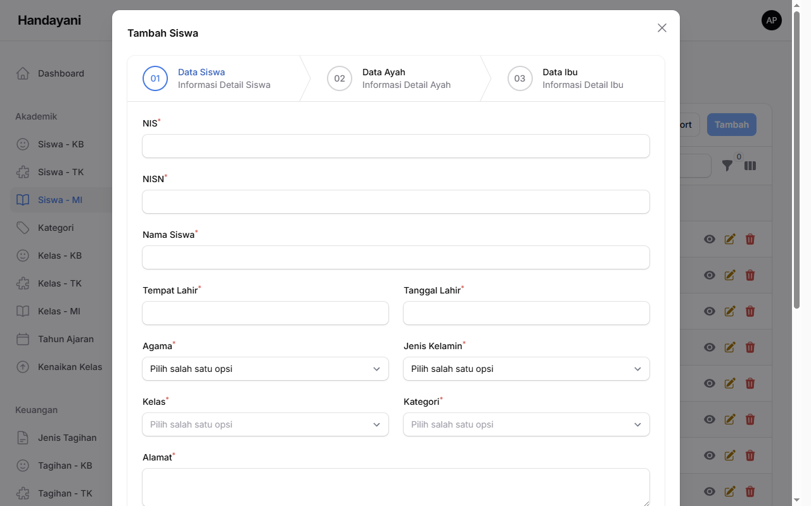

**Langkah 01 — Data Siswa.** Isi seluruh kolom bertanda bintang merah:

NIS, NISN, Nama Siswa, Tempat Lahir, Tanggal Lahir, Agama, Jenis Kelamin, Kelas, Kategori, Alamat, dan kolom lanjutan (asal sekolah, tahun diterima, status) di bagian bawah.

**Langkah 02 dan 03 — Data orang tua/wali.** Isinya berbeda menurut jenjang:

| Jenjang | Langkah 02 | Langkah 03 |
|---|---|---|
| **MI** | Data Ayah | Data Ibu |
| **KB dan TK** | Data Wali | — |

Pada langkah ini tersedia kotak pencarian bertuliskan *"Ketik nama ayah untuk mencari..."*. Gunakan bila orang tua tersebut **sudah terdaftar** karena punya anak lain di sekolah — pilih dari hasil pencarian, jangan mengetik ulang datanya. Bila belum terdaftar, isi manual.

**Berpindah langkah** — klik **Selanjutnya** untuk maju, **Sebelumnya** untuk mundur. Klik **Simpan** setelah semua langkah terisi.

> Tombol **Selanjutnya** tidak akan berpindah bila masih ada kolom wajib yang kosong. Kolom yang bermasalah akan bergaris merah dengan keterangan seperti *"NIS Tidak Boleh Kosong"* — gulir ke atas untuk menemukannya.

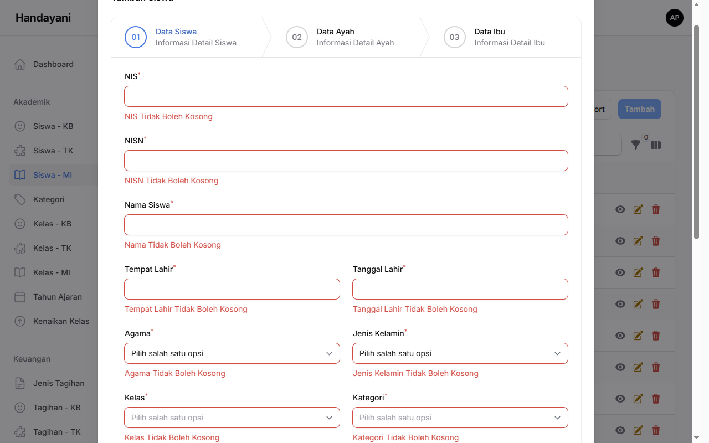

> **NIS bersifat kunci.** NIS dipakai untuk menghubungkan siswa dengan tagihannya, dan menjadi username siswa untuk login. Mengubah NIS siswa yang sudah punya tagihan dapat memutus keterkaitan data. Pastikan NIS benar sejak awal.

### 3.3 Menambah siswa secara massal (import)

Untuk data siswa baru dalam jumlah banyak, jangan diketik satu per satu.

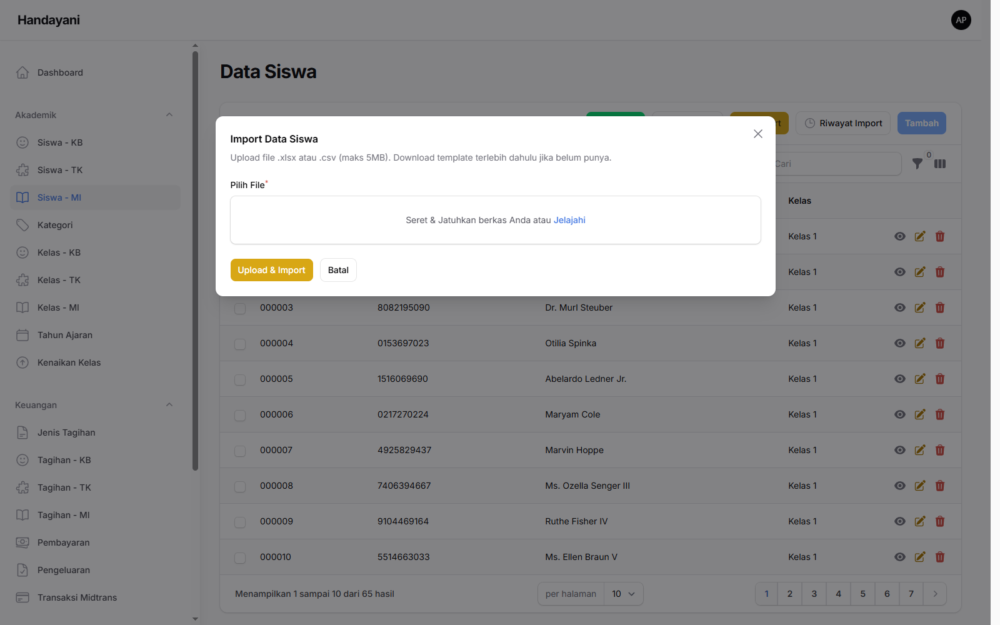

**Langkah 1 — Klik Template** (tombol abu-abu). Berkas contoh terunduh.

**Langkah 2 — Isi berkas tersebut di Excel.** **Jangan mengubah baris judul kolom** — sistem membaca kolom berdasarkan judul tersebut.

**Langkah 3 — Klik Import** (tombol kuning). Jendela **Import Data siswa** terbuka.

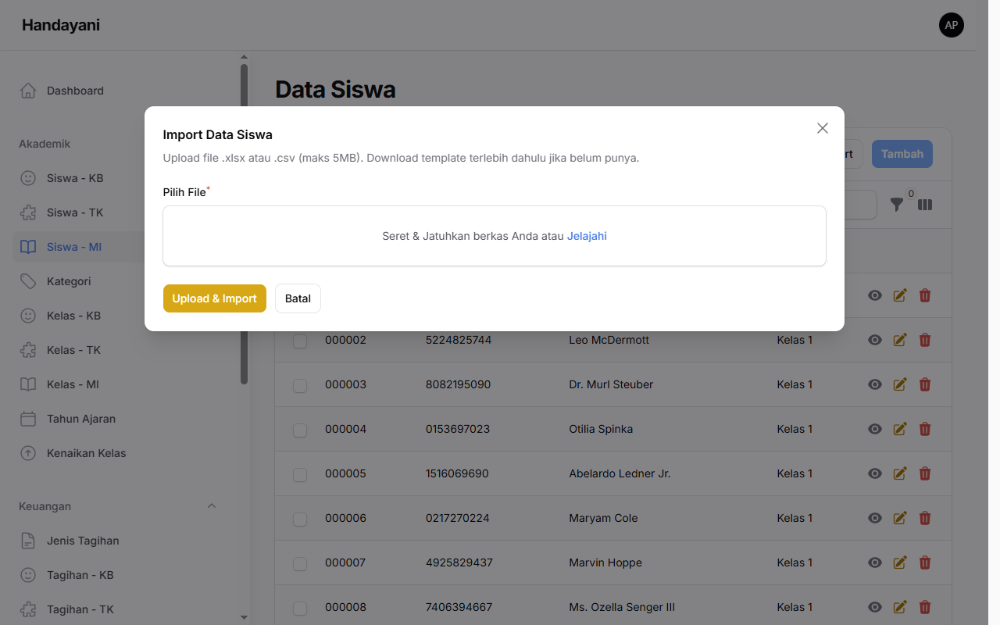

**Langkah 4 — Klik Pilih File**, ambil berkas Excel yang tadi Anda isi.

Ketentuan berkas: format `.xlsx` atau `.csv`, ukuran maksimal **5 MB**.

**Langkah 5 — Klik Upload & Import.** Tunggu sampai proses selesai.

**Langkah 6 — Periksa hasilnya.** Klik **Riwayat Import**.

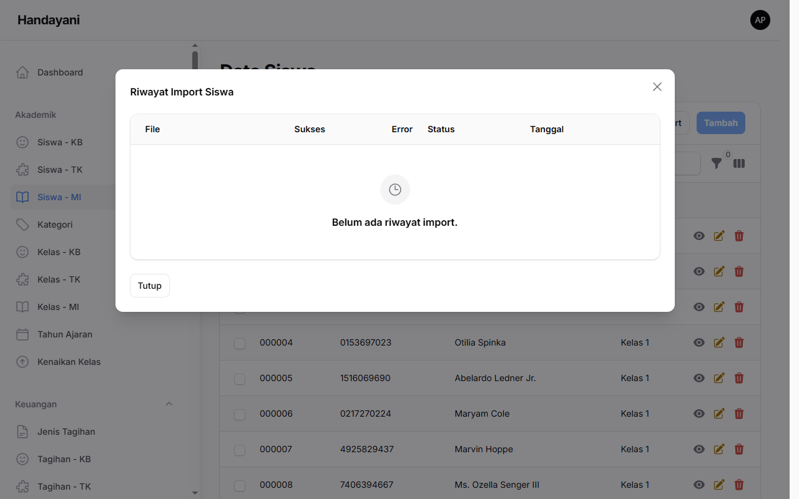

Tabel menampilkan per unggahan: **File**, **Sukses** (jumlah baris berhasil), **Error** (jumlah baris gagal), **Status**, dan **Tanggal**.

> Selalu buka Riwayat Import setelah mengunggah. Bila kolom **Error** tidak nol, ada baris yang tidak masuk — biasanya karena NIS ganda atau kolom wajib kosong.

**Membatalkan unggahan yang salah:** pada baris berkas yang bersangkutan di **Riwayat Import**, klik **Rollback**. Seluruh data dari unggahan tersebut dihapus sekaligus, sehingga Anda bisa memperbaiki berkasnya dan mengunggah ulang dari awal.

### 3.4 Melihat, mengubah, menghapus

Kolom **Aksi** paling kanan pada setiap baris siswa berisi tiga ikon, tanpa teks:

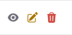

| Ikon | Fungsi |
|---|---|
| Mata | Lihat detail lengkap siswa |
| Pensil | Ubah data siswa |
| Tempat sampah | Hapus siswa tersebut |

Untuk menghapus banyak siswa sekaligus, centang beberapa baris lalu pilih **Hapus Terpilih**.

### 3.5 Mengeluarkan data siswa (export)

**Langkah 1 — Klik Export.** Jendela **Export Data** terbuka.

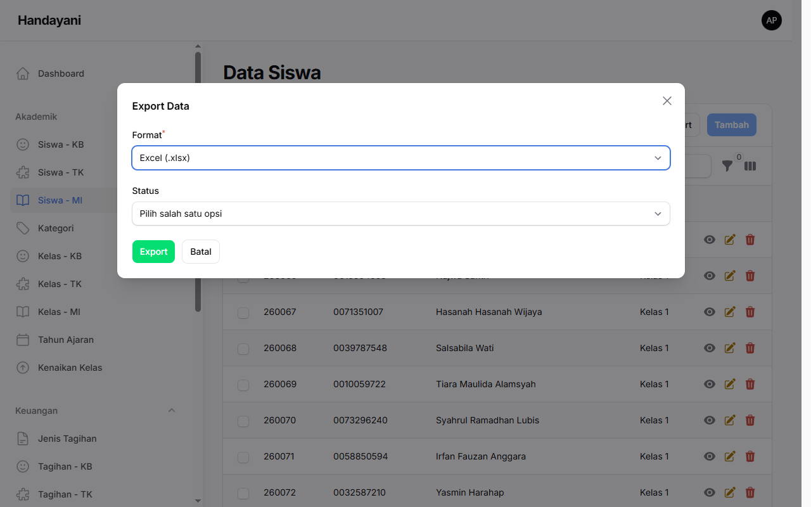

**Langkah 2 — Pilih Format:** `Excel (.xlsx)` atau `CSV (.csv)`.

**Langkah 3 — Saring bila perlu berdasarkan Status** (Aktif / Lulus / Pindah / Keluar).

**Langkah 4 — Klik Export** untuk mengunduh.

---

## 4. Membuat akun login untuk siswa

Siswa dan wali tidak bisa mendaftar sendiri. Akun dibuat oleh Anda.

Buka **Pengaturan → Manajemen Akun Siswa**.

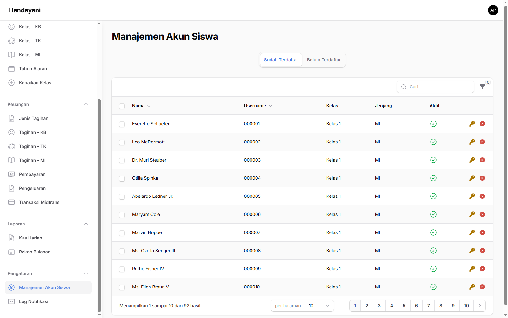

Halaman ini punya dua tab:

- **Belum Terdaftar** — siswa yang belum punya akun login
- **Sudah Terdaftar** — siswa yang sudah punya akun

### 4.1 Membuat akun massal

**Langkah 1 — Buka tab Belum Terdaftar.** Tabel menampilkan siswa yang belum punya akun, dengan kolom NIS, Nama, Jenjang, dan Kelas.

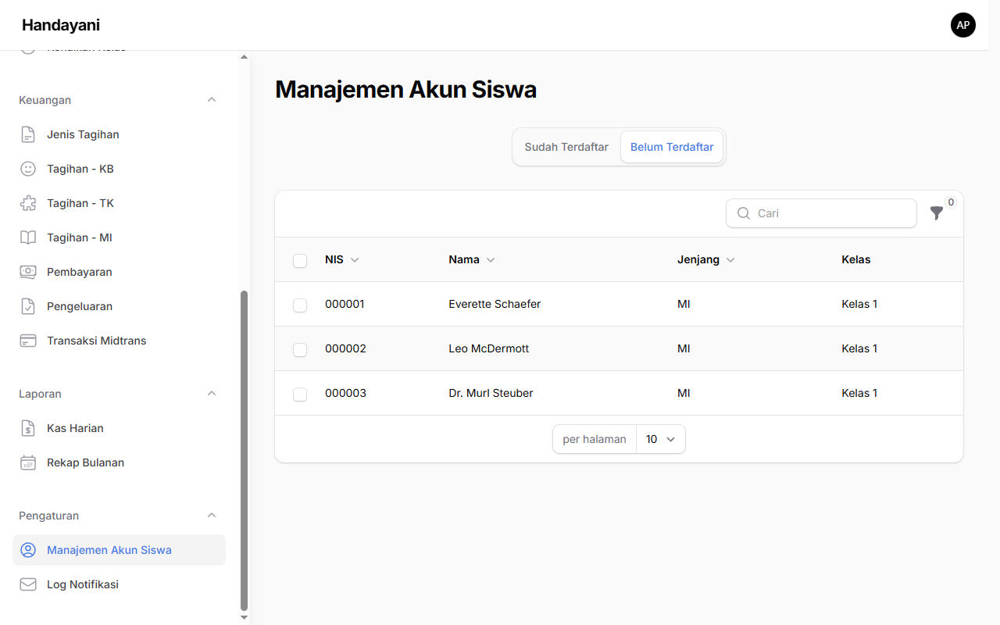

Bila tabel kosong dan tertulis **"Tidak Ada Siswa Tanpa Akun — Semua siswa sudah memiliki akun"**, berarti pekerjaan ini sudah selesai.

**Langkah 2 — Saring bila perlu** berdasarkan **Jenjang** dan **Kelas**, agar Anda memproses satu kelas sekaligus.

**Langkah 3 — Centang siswanya.** Centang satu per satu, atau centang kotak di baris judul tabel untuk memilih semua yang tampil.

Setelah ada yang tercentang, muncul tombol **Buat Akun** di kiri atas dan keterangan **"N data dipilih"**. Bila salah pilih, klik **Batalkan semua pilihan**.

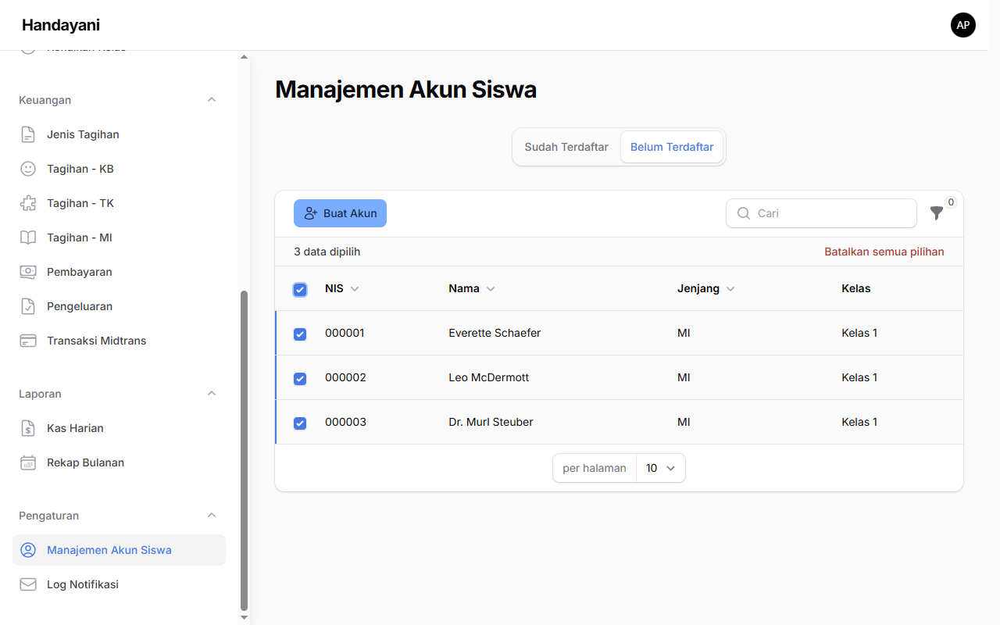

**Langkah 4 — Klik Buat Akun.** Muncul konfirmasi *"Apakah Anda yakin ingin membuat akun untuk N siswa yang dipilih?"*

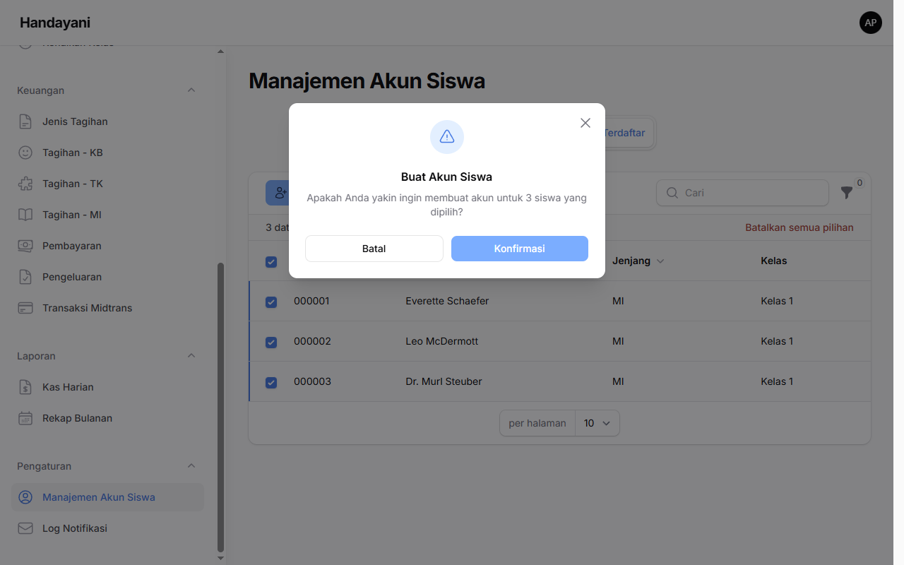

**Langkah 5 — Klik Konfirmasi.** Siswa tersebut pindah ke tab **Sudah Terdaftar**.

Sistem otomatis membuat akun dengan aturan:

- **Username = NIS siswa**
- **Password awal = tanggal lahir siswa**, format DDMMYYYY (contoh: `07082015`)
- Siswa **wajib mengganti password** saat pertama kali masuk

### 4.2 Membagikan kredensial ke wali murid

Dari tab **Sudah Terdaftar**:

1. Centang siswa yang bersangkutan.
2. Klik **Lihat Kredensial** untuk menampilkannya di layar, atau
3. Klik **Cetak PDF** untuk mengunduh berkas berisi daftar username dan password default — cocok untuk dipotong dan dibagikan per siswa.

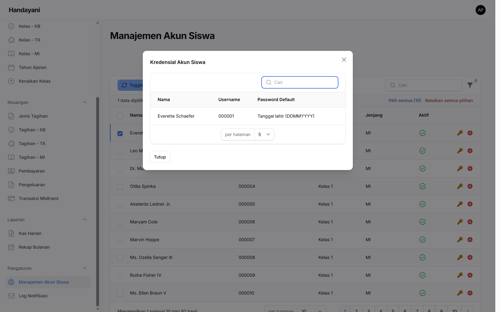

> Perlakukan berkas ini sebagai dokumen rahasia. Jangan dikirim ke grup WhatsApp kelas. Bagikan per orang.

### 4.3 Reset password dan menonaktifkan akun

- **Reset Password** — mengembalikan password ke tanggal lahir siswa. Siswa akan diminta membuat password baru lagi saat masuk. Gunakan ini bila wali murid lupa password dan belum mendaftarkan email.
- **Aktifkan / Nonaktifkan** — akun yang dinonaktifkan tidak bisa masuk. Gunakan untuk siswa yang sudah pindah atau lulus.

Keduanya bisa dijalankan per siswa maupun untuk banyak siswa sekaligus.

---

## 5. Menerbitkan tagihan

Urutannya: buat **Jenis Tagihan** dulu, baru terbitkan **Tagihan** ke siswa.

### 5.1 Membuat jenis tagihan

Buka **Keuangan → Jenis Tagihan**.

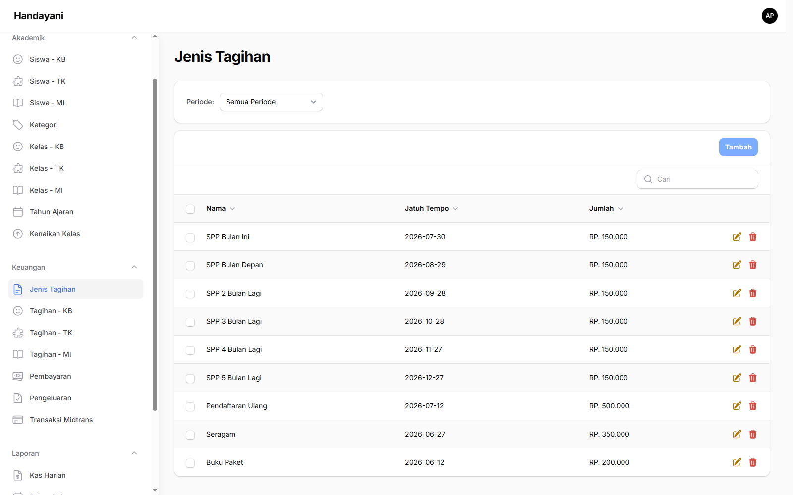

**Langkah 1 — Pilih Tahun Ajaran** yang dituju pada penyaring di atas tabel. Jenis tagihan yang Anda buat akan melekat pada periode ini.

**Langkah 2 — Klik Tambah.** Jendela **Tambah Jenis Tagihan** terbuka.

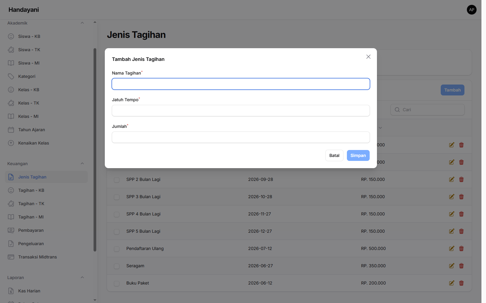

**Langkah 3 — Isi tiga kolom:**

| Kolom | Isi |
|---|---|
| **Nama Tagihan** | Contoh: `SPP Januari`, `Seragam`, `Buku Paket`, `Pendaftaran Ulang` |
| **Jatuh Tempo** | Tanggal batas pembayaran |
| **Jumlah** | Nominal per siswa |

**Langkah 4 — Klik Simpan.**

> Jenis tagihan ini baru berupa *cetakan*. Belum ada siswa yang tertagih sampai Anda menjalankan langkah 5.2.

### 5.2 Menerbitkan tagihan ke siswa

Buka **Keuangan → Tagihan - KB / TK / MI**.

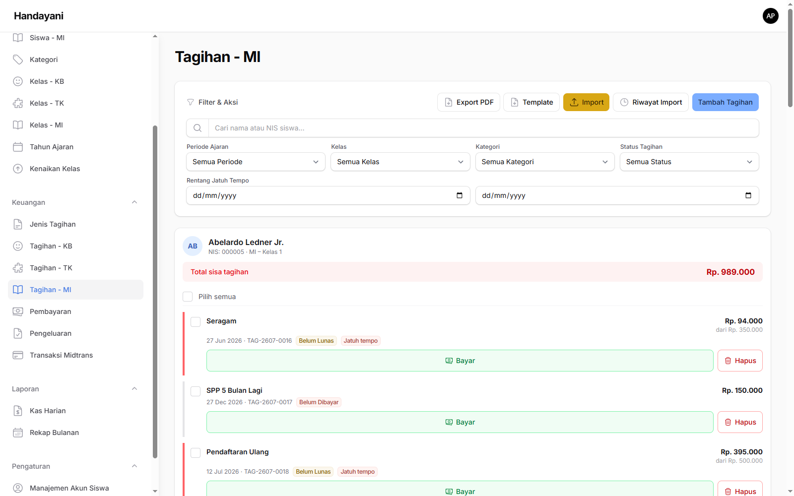

Halaman ini berbentuk kartu, bukan tabel — satu kartu untuk satu siswa beserta seluruh tagihannya.

**Langkah 1 — Klik Tambah Tagihan** di kanan atas. Jendela **Tambah Tagihan** terbuka.

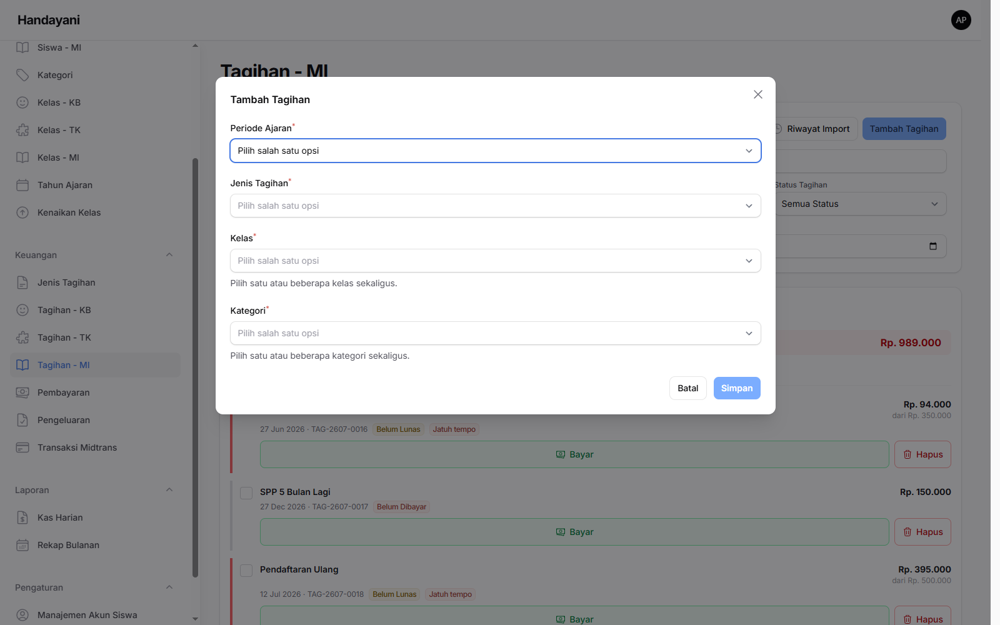

**Langkah 2 — Isi empat kolom:**

| Kolom | Isi |
|---|---|
| **Periode Ajaran** | Tahun ajaran tagihan ini |
| **Jenis Tagihan** | Pilih dari jenis tagihan yang Anda buat di langkah 5.1 |
| **Kelas** | **Boleh pilih beberapa kelas sekaligus** |
| **Kategori** | **Boleh pilih beberapa kategori sekaligus** |

**Langkah 3 — Klik Simpan.**

> **Ini penerbitan massal, bukan per siswa.** Satu kali simpan akan menerbitkan tagihan tersebut ke **semua siswa** yang berada di kelas dan kategori yang Anda pilih. Periksa pilihan Kelas dan Kategori sebelum menyimpan — menerbitkan ke kelas yang salah berarti harus menghapus tagihannya satu per satu.

**Alternatif untuk kasus tidak seragam:** bila nominal berbeda-beda per siswa, gunakan jalur import — **Template** → isi di Excel → **Import** → periksa **Riwayat Import** (cara kerjanya sama persis dengan import siswa di bagian 3.3, termasuk **Rollback** bila salah).

### 5.3 Menyaring dan membaca kartu siswa

Pada panel **Filter & Aksi** tersedia penyaring **Periode Ajaran**, **Kelas**, **Kategori**, **Status Tagihan** (Belum Dibayar / Belum Lunas / Lunas), dan **Rentang Jatuh Tempo** (dua kolom tanggal). Kotak pencarian bertuliskan "Cari nama atau NIS siswa...".

Setiap kartu siswa menampilkan nama, NIS, jenjang, kelas, dan baris merah **Total sisa tagihan** — jumlah yang masih harus dibayar siswa tersebut.

Di dalam kartu, setiap tagihan menampilkan nama jenis tagihan, tanggal, kode tagihan, dan penanda status (**Belum Dibayar**, **Belum Lunas**, **Jatuh tempo**). Bila tagihan sudah dibayar sebagian, nominal sisa ditampilkan besar dengan keterangan nilai penuhnya di bawah (contoh: `Rp. 94.000` — `dari Rp. 350.000`).

### 5.4 Mencetak laporan tagihan

**Langkah 1 — Klik Export PDF** di panel Filter & Aksi. Jendela **Export Laporan Tagihan (PDF)** terbuka.

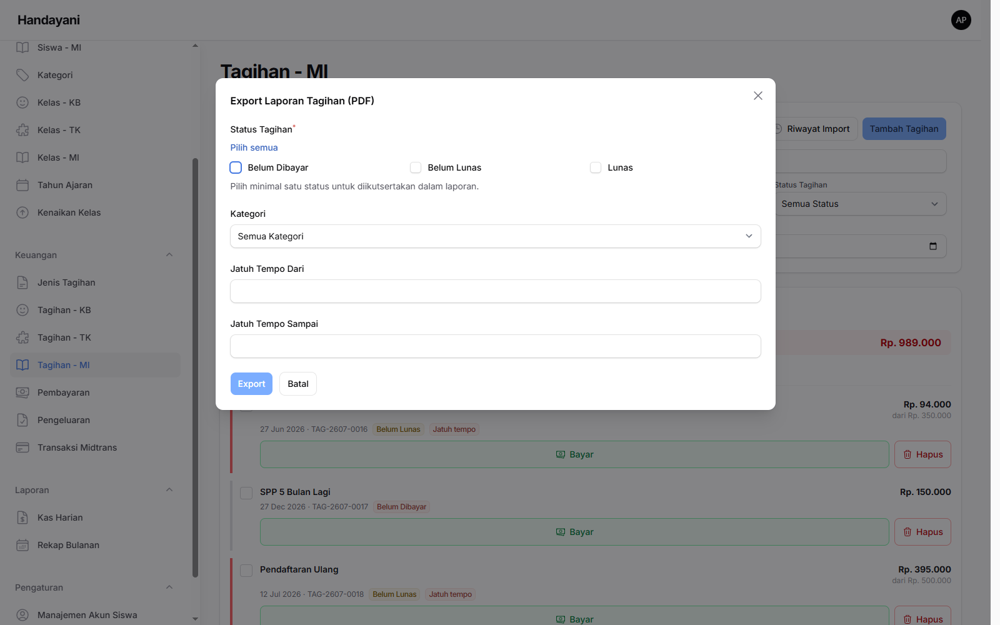

**Langkah 2 — Tentukan cakupan laporan:**

| Kolom | Kegunaan |
|---|---|
| **Status Tagihan** | Pilih *Belum Lunas* bila yang dicetak adalah daftar tunggakan |
| **Kategori** | Batasi ke kategori siswa tertentu |
| **Jatuh Tempo Dari / Sampai** | Batasi ke rentang tanggal tertentu |

**Langkah 3 — Unduh.** Berkas PDF siap dicetak dan dibagikan ke wali kelas.

> Pilihan pada jendela ini berdiri sendiri — tidak mengikuti penyaring yang sedang aktif di halaman. Tentukan ulang di sini.

---

## 6. Menerima pembayaran

### 6.1 Mencatat pembayaran tunai atau transfer

Dari halaman **Tagihan**, klik tombol **Bayar** pada tagihan yang bersangkutan. Jendela **Bayar Cicilan** akan terbuka:

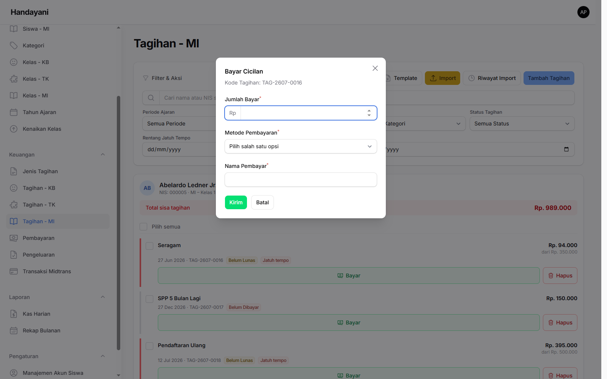

1. **Jumlah Bayar** — isi nominal yang benar-benar diterima. Boleh sebagian (cicilan) maupun penuh (pelunasan). Satu tombol ini dipakai untuk keduanya.
2. **Metode Pembayaran** — pilih cara pembayaran yang diterima.
3. **Nama Pembayar** — nama orang yang menyerahkan uang.
4. Klik **Kirim**.

### 6.2 Melunasi banyak tagihan sekaligus (satu siswa)

Dipakai bila wali murid membayar beberapa tagihan sekaligus dalam satu kali serah terima uang.

**Langkah 1 — Centang tagihannya.** Pada kartu siswa yang bersangkutan, centang **Pilih semua**, atau centang tagihannya satu per satu bila hanya sebagian.

**Langkah 2 — Periksa total di bagian bawah kartu.** Muncul baris **Bayar lunas yang dipilih** beserta jumlah totalnya, dan tombol **Bayar Lunas (N)** — N adalah banyaknya tagihan yang tercentang.

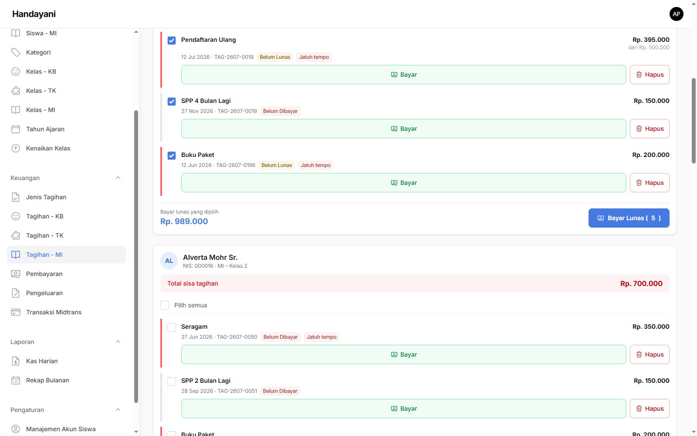

**Langkah 3 — Cocokkan angka total dengan uang yang diterima**, lalu klik **Bayar Lunas (N)**.

> Pencentangan berlaku **per kartu siswa**, bukan seluruh halaman. Tagihan milik siswa berbeda tidak bisa dilunasi dalam satu tindakan.
>
> Pelunasan massal selalu membayar **penuh**. Untuk pembayaran sebagian, gunakan tombol **Bayar** per tagihan (bagian 6.1).

### 6.3 Melihat riwayat dan mencetak kwitansi

Buka **Keuangan → Pembayaran**.

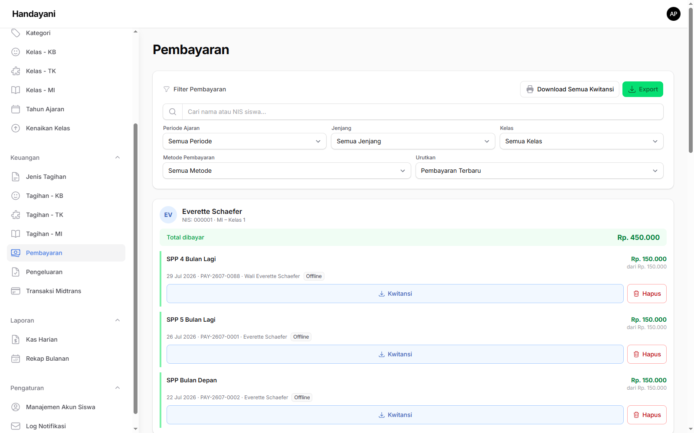

**Mencari pembayaran tertentu** — gunakan panel **Filter Pembayaran**: **Periode Ajaran**, **Jenjang**, **Kelas**, **Metode Pembayaran** (Offline / Online), dan **Urutkan** (Pembayaran Terbaru / Terlama). Kotak pencarian menerima nama atau NIS siswa.

**Mencetak kwitansi** — klik tombol **Kwitansi** pada pembayaran yang dimaksud. Berkas PDF langsung terunduh dan siap dicetak untuk wali murid.

**Mengunduh seluruh riwayat:**

**Langkah 1 — Klik Export.** Jendela **Export Data** terbuka.

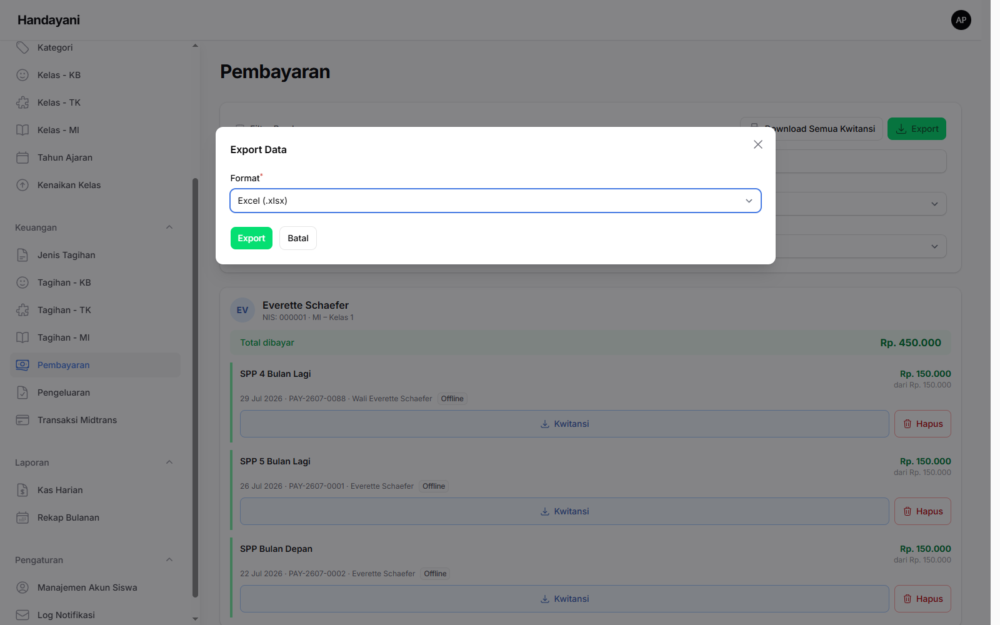

**Langkah 2 — Pilih Format:** `Excel (.xlsx)` atau `CSV (.csv)`.

**Langkah 3 — Unduh.** Berkas berisi pembayaran sesuai penyaring yang sedang aktif di halaman.

> **Pembayaran online tidak dapat dihapus.** Bila Anda mencoba, akan muncul pesan penolakan. Ini disengaja: pembayaran online sudah tercatat di sistem Midtrans sehingga tidak boleh dihapus sepihak. Yang bisa dihapus hanya pembayaran yang Anda input manual.

---

## 7. Mengajukan pengeluaran kas

Setiap pengeluaran melewati tiga tahap: **diajukan (Anda)** → **disetujui (Kepala Yayasan)** → **dicairkan (Anda)**.

Buka **Keuangan → Pengeluaran**.

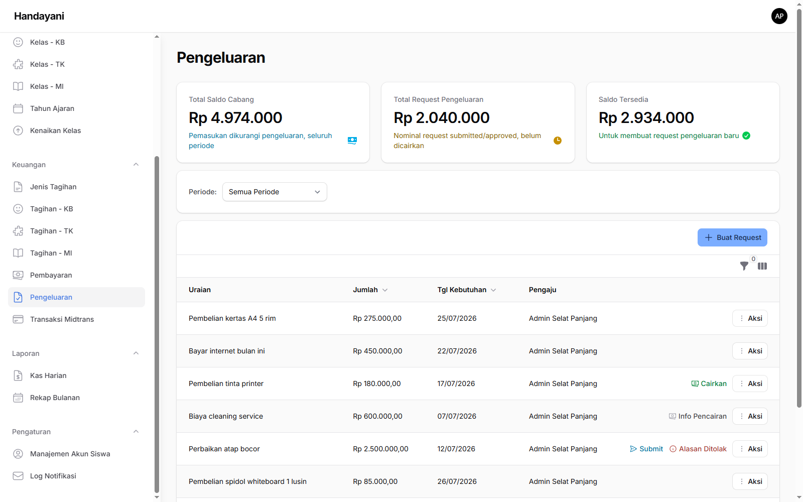

Tiga kartu di bagian atas menunjukkan kemampuan kas cabang:

| Kartu | Artinya |
|---|---|
| **Total Saldo Cabang** | Pemasukan dikurangi pengeluaran, seluruh periode |
| **Total Request Pengeluaran** | Nominal pengajuan yang sudah disubmit/disetujui tetapi **belum dicairkan** |
| **Saldo Tersedia** | Sisa yang benar-benar bisa dipakai untuk pengajuan baru |

> Periksa **Saldo Tersedia** sebelum membuat pengajuan baru. Angka ini sudah memperhitungkan pengajuan lain yang masih menunggu pencairan.

### 7.1 Membuat pengajuan

**Langkah 1 — Klik Buat Request.** Jendela **Buat Request Pengeluaran** terbuka.

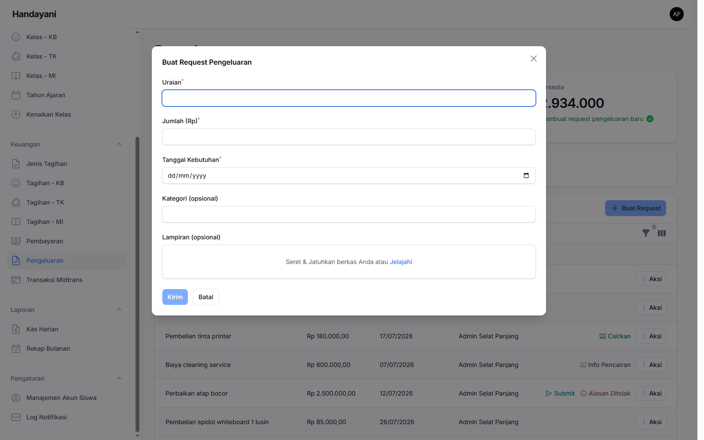

**Langkah 2 — Isi formulir:**

| Kolom | Isi | Wajib |
|---|---|---|
| **Uraian** | Keperluannya untuk apa, ditulis jelas (contoh: `Pembelian kertas A4 5 rim`) | Ya |
| **Jumlah (Rp)** | Nominal yang diminta | Ya |
| **Tanggal Kebutuhan** | Kapan uang tersebut dibutuhkan | Ya |
| **Kategori** | Pengelompokan pengeluaran | Tidak |
| **Lampiran** | Foto nota atau penawaran harga — seret berkasnya ke kotak, atau klik **Jelajahi** | Tidak |

**Langkah 3 — Klik Kirim.** Pengajuan tersimpan, tetapi statusnya masih **draf**.

**Langkah 4 — Klik Submit** pada baris pengajuan tersebut. Barulah pengajuan masuk ke antrean persetujuan Kepala Yayasan.

> **Langkah 4 sering terlewat.** Selama belum di-**Submit**, pengajuan Anda tidak terlihat oleh Kepala Yayasan dan tidak akan pernah diproses.
>
> Lampirkan nota atau penawaran harga bila ada. Pengajuan tanpa lampiran lebih sering ditolak dan harus diulang.

### 7.2 Setelah disetujui

Tombol **Cairkan** muncul pada baris tersebut. Klik **setelah uang benar-benar dikeluarkan** — tindakan inilah yang mencatatnya sebagai pengeluaran kas di laporan, bukan saat disetujui.

Untuk membaca catatan dari penyetuju, klik **Catatan Approval**. Setelah dicairkan, tombol berubah menjadi **Info Pencairan**.

### 7.3 Bila ditolak

**Langkah 1 — Klik Alasan Ditolak** pada baris tersebut untuk membaca alasan penolakan dari Kepala Yayasan.

**Langkah 2 — Perbaiki pengajuannya.** Klik **Aksi** di ujung kanan baris, lalu pilih **Edit** dari menu yang terbuka.

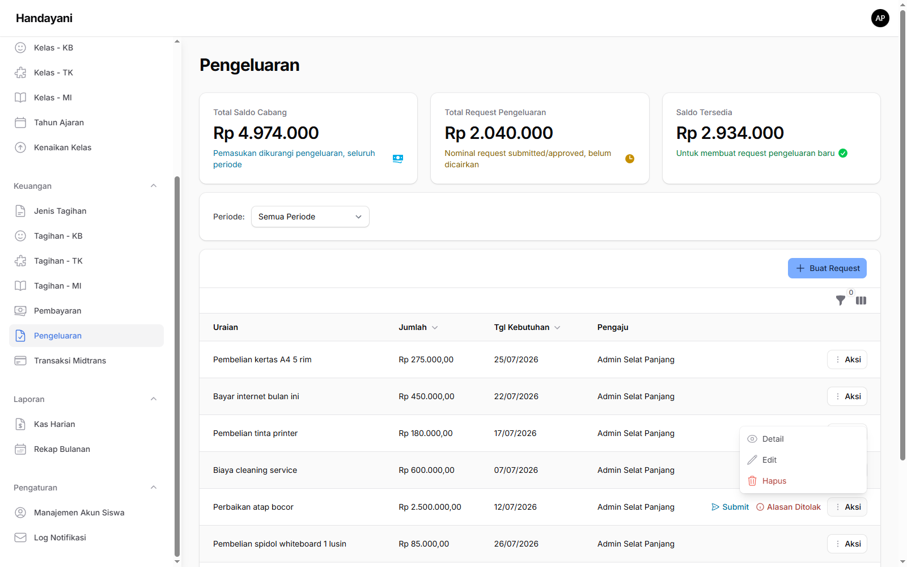

**Langkah 3 — Klik Submit ulang** setelah perbaikan selesai.

> Isi menu **Aksi** berubah menurut status pengajuan. Pengajuan yang masih draf atau sudah ditolak menampilkan **Detail**, **Edit**, dan **Hapus**. Pengajuan yang sudah disubmit hanya menampilkan **Detail** — sudah tidak bisa diubah lagi.

### 7.4 Persetujuan otomatis

Bila Kepala Yayasan mengaktifkan persetujuan otomatis, pengajuan **di bawah nilai ambang tertentu** akan langsung disetujui tanpa menunggu. Anda tinggal mencairkannya. Tanyakan besaran ambang ini kepada Kepala Yayasan.

---

## 8. Laporan keuangan

### 8.1 Kas Harian

Buka **Laporan → Kas Harian**.

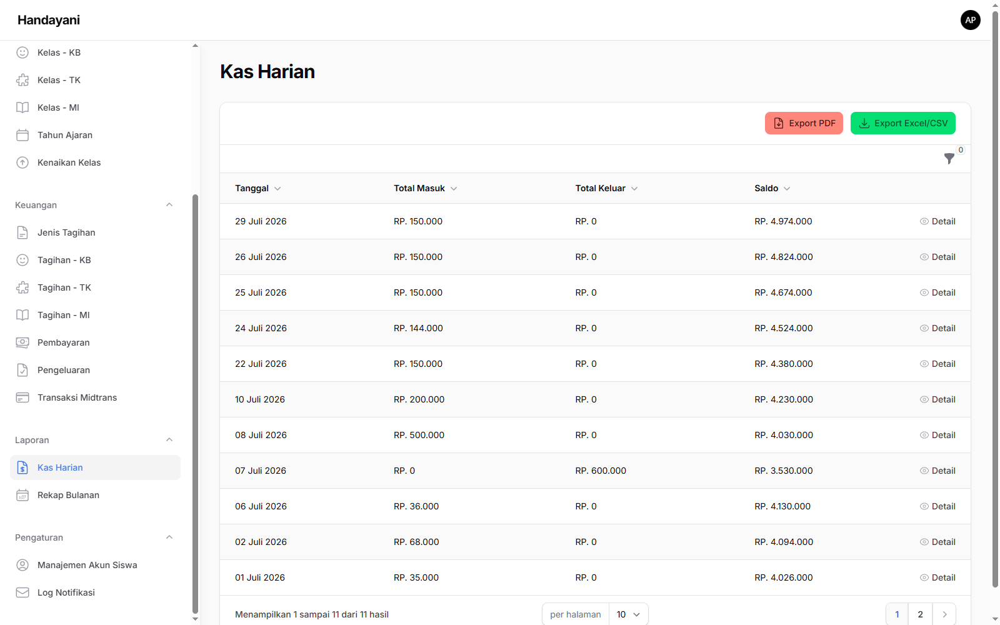

**Langkah 1 — Pilih Bulan dan Tahun** pada penyaring. Tabel menampilkan satu baris per tanggal: **Total Masuk**, **Total Keluar**, dan **Saldo**.

**Langkah 2 — Klik Detail** pada tanggal yang ingin ditelusuri.

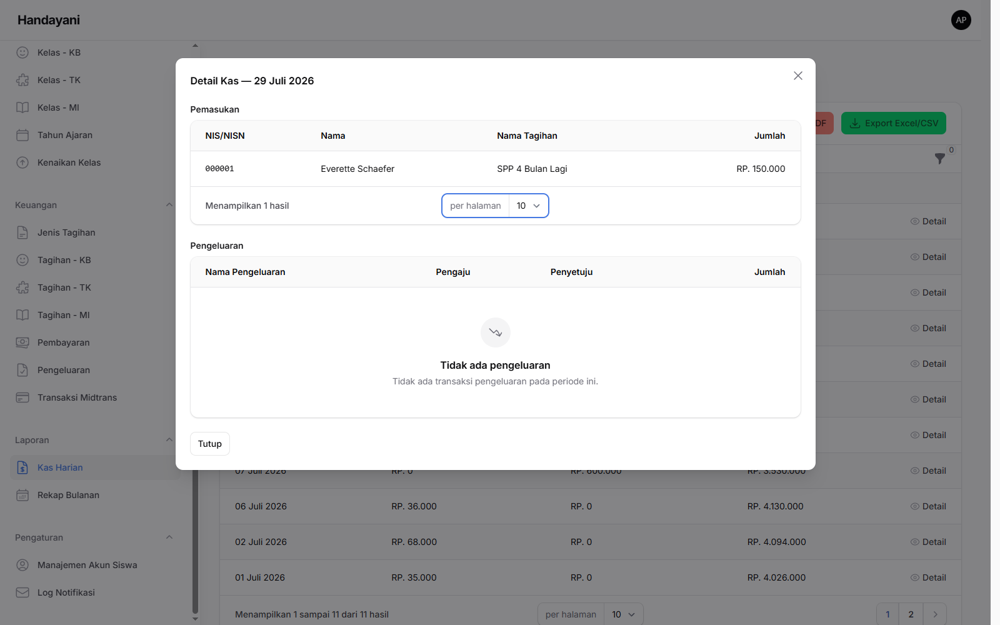

Rinciannya terbagi dua:

| Bagian | Kolom |
|---|---|
| **Pemasukan** | NIS/NISN, Nama, Nama Tagihan, Jumlah |
| **Pengeluaran** | Nama Pengeluaran, Pengaju, Penyetuju, Jumlah |

Kolom **Pengaju** dan **Penyetuju** inilah yang dipakai bila ada pengeluaran yang perlu dipertanggungjawabkan.

**Langkah 3 — Unduh bila perlu:**

- **Export PDF** — pilih Bulan dan Tahun pada jendelanya, hasilnya siap dicetak dan diarsipkan
- **Export Excel/CSV** — pilih Format, Bulan, dan Tahun, hasilnya bisa diolah lagi di Excel

### 8.2 Rekap Bulanan

Buka **Laporan → Rekap Bulanan**. Sama seperti Kas Harian, tetapi ringkasannya per bulan dalam satu tahun. Pilih **Tahun**, lalu gunakan **Detail** dan tombol export dengan cara yang sama.

---

## 9. Membaca dashboard

Buka **Dashboard**. Halaman terbagi dua bagian.

**Semua Periode** — akumulasi sejak awal, tidak terpengaruh pilihan periode:

- Total Tagihan, Total Pemasukan, Total Pengeluaran, dan **Total Saldo Cabang** (pemasukan dikurangi pengeluaran).

**Periode Ini** — mengikuti dropdown **Periode:** di atasnya:

| Kartu | Artinya |
|---|---|
| **Total Tagihan** | Seluruh tagihan periode terpilih |
| **Total Terbayar** | Yang sudah dibayar |
| **Total Tunggakan** | Yang belum dibayar |
| **Siswa Punya Tagihan** | Jumlah siswa yang ditagih |
| **Siswa Menunggak** | Jumlah siswa yang punya tunggakan |
| **Pelunasan** | Persentase tagihan yang sudah lunas |

Di bawahnya tersedia grafik **Pembayaran per Bulan**, **Pemasukan vs Pengeluaran**, **Tunggakan per Jenjang**, dan **Status Tagihan**.

Tiga tabel yang paling berguna untuk kerja harian:

- **Top 10 Tunggakan Terbesar** — siapa yang perlu ditagih lebih dulu
- **Tagihan Jatuh Tempo 7 Hari** — yang perlu diingatkan minggu ini
- **5 Pembayaran Terbaru**

---

## 10. Akhir tahun ajaran: kenaikan kelas

Dijalankan sekali setahun, setelah tahun ajaran baru dibuat (lihat bagian 2.1).

Buka **Akademik → Kenaikan Kelas**.

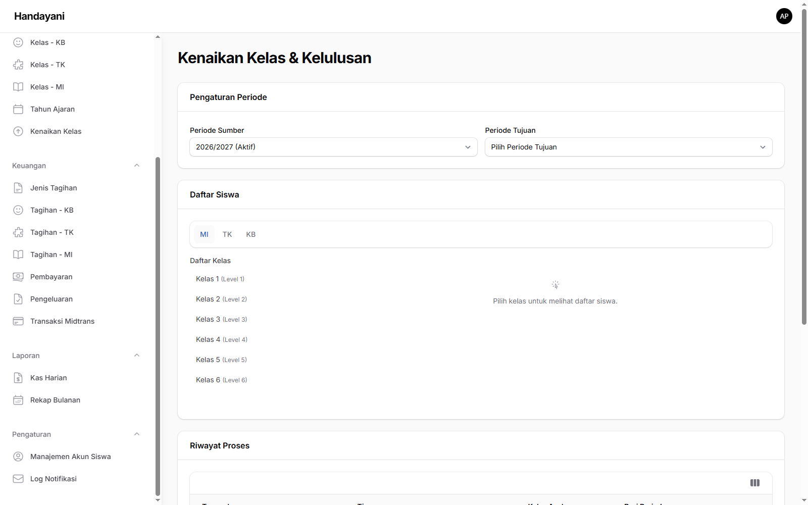

**Langkah 1 — Tentukan periode.** Pada panel **Pengaturan Periode**, isi dua dropdown:

| Dropdown | Isi |
|---|---|
| **Periode Sumber** | Tahun ajaran yang **berakhir** (biasanya bertanda *(Aktif)*) |
| **Periode Tujuan** | Tahun ajaran **baru** yang sudah Anda buat di bagian 2.1 |

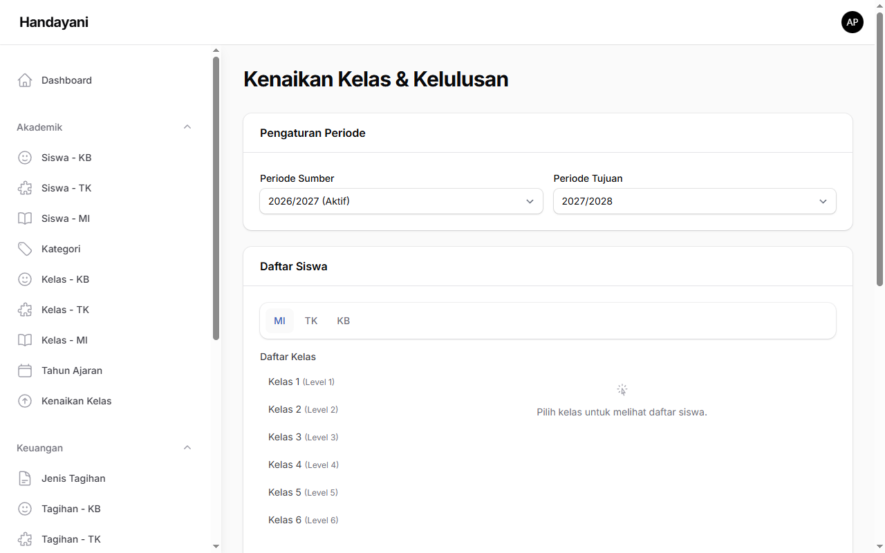

**Langkah 2 — Pilih jenjang** pada tab **MI / TK / KB**, lalu klik salah satu kelas di **Daftar Kelas** (contoh: `Kelas 1 (Level 1)`).

**Langkah 3 — Tentukan tindakan per siswa.** Daftar siswa kelas tersebut muncul dengan dropdown di kolom **AKSI**, terisi **Naik Kelas** secara default.

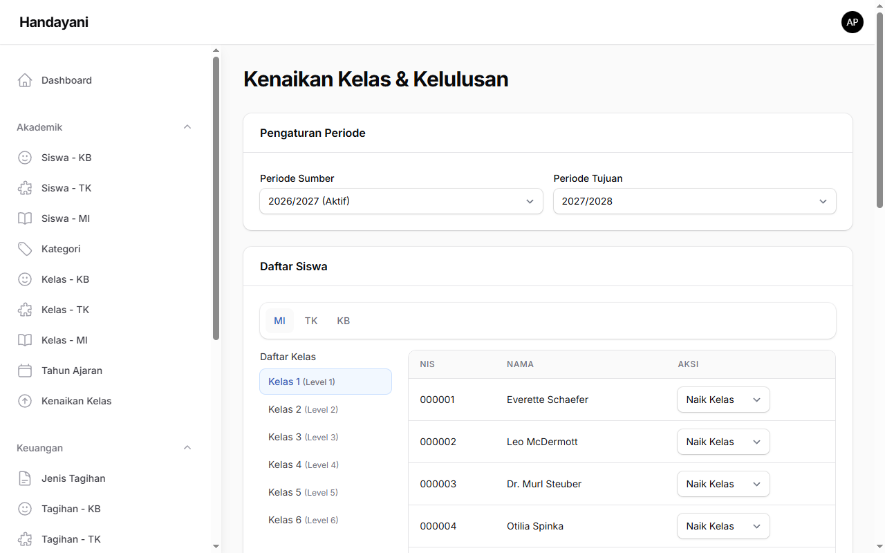

| Pilihan | Kapan dipakai |
|---|---|
| **Naik Kelas** | Siswa lanjut ke kelas berikutnya — pilih juga **Kelas Tujuan** |
| **Tinggal Kelas** | Siswa mengulang di kelas yang sama |
| **Lulus** | Siswa menyelesaikan jenjang terakhir |
| **Pindah Jenjang** | Siswa naik dari KB ke TK, atau TK ke MI |

Ubah hanya siswa yang tidak naik kelas — sisanya biarkan pada pilihan default.

**Langkah 4 — Periksa hitungannya.** Di bawah daftar siswa ada kartu penghitung (**Naik Kelas**, **Tinggal Kelas**, dan seterusnya) serta keterangan **Total: N siswa**. Cocokkan angkanya dengan keputusan rapat kenaikan kelas sebelum melanjutkan.

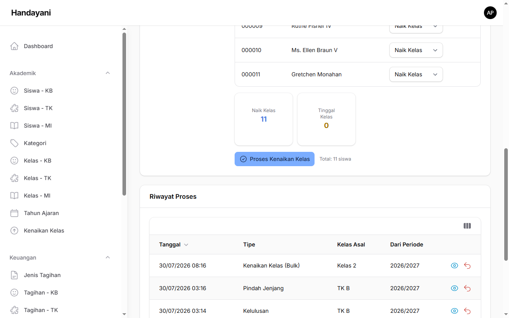

**Langkah 5 — Klik Proses Kenaikan Kelas** dan setujui konfirmasinya.

**Langkah 6 — Ulangi** dari Langkah 2 untuk kelas berikutnya.

**Membatalkan bila ada kesalahan:** pada tabel **Riwayat Proses** di bagian bawah halaman, setiap baris memuat Tanggal, Tipe (*Kenaikan Kelas (Bulk)*, *Pindah Jenjang*, *Kelulusan*), Kelas Asal, dan periode. Dua ikon di ujung kanan:

- **Ikon mata** — buka **Detail** untuk melihat siswa mana saja yang ikut dalam batch tersebut
- **Ikon panah balik** — **Undo**, membatalkan seluruh batch

> Kerjakan per kelas dan periksa **Detail** setiap selesai satu batch. Lebih mudah membatalkan satu kelas daripada satu jenjang penuh.

---

## 11. Memantau pembayaran online

Menu **Keuangan → Transaksi Midtrans** hanya muncul bila pembayaran online diaktifkan.

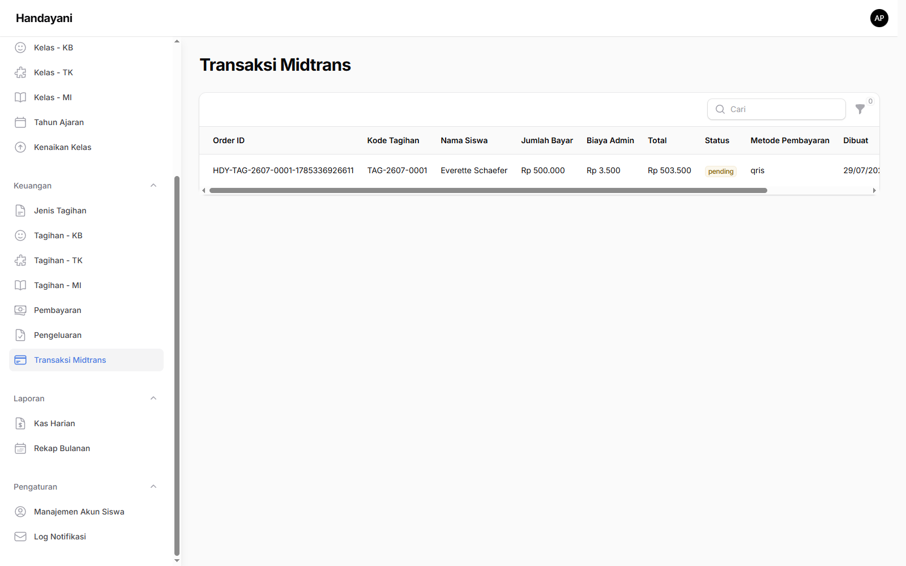

Tabel menampilkan Order ID, kode tagihan, nama siswa, jumlah bayar, biaya admin, total, status, dan metode pembayaran. Tersedia penyaring **Status**, **Dari Tanggal**, **Sampai Tanggal**, dan **Cabang**.

**Bila wali murid mengaku sudah membayar tetapi status belum berubah:**

**Langkah 1 — Tunggu beberapa menit.** Status diperbarui otomatis oleh sistem pembayaran, tanpa perlu tindakan Anda.

**Langkah 2 — Buka detail transaksinya.** Klik Order ID pada baris tersebut.

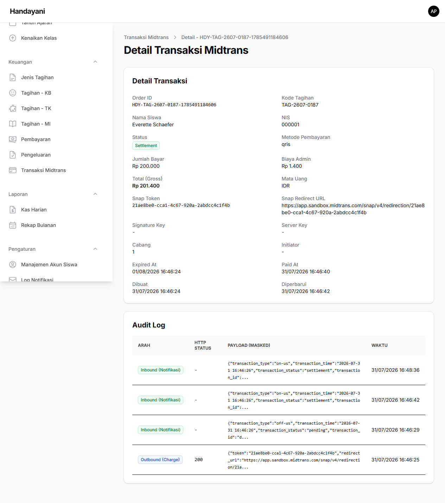

Panel **Detail Transaksi** memuat Order ID, Kode Tagihan, Nama Siswa, NIS, Status, Metode Pembayaran, Jumlah Bayar, Biaya Admin, Total (Gross), serta waktu **Expired At**, **Paid At**, **Dibuat**, dan **Diperbarui**.

Panel **Audit Log** di bawahnya mencatat seluruh lalu lintas data dengan Midtrans — berguna sebagai bukti bila wali murid memprotes.

**Langkah 3 — Klik Sinkronisasi Status**, lalu **Ya, Sinkronisasi**. Sistem menanyakan langsung status terbaru ke Midtrans.

> Tombol **Sinkronisasi Status** hanya muncul untuk transaksi yang statusnya masih **Pending** — dan memang hanya transaksi itulah yang perlu disinkronkan. Transaksi yang sudah *Settlement*, *Expire*, atau *Cancel* sudah final.
>
> Bila hasil sinkronisasi tetap Pending, berarti wali murid membuka halaman pembayaran tetapi belum menyelesaikan transaksinya. Minta mereka mengulang lewat tombol **Lanjutkan Pembayaran** di Portal.

---

## 12. Notifikasi email

Sistem mengirim email otomatis ke wali murid: pemberitahuan tagihan baru, kwitansi pembayaran, pengingat jatuh tempo, dan pemberitahuan keterlambatan.

> **Jenis email mana yang aktif dan jadwal pengingatnya diatur oleh Kepala Yayasan**, bukan operator. Bila wali murid mengeluh terlalu sering atau tidak pernah menerima pengingat, sampaikan ke Kepala Yayasan.

Yang menjadi tugas Anda adalah memantau pengirimannya.

Buka **Pengaturan → Log Notifikasi**.

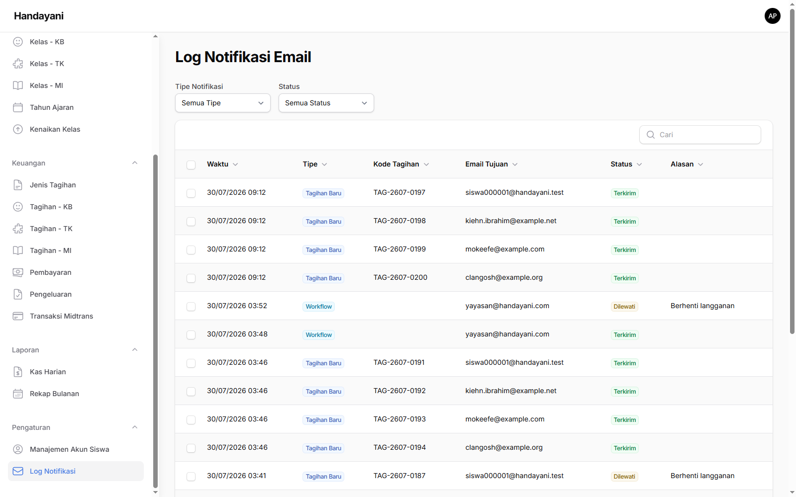

Tabel memuat waktu, jenis email, kode tagihan, email tujuan, status, dan alasan kegagalan.

Bila ada yang gagal terkirim: centang barisnya, lalu klik **Kirim Ulang Terpilih**. Bila terus gagal, periksa apakah alamat email walinya benar.

> Email hanya terkirim ke wali yang alamat emailnya sudah terdaftar **dan terverifikasi**. Wali juga dapat mematikan sendiri jenis email tertentu dari halaman Profil mereka — jadi tidak semua wali menerima email yang sama.

---

## 13. Mengatur profil sendiri

Klik avatar Anda di pojok kanan atas, lalu pilih **Profil Saya** dari menu yang terbuka.

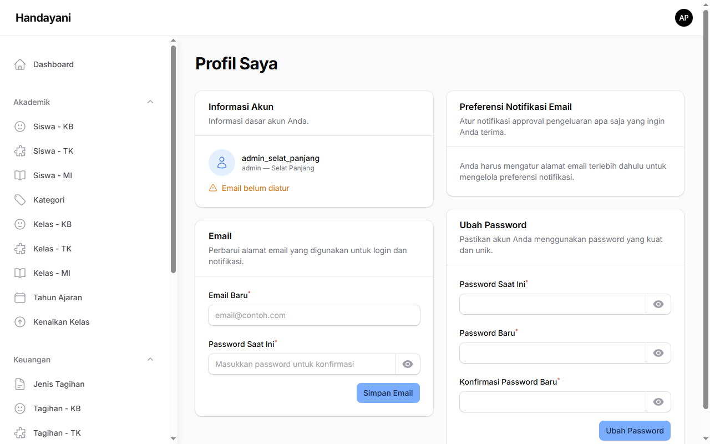

Halaman ini terbagi beberapa bagian:

**Informasi Akun** — menampilkan username, role, dan cabang Anda saat ini. Bila kolom email masih kosong, tertulis **"Email belum diatur"**.

**Email** — untuk mengatur atau mengganti email:

1. Isi **Email Baru**.
2. Isi **Password Saat Ini** sebagai konfirmasi.
3. Klik **Simpan Email**.

**Ubah Password:**

1. Isi **Password Saat Ini**.
2. Isi **Password Baru**.
3. Ulangi di **Konfirmasi Password Baru**.
4. Klik **Ubah Password**.

**Preferensi Notifikasi Email** — mengatur email approval pengeluaran apa saja yang ingin Anda terima (misalnya saat pengajuan disetujui atau ditolak). Bagian ini baru bisa diisi setelah Anda mengatur email terlebih dahulu.

---

## 14. Troubleshooting

### Tidak bisa masuk

| Pesan / gejala | Penyebab | Solusi |
|---|---|---|
| "Username/email atau kata sandi salah." | Salah ketik, atau salah jenis identitas | Staf memakai **email**, siswa memakai **NIS**. Periksa Caps Lock. |
| Tidak bisa masuk pakai username padahal biasanya bisa | Akun Anda sudah punya email terdaftar | Setelah email terdaftar, staf **wajib masuk dengan email**, bukan username. |
| "Akun tidak aktif. Hubungi admin sekolah." | Akun dinonaktifkan | Minta Kepala Yayasan atau Superadmin mengaktifkan kembali. |
| "Tidak dapat terhubung ke server." | Jaringan atau server bermasalah | Periksa koneksi internet. Bila jaringan normal, hubungi pengelola sistem. |
| Diblokir setelah beberapa kali gagal | Batas 5 percobaan | Tunggu beberapa menit sebelum mencoba lagi. |

### Tiba-tiba keluar sendiri dari aplikasi

Sesi berlaku 8 jam, atau akun Anda dipakai masuk di perangkat lain. Masuk kembali. Bila sering terjadi padahal Anda tidak berbagi akun, laporkan — kemungkinan akun Anda dipakai orang lain.

### Menu yang dicari tidak ada

Akun Anda tidak diberi hak akses untuk menu itu. Hubungi Kepala Yayasan atau Superadmin.

### Angka di dashboard tertulis "Tidak tersedia"

Muncul bersama keterangan "Data gagal dimuat dari server" — artinya aplikasi gagal mengambil data. Muat ulang halaman. Bila tetap, hubungi pengelola sistem.

### Salah unggah data (import)

Buka **Riwayat Import** pada halaman yang bersangkutan, cari berkasnya, klik **Rollback**. Perbaiki berkasnya, lalu unggah ulang.

### Salah memproses kenaikan kelas

Buka tabel **Riwayat Proses** di halaman Kenaikan Kelas, klik **Undo** pada batch yang salah.

### Wali murid tidak menerima email

1. Periksa **Pengaturan → Log Notifikasi** — apakah emailnya tercatat gagal? Bila ya, klik **Kirim Ulang Terpilih**.
2. Periksa apakah wali sudah mendaftarkan **dan memverifikasi** emailnya.
3. Minta wali memeriksa folder Spam.
4. Wali mungkin mematikan sendiri jenis notifikasi itu di halaman Profil mereka.
5. Bila email tersebut tidak muncul sama sekali di Log Notifikasi, kemungkinan jenis notifikasinya sedang dinonaktifkan — hubungi Kepala Yayasan.

### Menu Pengaturan Notifikasi / Manajemen User / Manajemen Cabang tidak ada

Menu tersebut memang bukan hak akses operator. Sampaikan kebutuhan Anda kepada Kepala Yayasan atau Superadmin.

### Wali murid lupa password dan tidak punya email

Buka **Manajemen Akun Siswa** → tab **Sudah Terdaftar** → **Reset Password**. Password kembali ke tanggal lahir siswa (DDMMYYYY) dan wali akan diminta membuat password baru saat masuk.

### Wali sudah bayar online tapi status belum lunas

Tunggu beberapa menit. Bila masih tertahan, buka **Transaksi Midtrans**, buka detail transaksinya, klik **Sinkronisasi Status**. Bila statusnya tertulis belum diproses Midtrans, berarti wali membuka halaman pembayaran tetapi belum menyelesaikannya — minta mereka mengulang lewat tombol **Lanjutkan Pembayaran** di Portal.

### Pembayaran tidak bisa dihapus

Pembayaran online memang tidak dapat dihapus. Hanya pembayaran yang diinput manual yang bisa dihapus.

### Kwitansi gagal diunduh

Muncul pesan "Kwitansi tidak tersedia". Muat ulang halaman dan coba lagi. Bila tetap gagal, hubungi pengelola sistem.
