# Panduan Kepala Yayasan

Panduan ini untuk peran pengawasan: memantau keuangan seluruh cabang, menyetujui pengeluaran, mengelola akun staf, dan mengatur identitas sekolah.

Cara masuk dan mengganti password pertama kali ada di [README](README.md).

> **Pembagian peran.** Operator sekolah yang menginput data siswa, tagihan, dan pembayaran. Anda yang menyetujui pengeluaran dan mengawasi hasilnya. Akun Anda memang tidak memiliki menu penginputan tagihan — itu bukan kesalahan sistem.

Menu yang tersedia untuk akun Kepala Yayasan:

| Grup | Menu |
|---|---|
| — | Dashboard |
| **Keuangan** | Pengeluaran |
| **Laporan** | Kas Harian · Rekap Bulanan |
| **Pengaturan** | Manajemen User · Pengaturan Aplikasi · Manajemen Cabang · Pengaturan Notifikasi · Pengaturan Approval · Manajemen RBAC |

Di bagian atas layar terdapat **pemilih cabang**. Seluruh angka dan daftar yang ditampilkan mengikuti cabang yang sedang terpilih.

> **Manajemen RBAC** adalah menu teknis untuk mengatur hak akses secara rinci. Sebaiknya diserahkan kepada pengelola sistem — kesalahan pengaturan di sana dapat membuat staf kehilangan akses.

## Daftar isi

1. [Membaca dashboard keuangan](#1-membaca-dashboard-keuangan)
2. [Menyetujui pengeluaran](#2-menyetujui-pengeluaran)
3. [Mengatur persetujuan otomatis](#3-mengatur-persetujuan-otomatis)
4. [Laporan keuangan](#4-laporan-keuangan)
5. [Mengelola akun staf](#5-mengelola-akun-staf)
6. [Mengelola cabang](#6-mengelola-cabang)
7. [Pengaturan identitas sekolah](#7-pengaturan-identitas-sekolah)
8. [Pengaturan notifikasi email](#8-pengaturan-notifikasi-email)
9. [Mengatur profil sendiri](#9-mengatur-profil-sendiri)
10. [Troubleshooting](#10-troubleshooting)

---

## 1. Membaca dashboard keuangan

Buka **Dashboard**. Ini halaman pertama yang muncul setelah Anda masuk.

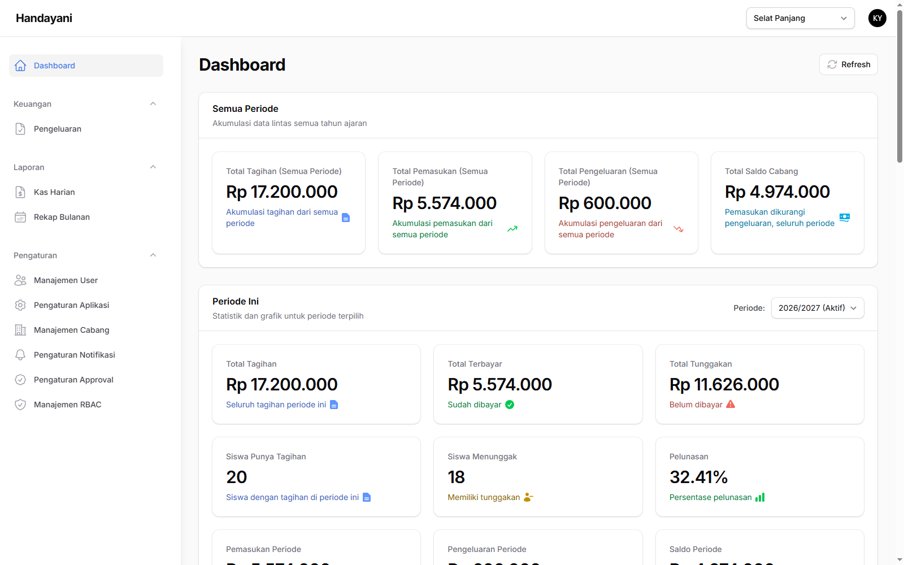

Halaman terbagi dua bagian.

### Semua Periode

Akumulasi sejak awal, lintas seluruh tahun ajaran — tidak terpengaruh pilihan periode.

| Kartu | Artinya |
|---|---|
| **Total Tagihan (Semua Periode)** | Seluruh nilai tagihan yang pernah diterbitkan |
| **Total Pemasukan (Semua Periode)** | Seluruh uang yang sudah diterima |
| **Total Pengeluaran (Semua Periode)** | Seluruh pengeluaran yang sudah dicairkan |
| **Total Saldo Cabang** | Pemasukan dikurangi pengeluaran |

**Total Saldo Cabang** adalah angka yang paling perlu Anda perhatikan sebelum menyetujui pengeluaran besar.

### Periode Ini

Mengikuti dropdown **Periode:** di atasnya. Gunakan untuk menilai kinerja tahun ajaran berjalan.

| Kartu | Artinya |
|---|---|
| **Total Tagihan** | Tagihan periode terpilih |
| **Total Terbayar** | Yang sudah masuk |
| **Total Tunggakan** | Yang belum tertagih |
| **Pelunasan** | Persentase tagihan yang sudah lunas |
| **Pemasukan / Pengeluaran / Saldo Periode** | Arus kas periode terpilih |

Grafik yang tersedia: **Pembayaran per Bulan**, **Pemasukan vs Pengeluaran**, **Tunggakan per Jenjang**, dan **Status Tagihan**.

Tabel **Top 10 Tunggakan Terbesar** menunjukkan siswa dengan tunggakan terbesar — berguna sebagai bahan rapat dengan operator.

> Angka di dashboard mengikuti **cabang yang sedang aktif** pada pemilih cabang di bagian atas layar. Untuk melihat cabang lain, ganti dulu pilihannya.

---

## 2. Menyetujui pengeluaran

Ini tugas rutin utama Anda.

Alur lengkap satu pengeluaran:

```
Operator membuat request  →  Operator klik Submit  →  ANDA menyetujui/menolak  →  Operator mencairkan
```

Buka **Keuangan → Pengeluaran**.

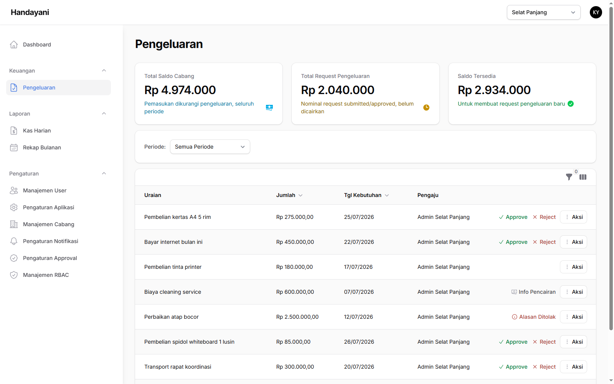

Gunakan penyaring **Status** untuk menampilkan hanya yang menunggu persetujuan.

### 2.1 Memeriksa pengajuan

**Langkah 1 — Klik Aksi** di ujung kanan baris pengajuan, lalu pilih **Detail**.


**Langkah 2 — Baca jendela Detail Request Pengeluaran.**

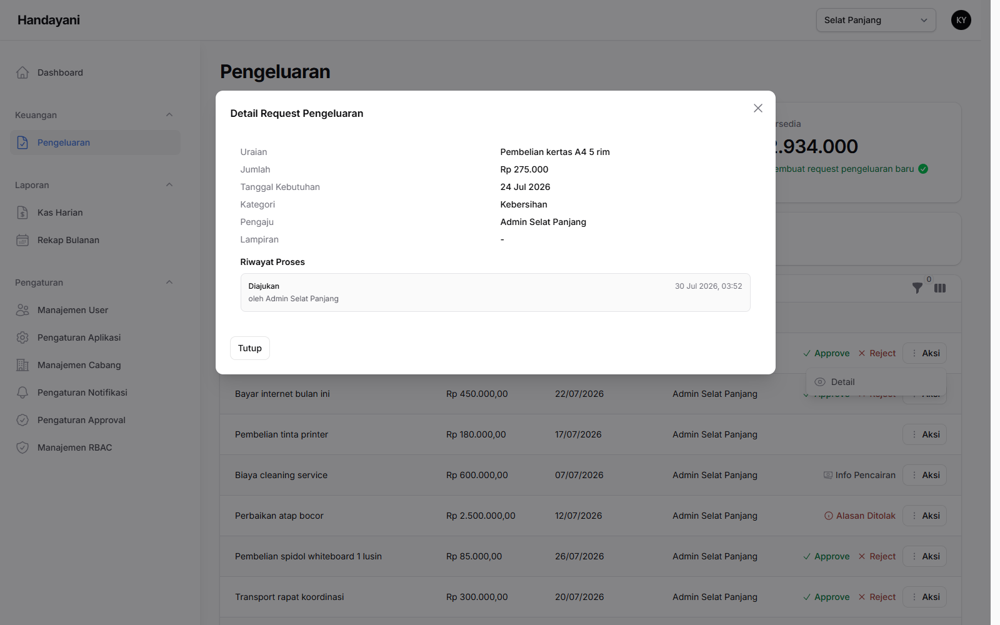

Isinya: **Uraian**, **Jumlah**, **Tanggal Kebutuhan**, **Kategori**, **Pengaju**, dan **Lampiran** (foto nota atau penawaran harga; bertanda `-` bila tidak ada).

Bagian **Riwayat Proses** di bawahnya mencatat siapa mengajukan dan kapan — nantinya juga mencatat persetujuan dan pencairan.

**Langkah 3 — Bandingkan dengan Total Saldo Cabang** di dashboard sebelum memutuskan.

### 2.2 Menyetujui

**Langkah 1 — Klik Approve** pada baris pengajuan. Jendela **Approve** terbuka.

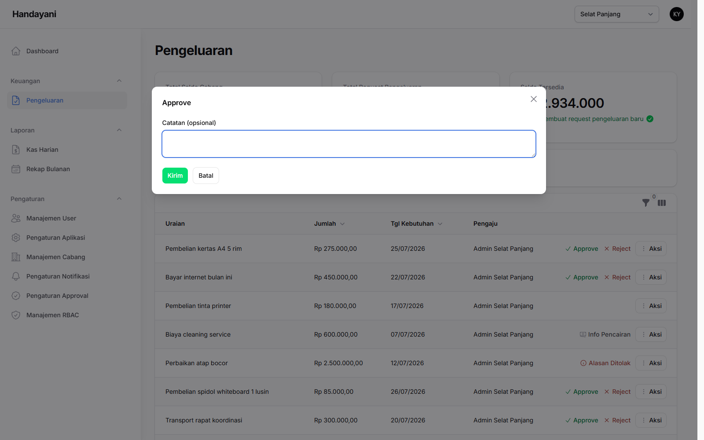

**Langkah 2 — Isi Catatan (opsional)** — misalnya batasan atau syarat pencairan. Boleh dikosongkan.

**Langkah 3 — Klik Kirim.**

Setelah disetujui, operator akan mendapat tombol **Cairkan**. **Pengeluaran baru tercatat di laporan setelah dicairkan operator**, bukan saat Anda menyetujui.

### 2.3 Menolak

**Langkah 1 — Klik Reject** pada baris pengajuan.

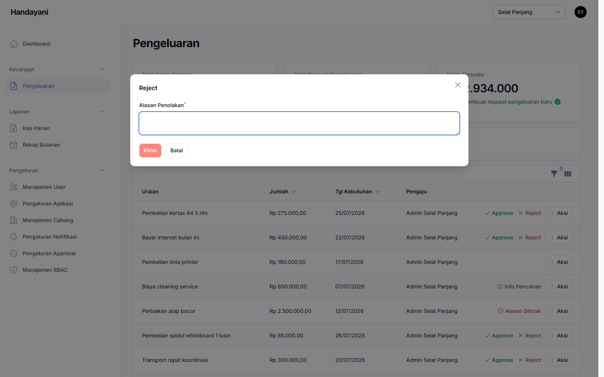

**Langkah 2 — Isi Alasan Penolakan.** Kolom ini **wajib diisi** — sistem tidak akan memproses penolakan tanpa alasan.

**Langkah 3 — Klik Kirim.**

Operator dapat membaca alasan Anda lewat tombol **Alasan Ditolak**, memperbaiki pengajuannya, lalu mengirim ulang.

> Tulis alasan yang konkret ("nota belum dilampirkan", "tunggu pencairan SPP bulan ini"). Alasan yang jelas mengurangi pengajuan ulang yang salah lagi.

---

## 3. Mengatur persetujuan otomatis

Bila pengeluaran kecil terlalu sering menumpuk di meja Anda, aktifkan persetujuan otomatis.

Buka **Pengaturan → Pengaturan Approval**.

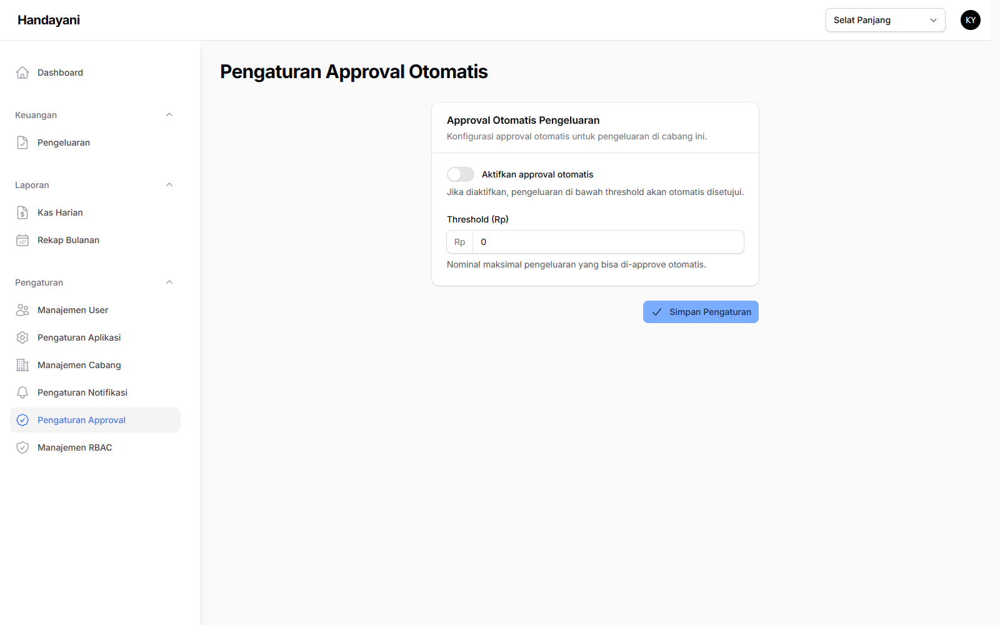

1. Aktifkan **Aktifkan approval otomatis**.
2. Isi **Threshold (Rp)** — batas nominal.
3. Simpan.

Setelah aktif, pengajuan **di bawah nilai ambang** langsung berstatus disetujui tanpa menunggu Anda. Pengajuan **di atas atau sama dengan nilai ambang** tetap memerlukan persetujuan manual.

> Pengaturan ini berlaku **per cabang**. Bila Anda mengelola beberapa cabang, ganti dulu cabang aktif di bagian atas layar, lalu atur satu per satu.
>
> Tetapkan ambang yang wajar — semua pengeluaran di bawahnya tetap tercatat di laporan, tetapi tidak lagi Anda periksa satu per satu sebelum terjadi.

---

## 4. Laporan keuangan

### 4.1 Kas Harian

**Laporan → Kas Harian**. Pilih **Bulan** dan **Tahun**. Menampilkan per tanggal: **Total Masuk**, **Total Keluar**, **Saldo**.

Klik **Detail** pada satu tanggal untuk melihat rinciannya. Bagian pengeluaran menampilkan kolom **Pengaju** dan **Penyetuju** — berguna untuk penelusuran bila ada yang perlu dipertanggungjawabkan.

### 4.2 Rekap Bulanan

**Laporan → Rekap Bulanan**. Pilih **Tahun**, dapatkan ringkasan per bulan. Ini yang paling cocok untuk laporan tahunan ke pengurus yayasan.

### 4.3 Mengunduh

Kedua laporan menyediakan:

- **Export PDF** — siap cetak dan diarsipkan
- **Export Excel/CSV** — untuk diolah lebih lanjut

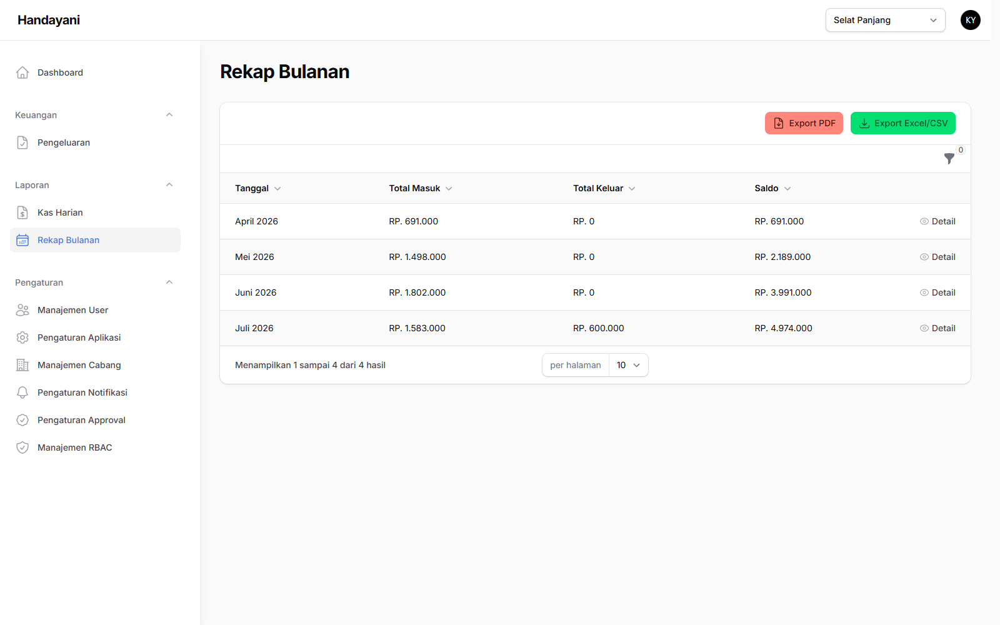

---

## 5. Mengelola akun staf

Buka **Pengaturan → Manajemen User**.

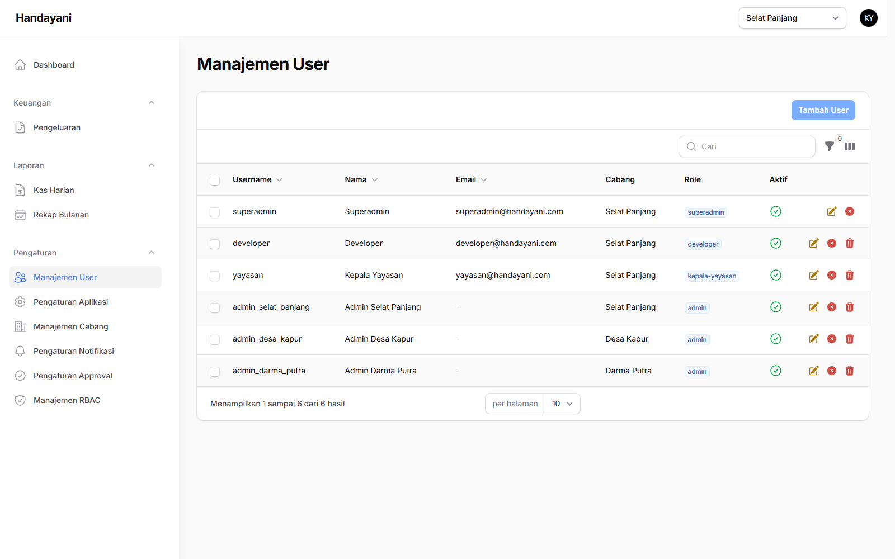

Tabel memuat username, nama, email, cabang, role, status aktif, dan tanggal dibuat. Gunakan penyaring **role** untuk melihat kelompok tertentu.

### 5.1 Menambah staf

**Langkah 1 — Klik Tambah User.** Jendela **Tambah User** terbuka.

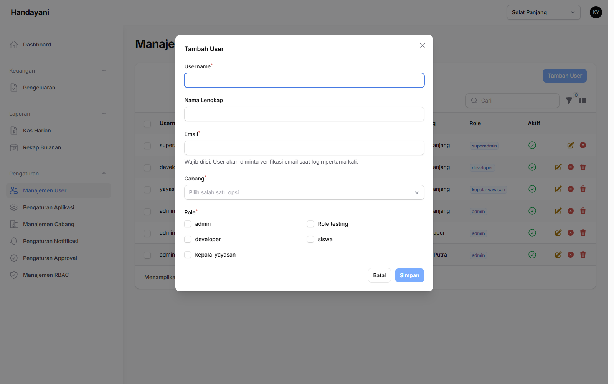

**Langkah 2 — Isi formulir:**

| Kolom | Isi | Wajib |
|---|---|---|
| **Username** | Nama pengguna, tanpa spasi (contoh: `admin_selat_panjang`) | Ya |
| **Nama Lengkap** | Nama orangnya | Tidak |
| **Email** | Alamat email aktif staf tersebut | Ya |
| **Cabang** | Cabang tempat staf bertugas | Ya |
| **Role** | Centang salah satu (lihat tabel di bawah) | Ya |

**Langkah 3 — Klik Simpan.**

> **Formulir ini tidak meminta password.** Staf baru mengaktifkan akunnya sendiri lewat email — sebagaimana keterangan di bawah kolom Email: *"Wajib diisi. User akan diminta verifikasi email saat login pertama kali."*
>
> Karena itu **pastikan alamat emailnya benar**. Salah ketik email berarti staf tersebut tidak akan pernah bisa masuk, dan Anda harus mengubahnya lewat **Ubah User**.

Role yang tersedia:

| Role | Untuk siapa |
|---|---|
| **admin** | Operator sekolah — data siswa, tagihan, pembayaran, laporan, pencairan pengeluaran |
| **kepala-yayasan** | Peran seperti Anda — pengawasan dan persetujuan |
| **superadmin** | Akses penuh ke seluruh sistem |
| **developer** | Peran teknis (pengaturan sistem) — biasanya hanya untuk vendor |
| **siswa** | Akun Portal untuk siswa/wali. **Jangan dibuat dari sini** — gunakan menu Manajemen Akun Siswa |

### 5.2 Mengubah, menonaktifkan, menghapus

- **Ubah User** — mengganti data atau role.
- **Aktifkan / Nonaktifkan** — akun nonaktif tidak bisa masuk, tetapi datanya tetap tersimpan.
- **Hapus User** — permanen.

> Untuk staf yang berhenti bekerja, **nonaktifkan** — jangan dihapus. Menghapus akun menghilangkan jejak siapa yang dulu mengajukan atau menyetujui pengeluaran di laporan.

---

## 6. Mengelola cabang

Buka **Pengaturan → Manajemen Cabang**.

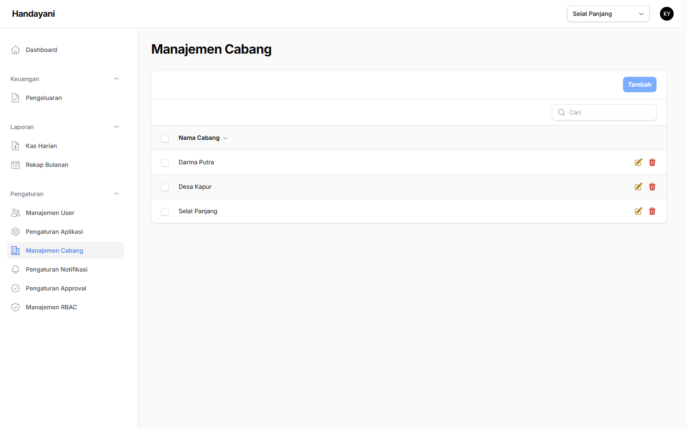

**Menambah cabang:**

**Langkah 1 — Klik Tambah.** Jendela **Tambah Cabang** terbuka.

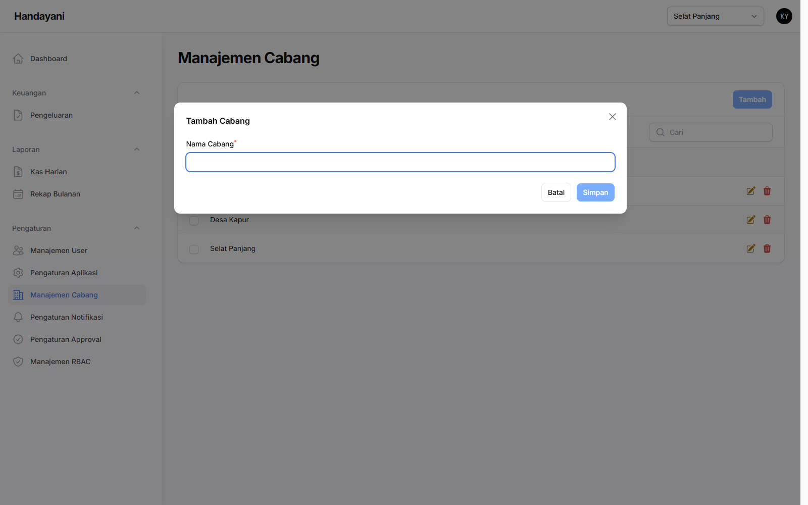

**Langkah 2 — Isi Nama Cabang**, lalu klik **Simpan**.

**Mengubah atau menghapus** — gunakan tombol pada baris cabang yang bersangkutan (**Ubah Cabang** / **Hapus Cabang**), atau centang beberapa baris lalu **Hapus Terpilih**.

Setiap cabang punya data siswa, tagihan, kas, dan pengaturan approval sendiri. Untuk berpindah antar cabang, gunakan pemilih cabang di bagian atas layar.

> Jangan menghapus cabang yang masih memiliki data siswa atau transaksi. Setelah cabang dihapus, laporan keuangan cabang tersebut ikut hilang dari sistem.

---

## 7. Pengaturan identitas sekolah

Buka **Pengaturan → Pengaturan Aplikasi**.

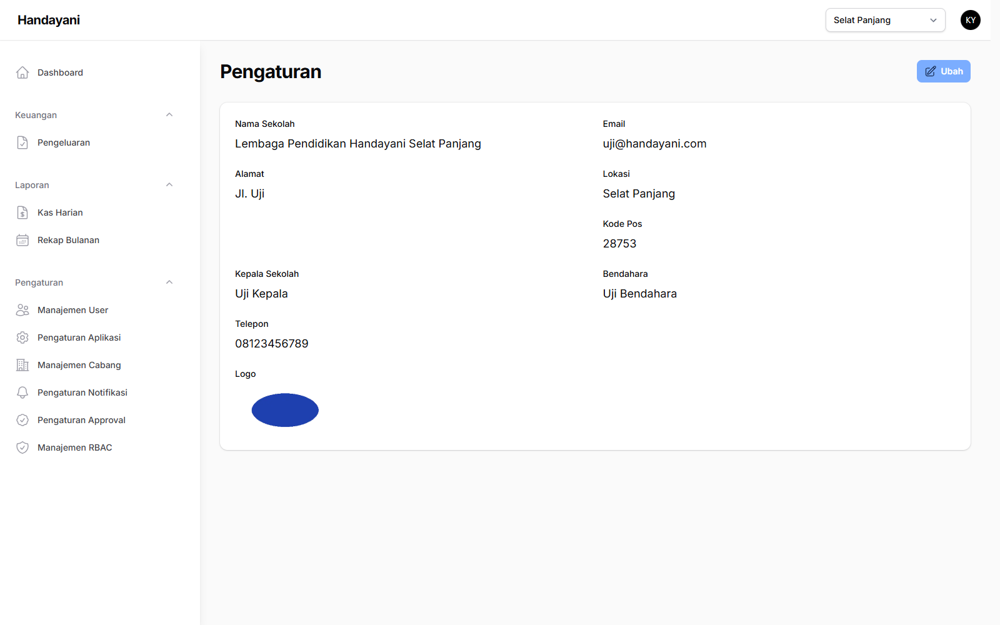

**Langkah 1 — Klik Ubah.** Formulir **Ubah Pengaturan Sekolah** terbuka, terdiri dari tiga bagian.

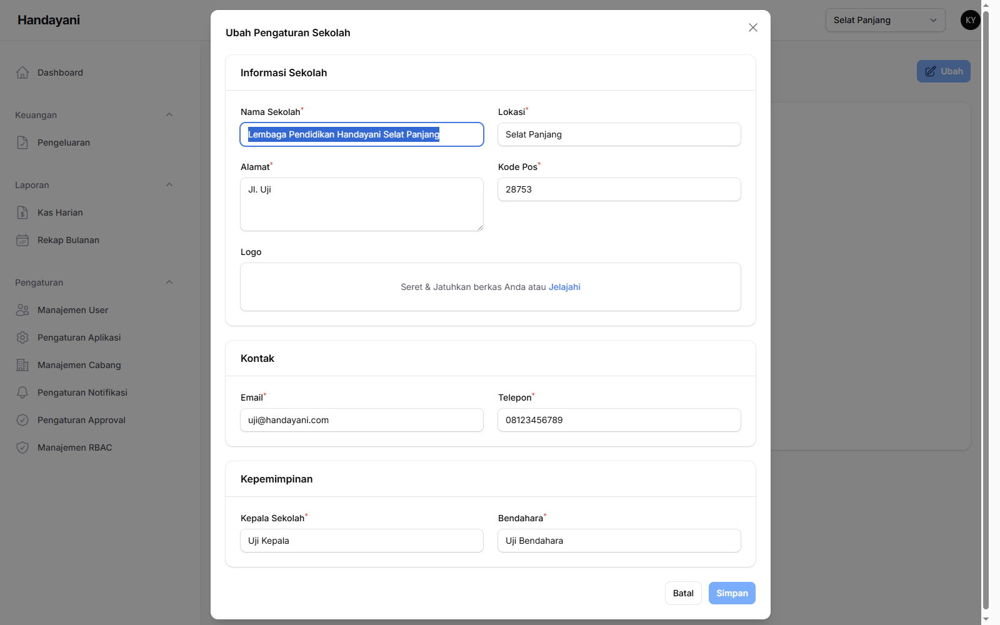

**Langkah 2 — Isi tiga bagian berikut:**

| Bagian | Kolom |
|---|---|
| **Informasi Sekolah** | Nama Sekolah, Lokasi, Alamat, Kode Pos, Logo |
| **Kontak** | Email, Telepon |
| **Kepemimpinan** | Kepala Sekolah, Bendahara |

Untuk **Logo**, seret berkas gambarnya ke kotak yang tersedia atau klik **Jelajahi**.

**Langkah 3 — Klik Simpan.**

> Data ini **muncul di kwitansi dan laporan PDF** yang diterima wali murid. Nama kepala sekolah dan bendahara dipakai sebagai penanda tangan, dan logo tampil pada tampilan aplikasi.
>
> Perbarui setiap ada pergantian jabatan — kwitansi yang dicetak setelahnya langsung memakai nama yang baru.

---

## 8. Pengaturan notifikasi email

Buka **Pengaturan → Pengaturan Notifikasi**.

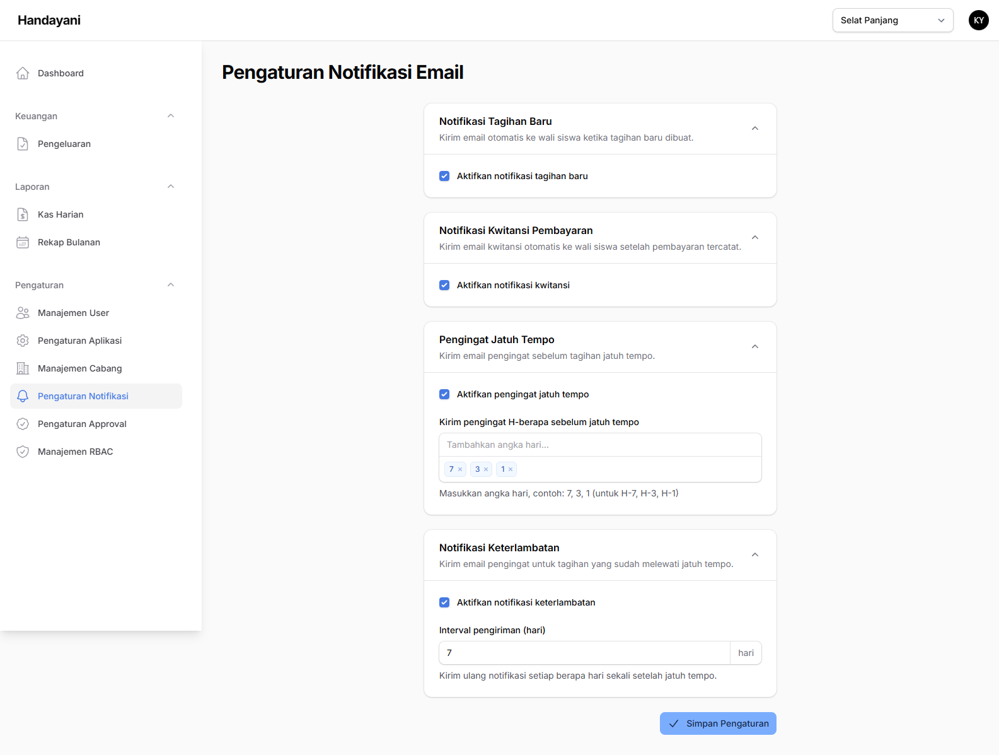

**Langkah 1 — Aktifkan/nonaktifkan toggle** untuk tiap jenis email yang ingin Anda kendalikan:

| Jenis | Kapan dikirim |
|---|---|
| **Notifikasi Tagihan Baru** | Saat tagihan diterbitkan |
| **Notifikasi Kwitansi Pembayaran** | Setiap pembayaran berhasil |
| **Pengingat Jatuh Tempo** | Beberapa hari sebelum jatuh tempo — tentukan H-berapa, boleh lebih dari satu (contoh: 7, 3, 1) |
| **Notifikasi Keterlambatan** | Setelah lewat jatuh tempo — tentukan **Interval pengiriman (hari)** |

**Langkah 2 — Isi angka H- atau interval** pada jenis yang memerlukannya.

**Langkah 3 — Klik Simpan.**

> Ini kebijakan komunikasi ke wali murid, bukan sekadar pengaturan teknis. Pengingat yang terlalu sering dapat menimbulkan keluhan; yang terlalu jarang membuat tunggakan menumpuk.
>
> Wali murid tetap dapat mematikan sendiri jenis email tertentu dari halaman Profil mereka.

Pemantauan email yang gagal terkirim (menu **Log Notifikasi**) ada pada akun operator sekolah, bukan akun Anda. Bila ada keluhan wali murid tidak menerima email, minta operator memeriksanya dan mengirim ulang.

---

## 9. Mengatur profil sendiri

Klik avatar Anda di pojok kanan atas, lalu pilih **Profil Saya**.

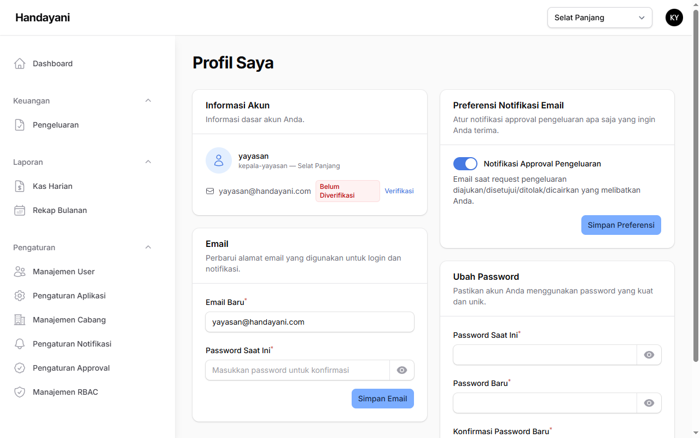

**Informasi Akun** — menampilkan username, role, dan cabang. Bila email sudah diisi tetapi belum diverifikasi, muncul keterangan **"Belum Diverifikasi"** beserta tombol **Verifikasi**.

**Email** — isi **Email Baru** dan **Password Saat Ini**, lalu klik **Simpan Email**.

**Preferensi Notifikasi Email** — toggle **Notifikasi Approval Pengeluaran** menentukan apakah Anda menerima email saat ada request pengeluaran yang diajukan, disetujui, ditolak, atau dicairkan. Klik **Simpan Preferensi** setelah mengubah. Bagian ini baru muncul setelah email Anda diatur.

**Ubah Password** — isi **Password Saat Ini**, **Password Baru**, **Konfirmasi Password Baru**, lalu klik **Ubah Password**.

---

## 10. Troubleshooting

### Tidak bisa masuk

| Pesan | Penyebab | Solusi |
|---|---|---|
| "Username/email atau kata sandi salah." | Salah ketik, atau memakai username | Gunakan **alamat email** Anda, bukan username. Periksa Caps Lock. |
| "Akun tidak aktif. Hubungi admin sekolah." | Akun dinonaktifkan | Hubungi Superadmin atau pengelola sistem. |
| "Tidak dapat terhubung ke server." | Jaringan atau server bermasalah | Periksa koneksi. Bila normal, hubungi pengelola sistem. |
| Diblokir setelah gagal berkali-kali | Batas 5 percobaan | Tunggu beberapa menit. |

### Angka di dashboard terasa tidak wajar

1. Periksa **cabang aktif** di bagian atas layar — mungkin Anda melihat cabang lain.
2. Periksa dropdown **Periode:** — bagian "Periode Ini" hanya menghitung periode terpilih.
3. Ingat bahwa pengeluaran baru masuk laporan **setelah dicairkan operator**, bukan saat Anda menyetujui. Pengeluaran yang sudah Anda setujui tetapi belum dicairkan belum mengurangi saldo.

### Kartu dashboard menampilkan "Tidak tersedia"

Muncul dengan keterangan "Data gagal dimuat dari server". Muat ulang halaman. Bila tetap, hubungi pengelola sistem.

### Tidak ada pengajuan pengeluaran yang muncul

Pengajuan baru terlihat setelah operator menekan **Submit**. Selama masih draf, pengajuan tidak masuk antrean Anda. Periksa juga penyaring **Status** dan cabang aktif.

### Pengeluaran langsung disetujui tanpa saya periksa

Persetujuan otomatis sedang aktif dan nominalnya di bawah ambang. Periksa **Pengaturan → Pengaturan Approval** untuk cabang tersebut.

### Menu yang dicari tidak ada

Beberapa menu memang tidak diberikan ke peran Kepala Yayasan — misalnya penerbitan tagihan dan pencatatan pembayaran, yang menjadi tugas operator. Bila Anda memang memerlukan akses tambahan, hubungi Superadmin.

### Tiba-tiba keluar sendiri dari aplikasi

Sesi berlaku 8 jam, atau akun Anda dipakai masuk di perangkat lain. Masuk kembali.
