# Panduan Siswa & Wali Murid

Panduan ini untuk siswa dan orang tua/wali. Lewat Portal, Anda dapat melihat tagihan sekolah, membayar secara online, dan mengunduh kwitansi kapan saja.

## Daftar isi

1. [Masuk pertama kali](#1-masuk-pertama-kali)
2. [Mengenal tampilan Portal](#2-mengenal-tampilan-portal)
3. [Beranda](#3-beranda)
4. [Melihat tagihan](#4-melihat-tagihan)
5. [Membayar secara online](#5-membayar-secara-online)
6. [Membayar beberapa tagihan sekaligus](#6-membayar-beberapa-tagihan-sekaligus)
7. [Memantau status pembayaran](#7-memantau-status-pembayaran)
8. [Riwayat pembayaran dan kwitansi](#8-riwayat-pembayaran-dan-kwitansi)
9. [Profil dan pengaturan email](#9-profil-dan-pengaturan-email)
10. [Lupa password](#10-lupa-password)
11. [Troubleshooting](#11-troubleshooting)

---

## 1. Masuk pertama kali

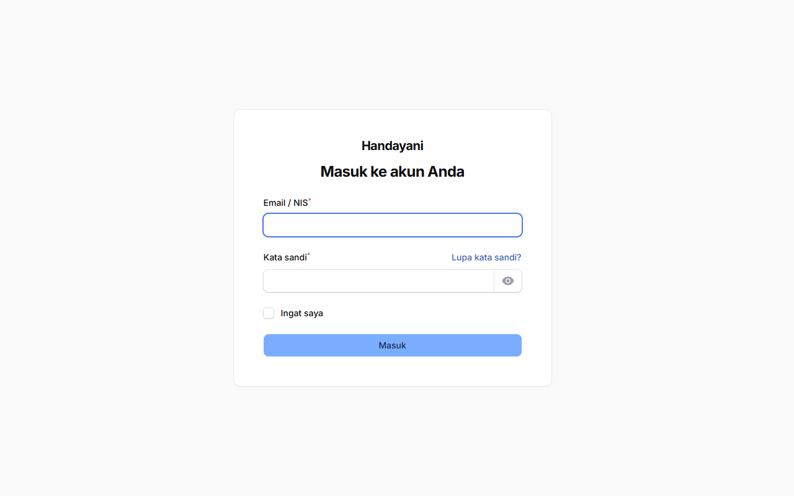

1. Buka alamat aplikasi di browser.
2. Pada kolom **Email / NIS**, isi **NIS siswa** (nomor induk siswa dari sekolah).
3. Pada kolom **Password**, isi **tanggal lahir siswa** dengan format hari-bulan-tahun tanpa pemisah.

   Contoh: siswa lahir **7 Agustus 2015** → password `07082015`.
4. Klik tombol masuk.

Bila NIS atau tanggal lahir tidak Anda ketahui, tanyakan ke admin sekolah. Sekolah juga dapat mencetakkan lembar berisi username dan password Anda.

> Akun Portal **dibuat oleh sekolah**. Tidak ada pendaftaran mandiri.

### Wajib mendaftarkan email dan mengganti password

Pada login pertama, Anda langsung diarahkan ke halaman **Ubah Password**. Anda belum bisa memakai Portal sebelum langkah ini selesai.

**Tahap 1 — Mendaftarkan email**

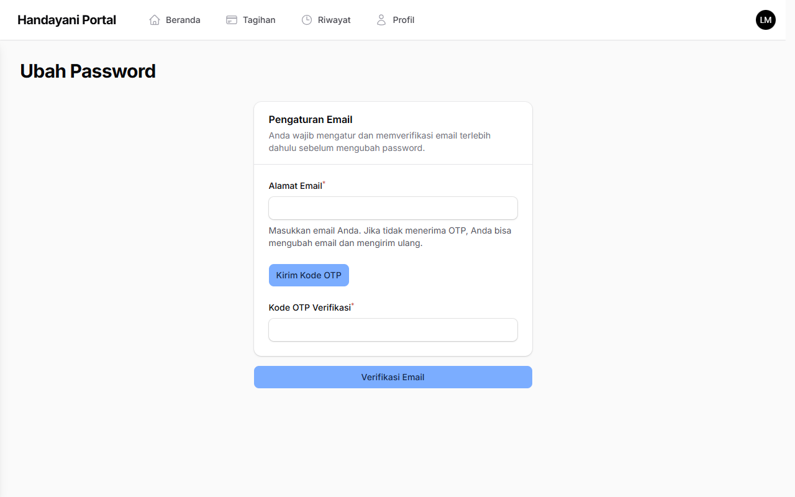

1. Isi **Alamat Email** dengan email yang aktif dan sering Anda buka.
2. Klik **Kirim Kode OTP**.
3. Buka email Anda — ada kode berisi **6 angka**.
4. Isikan kode tersebut ke kolom **Kode OTP Verifikasi**.
5. Klik **Verifikasi Email**.

Kode tidak masuk? Periksa folder **Spam**. Anda juga boleh mengganti alamat email di kolom yang sama lalu mengirim ulang kodenya.

**Tahap 2 — Mengganti password**

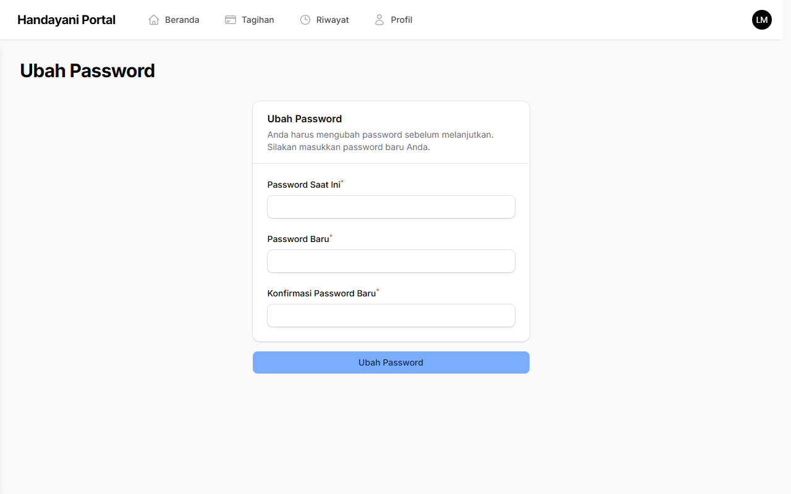

1. **Password Saat Ini** — isi tanggal lahir (DDMMYYYY).
2. **Password Baru** — minimal 8 karakter.
3. **Konfirmasi Password Baru** — ulangi persis.
4. Klik **Ubah Password**.

> **Setelah berhasil, Anda akan otomatis dikeluarkan dan kembali ke halaman login. Ini normal.**
> Masuk kembali dengan NIS dan **password baru** Anda. Banyak orang mengira ini kesalahan sistem — bukan.

Email yang Anda daftarkan dipakai untuk mengirim pemberitahuan tagihan, pengingat jatuh tempo, kwitansi, dan untuk memulihkan password bila lupa. Pastikan alamatnya benar.

---

## 2. Mengenal tampilan Portal

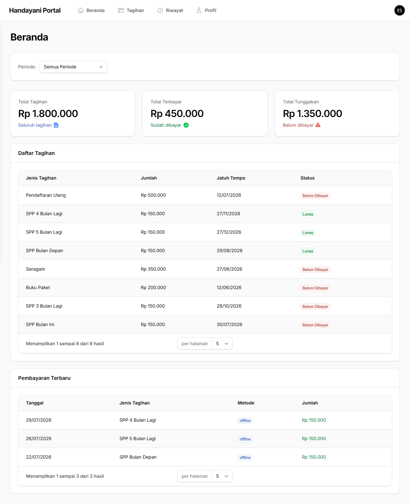

Menu terletak di **bagian atas layar**, terdiri dari empat pilihan:

| Menu | Isinya |
|---|---|
| **Beranda** | Ringkasan tagihan dan pembayaran terbaru |
| **Tagihan** | Daftar tagihan dan tombol bayar |
| **Riwayat** | Seluruh pembayaran yang pernah dilakukan, beserta kwitansi |
| **Profil** | Data diri, ubah email/password, pengaturan notifikasi |

Untuk keluar, klik nama Anda di pojok kanan atas → **Logout**.

---

## 3. Beranda

Di bagian atas ada dropdown **Periode:**. Pilihan **Semua Periode** menampilkan seluruh tahun ajaran; Anda juga dapat memilih satu tahun ajaran tertentu.

Tiga kartu ringkasan:

| Kartu | Artinya |
|---|---|
| **Total Tagihan** | Seluruh tagihan yang pernah diterbitkan untuk Anda |
| **Total Terbayar** | Yang sudah Anda bayar |
| **Total Tunggakan** | Yang **masih harus dibayar** |

Di bawahnya, bagian **Daftar Tagihan** menampilkan jenis tagihan, jumlah, jatuh tempo, dan status:

- Badge **Lunas** (hijau) — sudah selesai
- Badge **Belum Lunas** (kuning) — masih ada sisa
- Badge merah — tagihan yang perlu segera diperhatikan

Bagian **Pembayaran Terbaru** menampilkan transaksi terakhir Anda.

---

## 4. Melihat tagihan

Buka menu **Tagihan**.

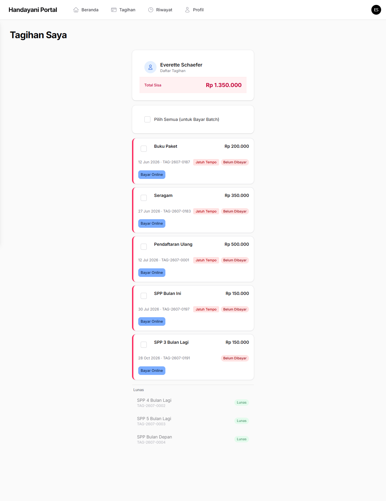

Setiap tagihan ditampilkan sebagai satu kartu berisi nama jenis tagihan, kode tagihan, sisa yang harus dibayar, tanggal **Jatuh Tempo**, dan status.

Kotak **Total Sisa** berwarna merah di bagian atas menunjukkan jumlah keseluruhan yang masih harus dibayar.

Tagihan yang sudah selesai dipindahkan ke bagian terpisah berjudul **Lunas** di bagian bawah halaman.

---

## 5. Membayar secara online

> Tombol pembayaran online hanya muncul bila sekolah Anda mengaktifkan layanan ini. Bila tidak ada, pembayaran dilakukan langsung di sekolah.

**Langkah 1 — Buka jendela pembayaran**

Di menu **Tagihan**, klik **Bayar Online** pada tagihan yang dituju. Akan muncul jendela pembayaran berisi kolom **Nominal Pembayaran** yang sudah terisi otomatis sebesar sisa tagihan:

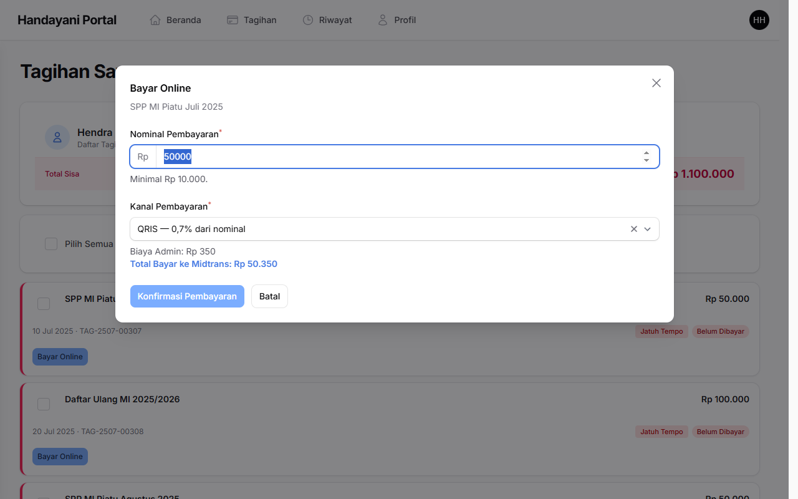

- Anda boleh mengurangi nominal untuk membayar **sebagian** (mencicil).
- Minimal **Rp 10.000**.
- Tidak boleh melebihi sisa tagihan.

**Langkah 2 — Pilih Kanal Pembayaran**

Klik kolom **Kanal Pembayaran** untuk membuka daftar cara bayar beserta biaya adminnya masing-masing (QRIS, Bank Transfer/Virtual Account, GoPay, ShopeePay, Kartu Kredit, dan lainnya):

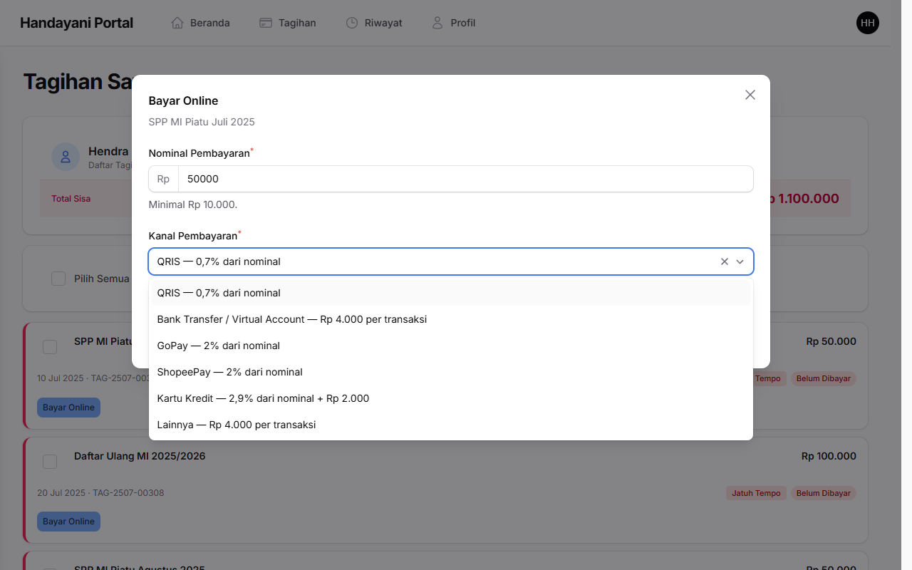

Pilih salah satu. Bila ingin biaya admin lebih murah, bandingkan dulu beberapa kanal sebelum melanjutkan.

**Langkah 3 — Periksa ringkasan biaya**

Setelah memilih kanal, dua baris di bawahnya berubah mengikuti pilihan Anda:

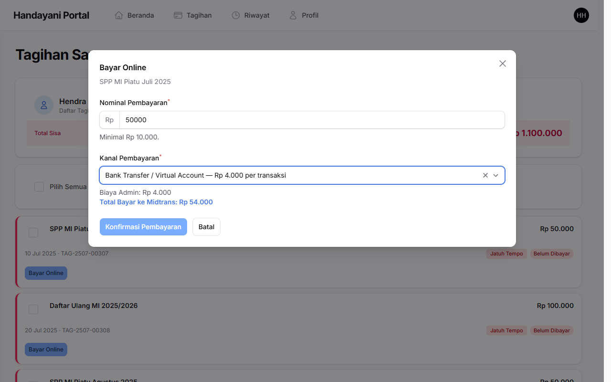

- **Biaya Admin** — biaya layanan pembayaran online
- **Total Bayar ke Midtrans** — **jumlah yang benar-benar Anda transfer**

**Langkah 4 — Konfirmasi dan selesaikan pembayaran**

Klik **Konfirmasi Pembayaran**. Anda akan dibawa ke halaman pembayaran Midtrans:

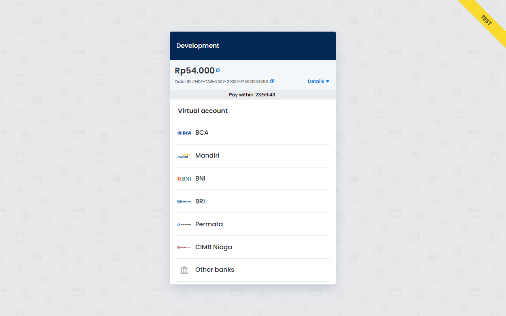

Ikuti petunjuk di sana sesuai kanal yang dipilih (pindai QR, transfer ke nomor virtual account, atau bayar lewat e-wallet). Setelah selesai, Anda kembali ke halaman **Status Pembayaran** (lihat bagian 7).

> **Jangan menutup halaman pembayaran sebelum menyelesaikan transaksi.** Bila terlanjur tertutup, jangan membuat pembayaran baru — gunakan tombol **Lanjutkan Pembayaran** (lihat bagian 7).

---

## 6. Membayar beberapa tagihan sekaligus

Bila ada beberapa tagihan yang ingin dilunasi bersamaan:

**Langkah 1 — Centang tagihan yang ingin dibayar**

Centang kotak di setiap tagihan yang dituju, atau centang **Pilih Semua (untuk Bayar Batch)** di bagian atas untuk memilih seluruhnya. Begitu ada tagihan yang tercentang, muncul bar terapung di bagian bawah layar berisi jumlah tagihan terpilih dan totalnya:

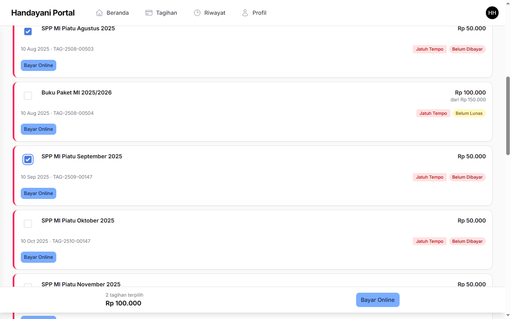

**Langkah 2 — Klik Bayar Online pada bar**

Klik tombol **Bayar Online** pada bar tersebut. Jendela pembayaran muncul — berbeda dengan pembayaran satu tagihan, di sini **tidak ada kolom Nominal Pembayaran**, hanya pilihan **Kanal Pembayaran** langsung:

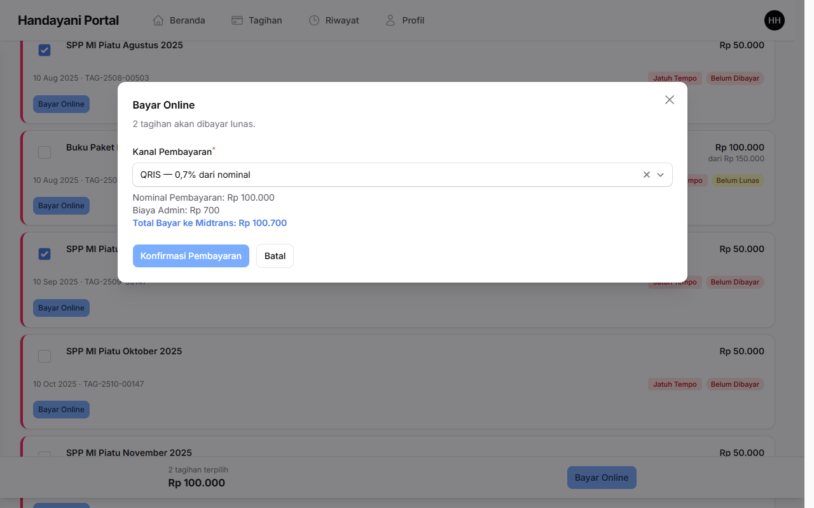

**Langkah 3 — Pilih Kanal Pembayaran dan konfirmasi**

Pilih **Kanal Pembayaran**, periksa **Nominal Pembayaran** (jumlah gabungan), **Biaya Admin**, dan **Total Bayar ke Midtrans**, lalu klik **Konfirmasi Pembayaran**.

Catatan:

- Pembayaran gabungan selalu **melunasi penuh** setiap tagihan yang dipilih — tidak bisa dicicil.
- Maksimal 50 tagihan dalam satu kali pembayaran.

---

## 7. Memantau status pembayaran

Setelah membayar, Anda diarahkan ke halaman **Status Pembayaran**. Halaman ini memeriksa status secara otomatis setiap beberapa detik.

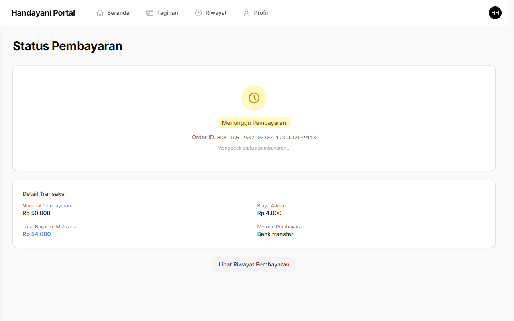

| Status | Artinya | Yang perlu dilakukan |
|---|---|---|
| **Menunggu Pembayaran** | Transaksi dibuat, dana belum diterima | Selesaikan pembayaran sesuai kanal yang dipilih |
| **Pembayaran Berhasil** | Dana sudah diterima | Selesai — unduh kwitansi |
| **Pembayaran Gagal** | Transaksi ditolak | Ulangi pembayaran |
| **Pembayaran Kadaluarsa** | Melewati batas waktu | Buat pembayaran baru dari menu Tagihan |
| **Pembayaran Dibatalkan** | Transaksi dibatalkan | Buat pembayaran baru bila masih ingin membayar |

Bagian **Detail Transaksi** memuat Nominal Pembayaran, Biaya Admin, Total Bayar ke Midtrans, dan Metode Pembayaran.

Bila status berhasil, tersedia tombol **Unduh Kwitansi**.

> Halaman ini berhenti memeriksa otomatis setelah sekitar 2 menit. Bila muncul pesan agar mengecek di Riwayat Pembayaran, buka menu **Riwayat** — status di sana selalu yang terbaru. Uang Anda tidak hilang; sistem pembayaran memang kadang butuh waktu.

### Melanjutkan pembayaran yang tertunda

Selama masih ada transaksi yang belum selesai untuk sebuah tagihan, kartu tagihan tersebut di menu **Tagihan** otomatis berubah: badge status menjadi **Menunggu Pembayaran** dan tombolnya berganti dari **Bayar Online** menjadi **Lanjutkan Pembayaran**.

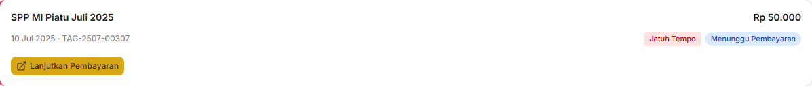

Klik **Lanjutkan Pembayaran** untuk kembali ke halaman pembayaran Midtrans yang sama persis (kanal dan nominal yang sudah dipilih sebelumnya).

> **Jangan membuat transaksi baru** untuk tagihan yang sama. Tunggu sampai yang lama selesai atau kadaluarsa, agar Anda tidak membayar dua kali.

---

## 8. Riwayat pembayaran dan kwitansi

Buka menu **Riwayat**.

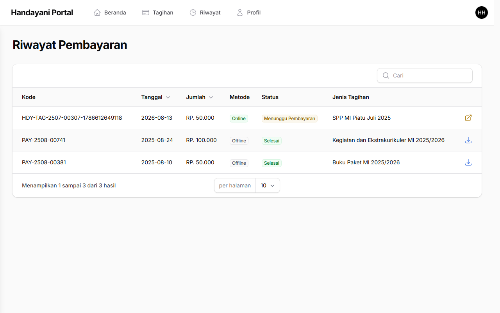

Tabel memuat seluruh pembayaran Anda — baik yang dibayar online maupun yang dibayar langsung di sekolah:

| Kolom | Keterangan |
|---|---|
| **Kode** | Nomor pembayaran |
| **Tanggal** | Waktu pembayaran |
| **Jumlah** | Nominal |
| **Metode** | **Online** (dibayar sendiri lewat Portal) atau **Offline** (dibayar di sekolah) |
| **Status** | **Selesai** atau **Menunggu Pembayaran** |
| **Jenis Tagihan** | Tagihan yang dibayar |

Di ujung kanan setiap baris (kolom **Aksi**) ada satu tombol berbentuk ikon kecil yang berbeda tergantung status baris tersebut:

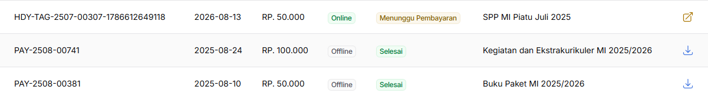

- **Lihat Status** — ikon panah, muncul pada transaksi yang masih **Menunggu Pembayaran**; membuka kembali halaman Status Pembayaran transaksi tersebut.
- **Kwitansi** — ikon panah ke bawah, muncul pada transaksi yang sudah **Selesai**; klik untuk langsung mengunduh bukti pembayaran dalam bentuk PDF ke perangkat Anda.

> Simpan kwitansi Anda. Kwitansi dapat diunduh ulang kapan saja dari halaman ini.

---

## 9. Profil dan pengaturan email

Buka menu **Profil**.

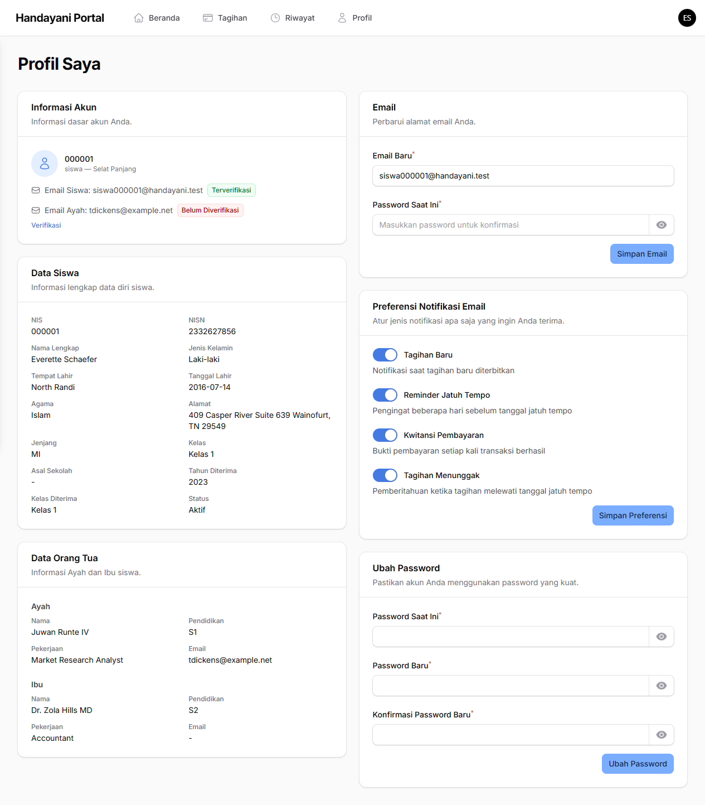

Bagian-bagian yang tersedia:

**Informasi Akun** — username, email, dan status verifikasi email.

**Data Siswa** *(hanya bisa dilihat)* — NIS, NISN, nama, tempat & tanggal lahir, jenjang, kelas, dan lainnya. Bila ada data yang keliru, hubungi admin sekolah — data ini tidak bisa Anda ubah sendiri.

**Data Orang Tua / Data Wali** — nama, pendidikan, pekerjaan, dan email ayah/ibu/wali. Bila email orang tua belum diverifikasi, muncul badge **Belum Diverifikasi** beserta tombol **Verifikasi** di sebelahnya (bagian **Informasi Akun** di atasnya).

**Cara memverifikasi email orang tua:**

1. Klik **Verifikasi** di samping email yang berstatus **Belum Diverifikasi**.
2. Sistem langsung mengirim kode OTP dan menampilkan jendela berisi kolom **Kode OTP**:

   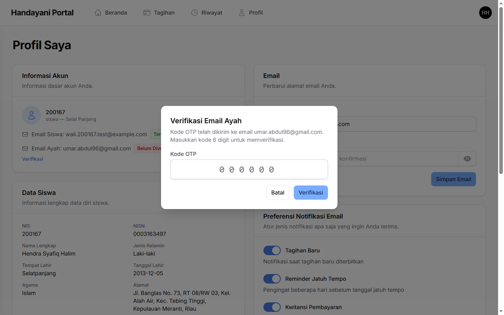
3. Buka email orang tua yang dituju, salin kode 6 angka yang diterima.
4. Masukkan ke kolom **Kode OTP**, lalu klik **Verifikasi**.

Email yang sudah terverifikasi akan menerima pemberitahuan tagihan dan kwitansi.

**Email** — mengubah alamat email akun Anda. Isi **Email Baru** dan **Password Saat Ini**, lalu klik **Simpan Email**.

**Preferensi Notifikasi Email** — Anda menentukan sendiri email apa saja yang ingin diterima lewat 4 toggle:

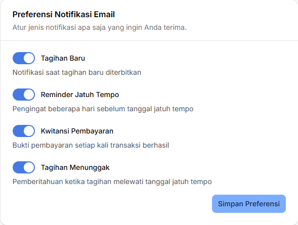

| Pilihan | Isinya |
|---|---|
| **Tagihan Baru** | Pemberitahuan saat tagihan baru diterbitkan |
| **Reminder Jatuh Tempo** | Pengingat beberapa hari sebelum jatuh tempo |
| **Kwitansi Pembayaran** | Bukti pembayaran setiap transaksi berhasil |
| **Tagihan Menunggak** | Pemberitahuan bila tagihan melewati jatuh tempo |

Geser toggle yang diinginkan, lalu klik **Simpan Preferensi**.

> Sebaiknya **biarkan Reminder Jatuh Tempo tetap aktif** agar Anda tidak terlambat membayar.

**Ubah Password** — isi **Password Saat Ini**, **Password Baru** (minimal 8 karakter), dan **Konfirmasi Password Baru**. Berbeda dengan penggantian password pertama kali, di sini Anda tidak akan dikeluarkan dari aplikasi.

---

## 10. Lupa password

Bisa dilakukan sendiri **bila email Anda sudah didaftarkan dan diverifikasi**.

1. Di halaman login, klik tautan **Lupa kata sandi?** di sebelah kolom Kata sandi.
2. Isi alamat email Anda, lalu kirim.
3. Buka email dan klik tautan reset. **Tautan hanya berlaku 60 menit.**
4. Isi **Password Baru** (minimal 8 karakter) dan **Konfirmasi Password**.
5. Masuk kembali dengan password baru.

> Sistem selalu menampilkan pesan berhasil, **walaupun email yang Anda ketik belum terdaftar** — ini demi keamanan. Bila dalam beberapa menit tidak ada email masuk (sudah termasuk cek folder Spam), berarti email tersebut memang belum terdaftar.

**Belum punya email terdaftar?** Hubungi admin sekolah untuk melakukan reset. Password akan dikembalikan ke tanggal lahir siswa, dan Anda akan diminta membuat password baru saat masuk.

---

## 11. Troubleshooting

### Tidak bisa masuk

| Gejala | Penyebab | Solusi |
|---|---|---|
| "Username/email atau kata sandi salah." | Salah NIS atau salah format tanggal lahir | Password awal adalah tanggal lahir **DDMMYYYY** — 8 angka, tanpa titik/garis miring. Contoh: `07082015`. Bila sudah pernah ganti password, gunakan password baru Anda. |
| "Akun tidak aktif. Hubungi admin sekolah." | Akun dinonaktifkan sekolah | Hubungi admin sekolah. |
| "Tidak dapat terhubung ke server." | Masalah jaringan | Periksa koneksi internet Anda, lalu coba lagi. |
| Tidak bisa mencoba lagi | Sudah 5 kali salah | Tunggu beberapa menit. |

### Sudah ganti password, lalu tiba-tiba keluar sendiri

Ini normal. Setelah penggantian password pertama kali, sistem sengaja mengeluarkan Anda. Masuk kembali dengan password baru.

### Kode OTP tidak masuk ke email

1. Periksa folder **Spam** atau **Promosi**.
2. Tunggu 1–2 menit — email tidak selalu langsung sampai.
3. Pastikan alamat email tidak salah ketik. Bila salah, ubah di kolom yang sama lalu kirim ulang.

### Tombol "Bayar Online" tidak ada

Sekolah Anda belum mengaktifkan pembayaran online, atau tagihan tersebut sudah lunas. Pembayaran dapat dilakukan langsung di sekolah.

### Pesan saat akan membayar

| Pesan | Artinya |
|---|---|
| "Tagihan sudah lunas." | Tagihan sudah dibayar. Muat ulang halaman. |
| "Nominal pembayaran minimal Rp 10.000." | Naikkan nominal pembayaran Anda. |
| "Nominal melebihi sisa tagihan." | Nominal yang diisi lebih besar dari sisa tagihan. Kurangi. |
| "Layanan pembayaran online belum dikonfigurasi. Hubungi admin." | Sekolah belum menyiapkan pembayaran online. Bayar di sekolah. |
| "Layanan pembayaran online sedang tidak tersedia. Coba lagi nanti." | Gangguan sementara. Coba beberapa saat lagi. |

### Sudah bayar tapi status masih "Menunggu Pembayaran"

1. Tunggu beberapa menit — konfirmasi dari bank/e-wallet kadang butuh waktu.
2. Buka menu **Riwayat** dan periksa kembali statusnya di sana.
3. Bila lebih dari 1 jam belum berubah padahal dana sudah terpotong, hubungi admin sekolah dan sebutkan **Order ID** yang tertera di halaman Status Pembayaran. Admin dapat menyinkronkan status Anda.

### Halaman pembayaran tertutup sebelum selesai

Buka menu **Tagihan**, klik **Bayar Online** pada tagihan yang sama. Akan muncul pemberitahuan bahwa ada pembayaran yang masih diproses — klik **Lanjutkan Pembayaran**. **Jangan membuat transaksi baru**, agar tidak terbayar dua kali.

### Kwitansi gagal diunduh

Muncul pesan "Kwitansi tidak tersedia". Muat ulang halaman dan coba lagi. Bila tetap gagal, hubungi admin sekolah.

### Data siswa di Profil ada yang salah

Data siswa hanya dapat diubah oleh sekolah. Hubungi admin sekolah untuk memperbaikinya.

### Tagihan yang seharusnya ada tidak muncul

Periksa dropdown **Periode:** di halaman Beranda — mungkin sedang menampilkan tahun ajaran lain. Pilih **Semua Periode**. Bila tetap tidak ada, hubungi admin sekolah.
