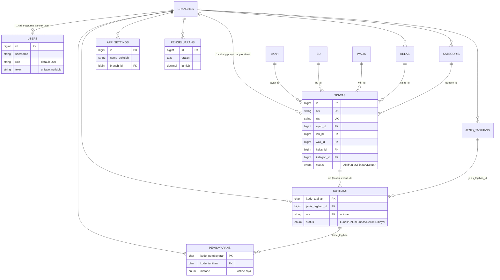

# Tracking Perubahan Sistem

**Rentang commit:** `37ff85a9` (Merge PR #10 dev-fio) → `26e9339` (HEAD, branch `v3-last-project`)
**Periode:** 29 April 2026 – 23 Juli 2026
**Jumlah commit:** 74 commit (49 commit sampai `34451d1`, sudah tercatat di revisi dokumen sebelumnya + 23 commit sampai `93f02c9` (tercatat di revisi sebelumnya): `d40da34`, `f45c7ae`, `361ce37`, `52a8f25`, `2cc667c`, `2f84a0a`, `4a9ec63`, `ad2e9ab`, `3d3e295`, `a5bdf76`, `55352e9`, `a71bdd0`, `1d896e1`, `53515d2`, `1ebf989`, `7ebe33f`, `33070b1`, `21b6529`, `630a31d`, `574d551`, `fc34f17`, `245569c`, `93f02c9` + 2 commit baru: `48e9c07` (update dokumentasi tracking/komparasi), `26e9339` (audit & pembersihan dead code — lihat Bagian 10))

> Catatan metodologi: dokumen ini dideskripsikan berdasarkan **kondisi kode saat ini** (commit HEAD, tidak ada working-tree tersisa — seluruh perubahan sudah di-`git commit`), bukan sebagai catatan harian per sesi kerja — setiap sub-bagian fitur ditulis sebagai deskripsi state final, dengan detail commit/tanggal hanya sebagai referensi historis. Isi diverifikasi ulang lewat `git show`/`git diff` per commit (bukan disalin mentah dari draft sebelumnya) per 22 Juli 2026, dikecualikan `graphify-out/`, lockfile (`composer.lock`, `package-lock.json`), dan artefak build. **Catatan revisi ini**: beberapa paragraf pada revisi dokumen sebelumnya menandai sejumlah perilaku (branch-scoping Transaksi Midtrans, pengelompokan audience & validasi toggle RBAC, logging notifikasi workflow, alasan login akun nonaktif) sebagai "working-tree belum di-`git commit`" — semuanya sudah menjadi commit resmi sejak saat itu (`361ce37`, `f45c7ae`, `4a9ec63`, `3d3e295`), caption tersebut sudah diperbaiki di masing-masing sub-bagian pada revisi ini untuk mengutip hash commit yang benar. Isi satu paragraf (unsubscribe link di email workflow, section 1.4) juga dikoreksi karena perilakunya sudah berubah lagi sejak deskripsi lama ditulis — link unsubscribe di email digantikan toggle preferensi di halaman profil (`4a9ec63`).

---

## 1. Fitur Baru

### 1.1 Midtrans Payment Gateway (pembayaran online)
> ⚠️ **Status vs proposal TA:** Sebagian di luar scope — inti pembayaran Midtrans sesuai rencana; dukungan batch payment (bayar banyak tagihan sekaligus) adalah tambahan di luar rencana.

Modul lengkap integrasi Midtrans Snap ditambahkan di `backend/app/Services/Midtrans/`: `MidtransClient`, `MidtransSnapClient`, `MidtransInitiationService`, `MidtransNotificationService`, `MidtransStatusSyncService`, `MidtransLogService`, `MidtransFeeService`, `SignatureVerifier`, `StatusMapper`, `StatusTransitionGuard`, `OrderIdGenerator`, plus DTO (`InitiationResult`, `MidtransStatusResponse`, `NotificationResult`, `SnapPayload`).
Controller: `MidtransAdminController`, `MidtransNotificationController` (webhook publik `POST /api/midtrans/notification` — sengaja tanpa auth), `MidtransTransactionController`.
Frontend: halaman admin `TransaksiMidtransPage`, `TransaksiMidtransDetailPage`, view `transaksi-midtrans.blade.php` & `transaksi-midtrans-detail.blade.php`.
Config baru: `backend/config/midtrans.php`. Dependency baru: `midtrans/midtrans-php` (`composer.json`).
Commit terkait: `a99177e` (checkpoint implementasi midtrans payment gateway), `0a990a2`, `6fae19f`.

**Commit `361ce37`** (sebelumnya didokumentasikan sebagai working-tree belum di-commit — sudah menjadi commit resmi): `MidtransAdminController::index()`/`show()`/`logs()`/`sync()` seluruhnya di-scope unconditional ke `$request->user()->branch_id` — sebelumnya `index()` hanya memfilter cabang jika query param dikirim eksplisit (default menampilkan semua cabang), dan `show()`/`logs()`/`sync()` bahkan tidak difilter sama sekali sehingga `order_id` cabang lain bisa diakses langsung dari admin cabang manapun. Exception handling `sync()` diperluas untuk semua tipe error Midtrans, ditambah lang key `API_UNAVAILABLE`/`OVERPAYMENT_BLOCKED` yang sebelumnya hilang. `TransaksiMidtransDetail::syncAction()` (Livewire) me-reload transaction+logs setelah sync gagal (exception apapun) agar UI tidak stuck menampilkan status lama tanpa refresh manual; komponen ini turut dikonversi ke `#[Lazy]` dengan placeholder spinner. Test regresi: `MidtransAdminSyncTest`.

### 1.2 Portal Web Siswa + Landing Page Publik
> ⚠️ **Status vs proposal TA:** Sebagian di luar scope — portal siswa sesuai rencana; landing page publik berbasis config + peta interaktif adalah tambahan di luar rencana.

Portal khusus siswa (Filament Panel terpisah) dengan halaman: `PortalBerandaPage`, `PortalProfilPage`, `PortalRiwayatPembayaranPage`, `PortalStatusPembayaranPage`, `PortalTagihanPage` (`frontend-v2/app/Filament/Portal/Pages/`), widget `PortalSiswaStatsWidget`, views `siswa-dashboard.blade.php`, `tagihan-siswa.blade.php`, `portal-siswa-pembayaran-table.blade.php`, `portal-siswa-tagihan-table.blade.php`.
Halaman publik (landing page) di `frontend-v2/resources/views/public/index.blade.php`, konten sepenuhnya dikonfigurasi lewat `frontend-v2/config/handayani-public.php` (dan `handayani.php` untuk branding). Route publik ditambahkan ke `frontend-v2/routes/web.php`.
Commit terkait: `1bfc236` (checkpoint public portal landing page), `333e098`/`833e8d0` (buat config semua konten halaman publik), `e495805` (penyesuaian konten & map interaktif), `7ceff1a` (fix semua periode di beranda portal).

### 1.3 RBAC Dinamis Penuh (Role/Permission berbasis Resource Key)
> ⚠️ **Status vs proposal TA:** Berubah/melampaui rencana — proposal hanya merencanakan RBAC Spatie standar; lapisan resource_key dinamis (binding via UI) jauh melampaui rancangan awal.

Implementasi besar di commit `075c7d7`: satu halaman admin (`RbacDashboard`) dengan tab **Permission CRUD**, **Role Assignment**, **Endpoint Mapping**, **Page Security (resource & action)**, dan **Panduan (dokumentasi)**.
Mekanisme baru: setiap resource/aksi diberi pointer `resource_key`, disimpan di database (tabel `permission_resources`, `permission_endpoints`, `page_permissions`) lalu di-bind ke permission via UI — menggantikan pengecekan permission hardcode dengan sistem berbasis binding yang fleksibel.
Backend: `RbacController`, dependency baru `spatie/laravel-permission` (`composer.json` backend) beserta config `backend/config/permission.php`.
Frontend: `RoleManagement.php`, `UserManagement.php`, `BranchManagement.php` sebagai halaman terpisah.
Iterasi perbaikan lanjutan: `9d76215`, `7f01950` (abstraksi proteksi halaman & visibilitas aksi yang belum sepenuhnya terimplementasi), `81c268a` (perbaiki bug resource key tidak sesuai + dropdown semua cabang untuk akses lebih tinggi — permission `view-all-branches`), `67a33fd` (fix bug log notifikasi terkait RBAC), `6cad146` (fix bug endpoint permission).

**Commit `f45c7ae`** (sebelumnya didokumentasikan sebagai working-tree belum di-commit — sudah menjadi commit resmi): `RbacController::permissionsTree()` mengelompokkan permission ke section berdasarkan kolom `audience` secara dinamis — sebelumnya permission ber-`audience` non-null ikut ter-drop ke section default/admin, dan loop pembangun section audience hardcode hanya mengenali `audience === 'siswa'` (audience lain didrop diam-diam). Method `$this->halt()` (bukan API valid di Livewire 3/Filament 4, selalu fatal — bikin request Livewire berhenti total, bukan cuma skip action) diganti `return;` di seluruh 9 pemanggilan across `RbacPermissionsTable`, `RbacEndpointsTable`, `RbacPagePermissionsTable`. Validasi `resource_key` pada `updateEndpoint()`/`updatePagePermission()` diubah dari `required` menjadi `sometimes|required` agar `ToggleColumn` (yang hanya mengirim `{is_active}` partial payload) tidak lagi ditolak dengan pesan "Field resource key wajib diisi.", sementara form full-edit tetap mewajibkan field tsb saat memang dikirim. Konsolidasi 4 seeder RBAC (`RoleAndPermissionSeeder`, `PermissionResourceSeeder`, `PermissionMetadataSeeder`, `PermissionEndpointSeeder`) menjadi satu `RbacSeeder` (dipanggil dari `DatabaseSeeder`, dan sejak `1c39767` juga jadi satu-satunya jalur RBAC sync saat boot Docker). Test baru: `RbacToggleAndAudienceTest`.

**Commit `574d551`**: tabel Permissions, Endpoint Mapping, dan Resource & Page Registry di `RbacDashboard` (tabel Manajemen Role sengaja dikecualikan) mendapat grouping dan paginasi. Ketiga tabel ini mengambil data lewat closure `records()` yang mengembalikan array biasa dari API — grouping bawaan Filament (`->groups()`) butuh instance Eloquent Model, langsung 500 kalau dipasang begitu saja di atas array. Dibuat `App\Support\ApiTableRecord` (Model non-persisted ringan) untuk membungkus array API agar kompatibel dengan fitur grouping; `records()` diubah menerima `$page`/`$recordsPerPage` dan mengembalikan `LengthAwarePaginator` (pola sama seperti `ManajemenAkunSiswa`), dan saat grouping aktif otomatis sort ke kolom grup dulu.

**Commit `93f02c9`** (bug RBAC-005, sesi terbaru): `RbacController::storeRole()` memanggil `Role::create(['name' => ...])` tanpa `guard_name` eksplisit — Spatie otomatis memakai guard dari aktor yang login (`sanctum`), padahal seluruh permission ter-seed `guard_name='web'`, sehingga `PermissionDoesNotExist` dilempar saat role baru di-attach permission apapun. Fix: `guard_name => 'web'` ditambahkan eksplisit di `Role::create()`. Test baru: `RbacToggleAndAudienceTest::test_creating_a_role_with_permissions_succeeds_and_uses_web_guard`.

### 1.4 Notifikasi Email Workflow Approval Pengeluaran
> ⚠️ **Status vs proposal TA:** Sebagian di luar scope — notifikasi email & approval workflow sesuai rencana; auto-approval per cabang, retry notifikasi, email opt-out, dan kwitansi PDF adalah tambahan di luar rencana.

`WorkflowService`, `WorkflowNotificationService`, `AutoApprovalService`, `PengeluaranWorkflowNotification`, tabel `approval_logs`, `branch_approval_settings`, `notifications`, `notification_settings`, `notification_logs`, `email_opt_outs`, `notification_sent_records`.
Halaman baru: `PengeluaranRequestPage`, `NotificationLogPage` (log notifikasi — commit `8834588`), `NotificationSettingsPage` (pengaturan notifikasi), `BranchApprovalSettingsPage` (pengaturan approval per cabang).
Commit terkait: `b655de6` (notifikasi email pengeluaran approval workflow), `6cad146`, `8834588`, `eca3a15` (tambah halaman pengaturan notifikasi & approval).
Controller pendukung: `NotificationController`, `NotificationLogController`, `NotificationSettingController`, `EmailOptOutController`; service `Notifications\NotificationService`, `Notifications\RecipientResolver`, `Notifications\KwitansiPdfService`.

**Commit `4a9ec63`** (sebelumnya didokumentasikan sebagai working-tree belum di-commit — sudah menjadi commit resmi, dan satu isi paragrafnya sudah dikoreksi karena perilakunya sudah berubah lagi sejak deskripsi lama ditulis, lihat poin opt-out di bawah):
- **Halaman `PengeluaranRequestPage`** punya 3 row action: `detail` (modal, partial `frontend-v2/resources/views/livewire/partials/pengeluaran-detail.blade.php`, menampilkan timeline `ApprovalLog` kronologis penuh), `edit` (untuk status `draft`/`rejected` milik requester sendiri), `hapus` (untuk status `draft`/`rejected` milik requester sendiri — diperluas ke `rejected` oleh commit `2f84a0a`, lihat di bawah). Form Create ditambah field lampiran (upload) yang sebelumnya hilang meski backend sudah mendukungnya; model `PengeluaranRequest` punya accessor `lampiran_url` (`Attribute::get()`, `Storage::disk('public')->url($this->lampiran)`).
- **Pesan error validasi/gagal aksi tampil apa adanya** — action `create`/`submit`/`approve`/`reject`/`disburse` di `PengeluaranRequest.php` (Livewire) memakai `HandlesApiErrors::handleApiError()` yang sudah tersedia di codebase; sebelumnya beberapa action membaca key error yang salah (mis. `errors.status.0` padahal backend melempar key `jumlah`) atau tidak menampilkan notifikasi error sama sekali saat gagal, sehingga pesan asli backend (mis. "Saldo tidak mencukupi...") tertelan.
- **`WorkflowNotificationService`** benar-benar tersambung ke `Notifications\NotificationService::logNotification()` (`private readonly NotificationService $notificationService` di constructor) — sebelumnya adalah implementasi paralel yang tidak pernah mencatat apapun ke `notification_logs`. Notifikasi yang gagal dikirim lewat **queue** juga sekarang tercatat: log dibuat status `sent` SEBELUM dispatch, `PengeluaranWorkflowNotification::failed()` meng-update log itu jadi `failed` kalau job gagal setelah semua retry habis (sebelumnya dispatch sukses ≠ kirim sukses, tapi tidak ada yang mengoreksi log-nya). `notifyRequester()` yang tadinya filter opt-out secara bulk lalu early-return tanpa menulis log sama sekali kalau semua recipient opt-out, sekarang cek opt-out per-recipient di dalam loop (sama seperti `notifyApprovers()`), sehingga selalu ada baris `notification_logs` (sent/failed/skipped). `NotificationLogController::retryFailed()` punya `case 'workflow'` sehingga tombol Retry di `NotificationLogPage` berfungsi untuk log workflow.
- **Email opt-out mencakup tipe `workflow`** — `email_opt_outs.notification_type` diperluas dengan nilai `workflow` (migrasi baru, lihat Bagian 2). **Koreksi dari revisi dokumen sebelumnya**: sempat ditulis bahwa `PengeluaranWorkflowNotification` menyertakan link unsubscribe di footer email — itu benar untuk versi awal commit ini, tapi mekanismenya diubah lagi dalam commit yang sama: toggle unsubscribe notifikasi workflow dipindah dari link di email ke halaman profil (`EditProfile`), `UserController::getNotificationPreferences()` mengekspos key `workflow`. Jadi saat ini **tidak ada** link unsubscribe di email workflow — opt-out murni self-service lewat toggle profil, konsisten dengan mekanisme opt-out tipe lain (lihat 1.11).
- **Blade email `pengeluaran-workflow.blade.php`**: riwayat "rejected" dan "approved" dirender independen (bukan `if/elseif`) — baris "Alasan Penolakan" hanya tampil untuk event `rejected`; baris "Disetujui oleh" menampilkan "Sistem (disetujui otomatis)" saat `ApprovalLog.note` berawalan `Auto-approved`, alih-alih menampilkan nama requester untuk approval otomatis.
- **`AutoApprovalService`**: wording note `ApprovalLog` untuk kasus jumlah tepat sama dengan threshold diubah dari "di bawah threshold" menjadi "dalam batas threshold" — kondisi `jumlah <= threshold` sendiri sudah benar sejak awal, hanya teksnya yang menyesatkan.
- Test baru: `WorkflowNotificationLogTest`, `WorkflowEmailOptOutTest`, `NotificationPreferencesTest`, `PengeluaranWorkflowEmailTest`.

**Commit `2f84a0a`**: request pengeluaran berstatus `rejected` sekarang boleh dihapus (`isDeletable()` cek `draft`+`rejected`, sebelumnya hanya `draft`). Tiga row action detail/edit/delete digabung jadi satu `ActionGroup` di tabel Livewire. Method `WorkflowService::getSaldoBreakdown()` (`total_saldo_cabang`, `total_outstanding`, `saldo_tersedia`) di-extract dari `assertSaldoMencukupi()` — ternyata perhitungan saldo memang sudah branch-wide sejak awal (bukan per-periode tahun ajaran), murni di-DRY-kan dan dikunci lewat test regresi (`SaldoBreakdownTest`). Endpoint baru `GET /pengeluaran-request/stats` memakai method ini; ditambah widget `PengeluaranStatsWidget` (3 stat: Total Saldo Cabang, Total Request Pengeluaran, Saldo Tersedia) di halaman Pengeluaran, dan 4 stat "Total Saldo Cabang" di dashboard section Semua Periode. Test baru: `PengeluaranRequestCrudTest`, `SaldoBreakdownTest`.

**Commit `93f02c9`** (bug WF-011 & investigasi WF-010, sesi terbaru): filter dropdown "Tipe Notifikasi" di `NotificationLogPage` sebelumnya belum punya opsi "Workflow" dan label tipe `workflow` tampil sebagai raw value tanpa styling — ditambahkan opsi "Workflow" ke dropdown (`notification-log-table.blade.php`) serta label & warna badge `Workflow`/`info` di `NotificationLogTable::table()`. Terpisah dari itu, dugaan bug "`NotificationLogController::index()` tidak mengikuti active-branch-switcher" diinvestigasi ulang dan **dikonfirmasi bukan bug** — `ActiveBranchContextMiddleware` sudah memutasi `$request->user()->branch_id` in-memory sebelum controller jalan, dan `Auth::user()` mengembalikan instance yang sama (tercache di guard), jadi scoping branch-switch sudah bekerja benar; salah diagnosis sebelumnya karena investigasi hanya membaca kode tanpa menjalankan tes nyata dengan permission switch yang benar-benar ter-bind. Ditambah regression test baru `NotificationLogBranchScopeTest` (sebelumnya nol coverage untuk mekanisme ini) untuk mengunci perilaku yang sudah benar itu.

### 1.5 Detail Profil Siswa
> ⚠️ **Status vs proposal TA:** Tambahan di luar rencana — tidak disebut di proposal.

`DetailWali.php` (Filament page) + perbaikan bug badge/tombol verifikasi email yang overflow di profil siswa. Commit `f602d6a`.

**Commit `1ebf989`**: form edit siswa MI berubah jadi form KB/TK setelah keluar dari detail siswa lewat breadcrumb — root cause: URL detail siswa memakai jenjang lowercase (`Str::lower`), tapi seluruh pengecekan tab aktif membandingkan case-sensitive terhadap `'MI'` (uppercase), sehingga breadcrumb yang membawa nilai lowercase membuat tab MI dikira bukan MI. Dinormalisasi ke uppercase di titik masuk (`mount` `DataSiswa`, `DataMasterSiswa`, Filament Page `DetailSiswa`). Sekalian ditambahkan field email ayah/ibu/wali yang sebelumnya tidak dirender di halaman detail siswa meski datanya sudah dikirim backend (memenuhi TC-UI-001 — lihat `document/test-case-blackbox.md`). Test baru: `DataSiswaJenjangCaseTest`.

**Commit `2cc667c`** (lihat juga subsection UX di Bagian 1.12): `DetailSiswa` dan `DetailWali` (Livewire) dikonversi ke `#[Lazy]` dengan placeholder spinner agar render awal halaman tidak menunggu fetch API selesai.

### 1.6 Periode Tahun Ajaran / Kenaikan Kelas / Kelulusan / Auto-Create Akun Siswa
> ⚠️ **Status vs proposal TA:** Sepenuhnya di luar scope proposal TA — modul akademik yang tidak disebut sama sekali di proposal.

Backend: `TahunAjaranController`, `KenaikanKelasController`, `AkunSiswaController`, service `KenaikanKelasService`, `AkunSiswaService`. Tabel baru `tahun_ajarans`, `siswa_kelas`, `batch_promosis`, `batch_promosi_details`, kolom `tahun_ajaran_id` pada `tagihans`, `jenis_tagihans`, `pengeluarans`.
Frontend: `TahunAjaranManagement.php`, `KenaikanKelasPage.php`, `ManajemenAkunSiswa.php`, view `kenaikan-kelas.blade.php`, `kenaikan-kelas-batch-detail-table.blade.php`, partial `credentials-list/empty/modal.blade.php` (kredensial akun siswa auto-generate).
Commit: `05ba2e6` (checkpoint: tagihan-card-view, periode-tahun-ajaran, kenaikan-kelas-kelulusan, auto-create-akun-siswa).

**Commit `55352e9`** (bug TA-006 di `test-case-blackbox.md`): kenaikan kelas tidak mengubah `kelas_id` siswa asli, hanya tercatat di riwayat batch — root cause: sync `kelas_id` hanya jalan kalau periode tujuan sudah aktif SAAT promosi diproses, padahal alur normal mempromosikan siswa ke periode yang BELUM aktif, sehingga sync tidak pernah terjadi dan tidak pernah di-backfill saat periode itu akhirnya diaktifkan. Fix: `TahunAjaranController::activate()` sekarang me-resync `kelas_id` seluruh siswa dari placement `SiswaKelas` periode yang baru diaktifkan. Test baru: `TahunAjaranActivateTest`.

**Commit `a71bdd0`** — **koreksi penting terhadap nama subsection ini**: fitur "Auto-Create Akun Siswa" yang disebut di judul di atas **sudah dihapus** oleh commit ini. Dua bug ditemukan & diperbaiki sekaligus: (1) siswa baru tidak pernah muncul di tab "Belum Terdaftar" halaman Manajemen Akun Siswa — root cause: `SiswaController::create()` auto-membuat akun via `AkunSiswaService` setiap siswa baru dibuat, sehingga siswa itu langsung "terdaftar" dan tidak pernah masuk daftar belum-terdaftar; auto-create ini **dihapus**, akun sekarang murni dibuat manual lewat halaman Manajemen Akun Siswa. (2) data akun siswa bocor lintas cabang — `AkunSiswaController::index()` mengambil `$branchId` tapi tidak pernah memakainya untuk filter query; ditambah `->where('branch_id', $branchId)`. `KategoriFactory` ditambah default `branch_id` untuk mendukung test yang butuh kategori ter-scope cabang. Test baru: `SiswaTest`.

> ⚠️ **Dampak ke `komparasi-proposal-vs-implementasi.md`**: dokumen komparasi masih mendeskripsikan "auto-create akun siswa dengan kredensial generate otomatis" sebagai implementasi berjalan (baris "Portal siswa — cakupan tambahan" dan tabel "Ringkasan Konsolidasi"). Sejak `a71bdd0`, itu tidak lagi akurat — akun siswa sekarang murni dibuat manual. Perlu direvisi terpisah (di luar scope perubahan dokumen ini).

### 1.7 Import/Export Data
> ⚠️ **Status vs proposal TA:** Sesuai rencana proposal.

Service baru `backend/app/Services/ImportExport/`: `ImportBatchService`, `TemplateService`, `SiswaImportService`, `SiswaExportService`, `TagihanImportService`, `TagihanExportService`, `PembayaranExportService`, `KasExportService`. Controller `ImportExportController`. Tabel baru `import_batches`, `export_jobs`, kolom `batch_reference` pada `siswas`/`tagihans`. Dependency baru `maatwebsite/excel` di `backend/composer.json`. Commit `a2b9298` (checkpoint: import/export).

**Commit `33070b1`** (6 bug dari `test-case-blackbox.md`: TA-005, IE-001–IE-005):
- **TA-005**: tabel akun siswa terdaftar (`ManajemenAkunSiswa`) mendapat opsi paginasi `'all'` agar bulk print kredensial bisa langsung semua siswa tanpa per-halaman — `recordsPerPage` ditangani manual karena dukungan `'all'` bawaan Filament hanya jalan untuk query builder Eloquent, bukan closure `records()` custom.
- **IE-001 & IE-004**: kolom export (`SiswaExport`) & template import siswa (`SiswaImportTemplate`) sekarang jenjang-aware — MI dapat NISN/asal_sekolah/kelas_diterima/tahun_diterima/ayah/ibu, KB/TK dapat wali, mengikuti field yang sungguh dikoleksi form create per jenjang. Tanpa filter jenjang tetap tampilkan semua kolom.
- **IE-002**: dua bug terpisah — modal Riwayat Import diganti dari tabel HTML kustom jadi komponen `ImportHistoryTable` (tabel Filament asli dengan row action Rollback sendiri); root cause "kelas diterima tidak terbaca di form edit": sample template import memakai angka Arab `'1'`, padahal Select form edit siswa MI hanya menerima angka Romawi I-VI, sehingga nilai hasil import tidak match opsi manapun. Sample diganti ke format Romawi + ditambah validasi dropdown & validasi baris import.
- **IE-003**: aksi Import Tagihan ditambahkan di `TagihanCardView` — backend sudah mendukung endpoint ini sejak awal, hanya belum pernah di-wire ke frontend.
- **IE-005**: aksi Export Pembayaran ditambahkan di `PembayaranCardView`, pola sama seperti IE-003.
- Dokumentasi `test-case-blackbox.md` diupdate sesuai (status keenam bug jadi "Sudah diperbaiki").

**Commit `93f02c9`** (bug IE-006, sesi sebelumnya — root cause asli IE-003/IE-005): aksi `importTagihanAction`/`templateTagihanAction`/`importHistoryTagihanAction`/`exportPembayaranAction` yang ditambahkan `33070b1` ternyata **tidak benar-benar berfungsi** — klik tombol tidak melakukan apapun, tanpa modal/error. Root cause: `HasImportExport::makeExportAction()` dkk memanggil `Action::make("import_{$type}")` dengan nama snake_case, padahal Filament `InteractsWithActions::resolveAction()` menemukan action lewat `method_exists($this, "{nama}Action")` — nama snake_case tidak pernah cocok dengan method camelCase pemanggilnya, sehingga `mountAction()` diam-diam gagal resolve & unmount tanpa efek (tidak ada error sama sekali). Fix: nama di `Action::make()` diubah pakai `Str::camel()` agar cocok persis nama method pemanggil (`frontend-v2/app/Livewire/Concerns/HasImportExport.php`). Test regresi: `CardViewImportExportActionsTest` (assert nama action + assert mount sungguhan membuka modal via `Livewire::test()`).

### 1.8 Widget Dashboard Baru
> ⚠️ **Status vs proposal TA:** Sesuai rencana proposal (dashboard monitoring termasuk kebutuhan fungsional proposal).

`DashboardAllTimeStatsWidget`, `DashboardKasStatsWidget`, `DashboardStatsWidget`, `KasBulananChart`, `PembayaranBulananChart`, `PembayaranTerbaruWidget`, `StatusTagihanChart`, `TagihanJatuhTempoWidget`, `TopTunggakanWidget`, `TunggakanJenjangChart`, controller pendukung `DashboardController`, service `DashboardService`.

### 1.9 Tampilan Card untuk Tagihan/Pembayaran
> ⚠️ **Status vs proposal TA:** Penyempurnaan UI di luar detail proposal (proposal tidak menspesifikasikan bentuk tampilan).

`tagihan-card-view.blade.php` dan `pembayaran-card-view.blade.php` (mengganti tampilan tabel lama dengan card, terlihat dari penghapusan baris di `tagihan.blade.php`/`pembayaran.blade.php` dan file baru terkait). Commit `50e38cb` (penyesuaian fitur duplikat & perbaikan komponen yang belum menggunakan Filament).

### 1.10 Verifikasi Email Berbasis OTP (staff/admin & orang tua/wali)
> ⚠️ **Status vs proposal TA:** Tambahan di luar rencana — verifikasi email tidak disebut di proposal.

Verifikasi email dilakukan lewat **kode OTP 6 digit** (`random_int(100000, 999999)`), BUKAN link verifikasi. Implementasi di `backend/app/Http/Controllers/UserController.php`: `sendVerificationOtp()` (baris 233-278), `verifyEmailOtp()` (312-347), `sendWaliOtp()` (352-415), `verifyWaliOtp()` (420-476).
OTP disimpan di Cache 10 menit (key `email_otp_{user_id}_{email}` / `wali_otp_{parent_id}_{type}_{email}`); rate limit 3 request per 10 menit (counter di key terpisah `otp_rate_{user_id}` / `wali_otp_rate_{parent_id}_{type}`, respons HTTP 429 bila terlampaui); template email `backend/resources/views/emails/verification-otp.blade.php`.
Route (auth:sanctum): `POST /users/send-verification-otp`, `POST /users/verify-email-otp`, `POST /users/send-wali-otp`, `POST /users/verify-wali-otp`.
**Dua alur terpisah**: (1) verifikasi email user staff/admin sendiri — UI di `frontend-v2/app/Filament/Pages/Auth/EditProfile.php` (method `sendOtp()`/`verifyOtp()`); (2) verifikasi email orang tua/wali siswa (ayah/ibu/wali) — dipicu dari profil portal siswa `frontend-v2/app/Filament/Portal/Pages/PortalProfilPage.php` (baris 322 & 367).
Diperkenalkan commit `eca3a15`.

### 1.11 Manajemen & Keamanan Akun User (toggle aktif, lupa/ganti password, update email, preferensi notifikasi)
> ⚠️ **Status vs proposal TA:** Tambahan di luar rencana — mekanisme-mekanisme berikut tidak disebut di proposal.

1. **Toggle aktif/nonaktif akun staff/admin (`toggle-user`)** — `UserController::toggleActive()` (baris 482-505), route `PATCH /users/{id}/toggle-active` (middleware `endpoint.permission:users.toggle`). Saat dinonaktifkan, semua token Sanctum user dicabut; user nonaktif ditolak login di `AuthController` (baris 57). Kolom `is_active` dari migrasi `2026_05_26_200000_add_siswa_id_is_active_must_change_password_to_users_table.php` (commit `05ba2e6`). UI: `frontend-v2/app/Livewire/UserManagement.php` (baris 306-319). **Terpisah dari** mekanisme `toggle-akun-siswa` (`PATCH /akun-siswa/{id}/toggle-active`, halaman `ManajemenAkunSiswa`) yang khusus akun siswa.
2. **Forgot-password self-service (generik semua tipe user)** — `backend/app/Services/PasswordResetService.php`: `sendResetLink()` (baris 16-48) query `User::where('email', ...)->where('is_active', true)` TANPA filter role/siswa — berlaku untuk staff, admin, maupun siswa; `resetPassword()` (baris 67-95) set `must_change_password = false`, hapus semua token Sanctum, tandai token reset `used`. Route publik tanpa auth (`backend/routes/api.php` baris 37-40): `POST /forgot-password`, `GET /reset-password/{token}`, `POST /reset-password`. Tabel `password_reset_tokens` (migrasi `2026_05_26_210001`). Catatan koreksi: sebelumnya dokumen ini (section 3, poin "Auto-create akun siswa") mengesankan `PasswordResetService` hanya untuk akun siswa — yang khusus siswa sebenarnya `AkunSiswaController::resetPassword` (`POST /akun-siswa/{id}/reset-password`, reset oleh admin ke password default DDMMYYYY), sedangkan `PasswordResetService` adalah alur lupa-password mandiri via email+token untuk semua user.
3. **Ganti password mandiri + wajib ganti password generik** — `UserController::changePassword()` (baris 283-310, verifikasi `current_password` via `Hash::check`, set `must_change_password=false`), route `POST /users/change-password`, halaman `frontend-v2/app/Filament/Pages/ChangePassword.php`. Mekanisme `must_change_password` + redirect paksa ganti password saat login berlaku untuk SEMUA role (cek generik di `frontend-v2/app/Filament/Pages/Auth/Login.php` baris 101 & 107; `AuthController` baris 92), bukan hanya akun siswa.
4. **Update email mandiri & preferensi notifikasi per-user** — `UserController::updateEmail()` (baris 545-579, route `PATCH /users/current/email`, wajib `current_password`, validasi unik email per-cabang via `EmailValidationService`); `getNotificationPreferences()`/`updateNotificationPreferences()` (baris 584-663, route `GET`/`PUT /users/current/notification-preferences`, model `EmailOptOut`, tipe: `tagihan_baru`, `reminder`, `kwitansi`, `overdue`) — UI self-service di `frontend-v2/app/Filament/Portal/Pages/PortalProfilPage.php` (baris 134, 241, 300). Diperkenalkan commit `eca3a15`.

**Commit `3d3e295`** (sebelumnya didokumentasikan sebagai working-tree belum di-commit — sudah menjadi commit resmi): `IdentifierService::findUserByIdentifier()` sengaja **tidak** memfilter `is_active` di query pencarian user (didokumentasikan langsung di docblock method) — sebelumnya query difilter `is_active` sehingga akun nonaktif dianggap "tidak ditemukan" dan `AuthController` selalu jatuh ke pesan generik "Username atau password salah", padahal seharusnya menampilkan pesan spesifik "Akun tidak aktif. Hubungi admin sekolah." (baris 57-61). Dengan lookup tanpa filter `is_active`, `AuthController` bisa membedakan "akun tidak ada" dari "akun ditemukan tapi nonaktif" dan menampilkan pesan yang sesuai. Test regresi ditambahkan di `UserTest`.

**Commit `1d896e1`**: reset password memaksa logout sesi lama lewat `Filament\Http\Middleware\AuthenticateSession`, yang mendeteksi password berubah lalu redirect ke `route('login')` — tapi aplikasi ini tidak pernah mendaftarkan route bernama `login` (hanya path custom), sehingga muncul `RouteNotFoundException`. Fix: tambah route fallback bernama `login` (`frontend-v2/routes/web.php`) yang redirect ke login URL panel Filament aktif.

**Commit `53515d2`**: pengguna yang password-nya di-reset masih dipaksa verifikasi ulang email padahal sudah pernah verified sebelumnya — root cause: `ChangePassword::mount()` selalu set `isEmailVerified = false` tanpa mengecek status verifikasi sebenarnya. Fix: response login (`AuthController`) sekarang menyertakan `email_verified_at`, disimpan ke session saat login (`Login.php`), dan `ChangePassword::mount()` memakainya untuk skip langkah OTP kalau email sudah pernah diverifikasi. Test baru di `UserTest`.

**Commit `fc34f17`**: akun yang dinonaktifkan saat sedang login tidak benar-benar logout, dan tetap kehilangan akses (permission kosong) walau sudah diaktifkan kembali. Root cause dua lapis: backend sudah benar mencabut token Sanctum saat akun dinonaktifkan, tapi frontend tidak pernah mendeteksi ini — sesi Laravel (`data.token`) tetap nyangkut sampai user logout manual; reaktivasi juga tidak reissue token baru, sehingga begitu token lama terhapus permanen, semua panggilan API balik 401 selamanya walau `is_active` sudah `true` lagi. Fix: listener global di `Http\Client\Events\ResponseReceived` (`frontend-v2/app/Providers/AppServiceProvider.php`) — begitu ada respons 401 dari backend API untuk sesi yang punya `data.token`, langsung `Auth::logout()` + flush session (sama seperti `LogoutResponse` saat logout manual), sehingga navigasi berikutnya otomatis kembali ke halaman login untuk dapat token baru. Turut ditemukan ada dua sesi login paralel (`data.token` custom dan Laravel Auth guard Filament) yang keduanya perlu di-clear. Test baru: `SessionInvalidatedOnRevokedTokenTest`.

### 1.12 Perbaikan UX Navigasi & Layout
> ⚠️ **Status vs proposal TA:** Penyempurnaan UI/UX di luar detail proposal (proposal tidak menspesifikasikan mekanisme navigasi/loading maupun tata letak halaman).

**Commit `2cc667c`**: SPA mode (`spa()`) dinonaktifkan di `AdminPanelProvider`/`PortalPanelProvider` agar navigasi antar halaman langsung berpindah dulu, tidak menunggu data load selesai. Ditambah 1 spinner loading global (`global-loading-spinner.blade.php` + `spinner-icon.blade.php`, memakai `generate_loading_indicator_html` Filament) yang dipasang di aksi-aksi yang memuat data; render hook pagination-loading lama yang rusak dihapus. `BranchSwitcher` diubah dari hard reload menjadi Livewire AJAX dengan `redirect(..., navigate: true)` ke referer, spinner-nya memakai `x-on:livewire:navigated.window` untuk reset state switching (sebelumnya nyangkut berputar terus karena `wire:navigate` melakukan morph DOM, bukan replace, sehingga state Alpine tidak ter-reset). `BranchApprovalSettings`, `DetailSiswa`, `DetailWali`, `NotificationSettings`, `SiswaDashboard` dikonversi ke `#[Lazy]` + placeholder spinner agar render awal halaman tidak menunggu fetch API selesai.

**Commit `21b6529` + `630a31d`**: layout profil diubah jadi 2 kolom di desktop (grid `grid-cols-1 lg:grid-cols-2 gap-6`), tetap 1 kolom di mobile. Portal siswa (`PortalProfilPage`): kolom kiri Informasi Akun/Data Siswa/Data Orang Tua, kolom kanan Email/Notifikasi/Password. Profil admin panel (`EditProfile`) memakai layout sama tapi section Email digabung ke kolom kiri (bareng Informasi Akun) khusus di halaman ini — kolom kanan tinggal Preferensi Notifikasi dan Ubah Password.

---

## 2. Perubahan Database

Semua migrasi berikut **baru ditambahkan** dalam rentang commit ini (`git diff --name-status 37ff85a9..HEAD -- backend/database/migrations`, status `A`):

**RBAC & Auth**
- `2026_05_01_234841_create_permission_tables.php` — tabel spatie/laravel-permission (`permissions`, `roles`, `model_has_permissions`, dll).
- `2026_05_01_235610_delete_role_on_users_table.php` — hapus kolom `role` lama di `users` (digantikan sistem role Spatie).
- `2026_05_02_000000_create_personal_access_tokens_table.php` — token Sanctum.
- `2026_05_02_010000_remove_token_column_from_users_table.php` — hapus kolom token lama.
- `2026_05_24_193811_add_name_column_to_users_table.php` — kolom `name` di `users`.
- `2026_05_26_200000_add_siswa_id_is_active_must_change_password_to_users_table.php` — kolom `siswa_id`, `is_active`, `must_change_password` di `users` (dukungan akun portal siswa).
- `2026_05_26_210000_add_email_column_to_users_table.php` — kolom `email` di `users`.
- `2026_05_26_210001_create_password_reset_tokens_table.php` — reset password.
- `2026_07_05_231916_add_email_verified_at_to_users_table.php` dan `2026_07_06_000000_add_email_verified_at_to_parents_tables.php` — verifikasi email untuk `users` dan tabel ortu (`ayahs`/`ibus`/`walis`).
- `2026_07_09_000001_create_permission_endpoints_table.php`, `2026_07_09_000002_create_permission_resources_table.php`, `2026_07_09_000006_create_page_permissions_table.php` — inti RBAC dinamis (resource_key).
- `2026_07_09_000003_add_group_to_permissions_table.php`, `2026_07_09_000004_add_audience_to_permissions_table.php`, `2026_07_09_000005_add_label_to_permissions_table.php`, `2026_07_09_000007_add_group_to_permission_resources_table.php`, `2026_07_09_000008_add_resource_key_to_page_permissions.php` — metadata tambahan permission (grouping, audience, label, resource_key).
- `2026_07_10_000001_simplify_rbac_to_pure_pointer.php`, `2026_07_10_000002_merge_resource_registry_into_page_permissions.php`, `2026_07_10_164859_update_permission_endpoints_add_resource_key.php` — penyederhanaan skema RBAC menjadi murni pointer `resource_key`.

**Tahun Ajaran / Kenaikan Kelas**
- `2026_05_25_100000_create_tahun_ajarans_table.php` — tabel tahun ajaran.
- `2026_05_25_100100_add_tahun_ajaran_id_to_tagihans_and_jenis_tagihans.php`.
- `2026_05_25_100200_create_siswa_kelas_table.php` — histori kelas siswa per tahun ajaran.
- `2026_05_25_100300_migrate_existing_data_to_tahun_ajaran.php` — migrasi data lama ke skema baru.
- `2026_05_25_100400_make_jenis_tagihans_tahun_ajaran_id_not_null.php`.
- `2026_05_25_100500_create_batch_promosis_table.php`, `2026_05_25_100600_create_batch_promosi_details_table.php` — batch kenaikan kelas/kelulusan.
- `2026_05_25_100700_add_tahun_ajaran_id_to_pengeluarans.php`.
- `2026_05_26_100000_add_level_column_to_kelas_table.php` — level jenjang kelas.

**Workflow Approval Pengeluaran & Notifikasi**
- `2026_05_26_220000_create_pengeluaran_requests_table.php`, `2026_05_26_220001_create_approval_logs_table.php`, `2026_05_26_220002_create_branch_approval_settings_table.php`, `2026_05_26_220004_add_pengeluaran_request_id_to_pengeluarans_table.php`.
- `2026_05_26_220003_create_notifications_table.php`, `2026_05_27_100100_create_notification_settings_table.php`, `2026_05_27_100200_create_notification_logs_table.php`, `2026_05_27_100300_create_email_opt_outs_table.php`, `2026_05_27_100400_create_notification_sent_records_table.php`.
- `2026_05_27_100000_add_email_to_parent_tables.php` — kolom email di tabel ortu.
- `2026_05_27_100500_create_jobs_table.php` — queue jobs (pengiriman email async).
- `2026_07_19_000001_add_workflow_to_email_opt_outs_notification_type.php` — perluas enum `email_opt_outs.notification_type` += `workflow` (opt-out email approval pengeluaran, terpisah dari opt-out email tagihan).
- `2026_07_19_000002_add_workflow_type_to_notification_logs.php` — perluas enum `notification_logs.notification_type` += `workflow`; tambah kolom `pengeluaran_request_id` (FK → `pengeluaran_requests`, nullable, `nullOnDelete`) dan `workflow_event` (string, nullable) agar log notifikasi workflow bisa ditelusuri balik ke request & event asalnya.

**Import/Export**
- `2026_05_28_100000_add_batch_reference_to_siswas_and_tagihans.php`.
- `2026_05_28_100000_create_import_batches_table.php`, `2026_05_28_100100_create_export_jobs_table.php`.

**Midtrans**
- `2026_06_22_000001_create_midtrans_transactions_table.php`, `2026_06_22_000002_create_midtrans_transaction_logs_table.php`.
- `2026_06_22_000003_add_midtrans_columns_to_pembayarans_table.php` — kolom relasi Midtrans di `pembayarans`.
- `2026_06_23_000001_add_batch_items_to_midtrans_transactions_table.php` — dukungan pembayaran batch.

**Lain-lain**
- `2026_06_24_000000_create_filament_notifications_table.php` — notifikasi database Filament.

Selain itu, sejumlah migrasi lama (`create_users_table`, `create_ayahs_table`, `create_ibus_table`, `create_kategoris_table`, `create_kelas_table`, `create_walis_table`, `create_siswas_table`, `create_jenis_tagihans_table`, `create_tagihans_table`, `create_pembayarans_table`, `create_app_settings_table`, `create_pengeluarans_table`, `change_column_nis_on_tagihans_table_not_unique`, `alter_users_new_column_branch_id`) dimodifikasi (status `M`) — kemungkinan disesuaikan untuk konsistensi dengan skema baru (perlu ditelusuri per-file bila diperlukan detail kolom persisnya).

---

## 3. Perubahan Workflow/Alur Sistem

- **Alur pembayaran online**: siswa/ortu dapat membayar tagihan via Midtrans Snap (permission `pay-tagihan-online`); status pembayaran disinkron via webhook (`MidtransNotificationController`, publik tanpa auth by design) dan job sinkronisasi (`MidtransStatusSyncService`). Ada dukungan batch payment (`BatchPaymentRequest`, `PembayaranController@batchLunas`).
- **Alur approval pengeluaran**: `WorkflowService` mengatur transisi status pengajuan pengeluaran (submit → approve/reject → disburse), mencatat `ApprovalLog`, dan memicu `WorkflowNotificationService` untuk mengirim email pada setiap perubahan status. `AutoApprovalService` menambahkan auto-approve berdasarkan pengaturan `branch_approval_settings`.
- **Alur RBAC**: pengecekan izin akses tidak lagi murni berbasis nama permission Spatie, tapi diperantarai `resource_key` yang di-bind ke permission via halaman admin — memungkinkan admin mengatur ulang proteksi halaman/endpoint tanpa deploy kode (lihat commit `075c7d7`, `9d76215`, `7f01950`, `81c268a`).
- **Alur tahun ajaran**: proses kenaikan kelas/kelulusan dilakukan secara batch (`batch_promosis`/`batch_promosi_details`) via `KenaikanKelasService`, dengan opsi undo (`undo-kenaikan-kelas`). Data lama dimigrasikan otomatis ke struktur tahun ajaran (`migrate_existing_data_to_tahun_ajaran`).
- **Auto-create akun siswa**: `AkunSiswaService` men-generate akun/kredensial siswa secara otomatis, dengan halaman kredensial (`credentials-list/empty/modal.blade.php`) dan reset password oleh admin (`AkunSiswaController::resetPassword`); terpisah dari itu, tersedia alur lupa-password mandiri via email untuk semua tipe user (`PasswordResetService`/`PasswordResetController`, lihat 1.11).
- **Import/Export**: proses import siswa/tagihan dan export siswa/tagihan/kas/pembayaran dijalankan via `ImportBatchService` dengan histori batch (`import_batches`, `export_jobs`) yang bisa dilihat di `partials/import-history.blade.php`.
- **Halaman publik**: landing page & konten publik kini seluruhnya digerakkan oleh config (`frontend-v2/config/handayani-public.php`), bukan hardcode di view — perubahan konten cukup lewat config, tidak perlu ubah blade.
- **Portal siswa**: siswa login ke panel terpisah (`Filament/Portal`) untuk melihat tagihan, riwayat pembayaran, status pembayaran, dan profil sendiri, dibatasi dengan permission `view-own-billing`.
- **Penghapusan frontend lama**: direktori frontend lama dihapus sepenuhnya (commit `a19d947` "Hapus direktori frontend lama"), aplikasi kini murni `frontend-v2`.

---

## 4. Perubahan Permission/RBAC

File `backend/app/Enum/Permission.php` **baru dibuat dalam rentang ini** (tidak ada sebelumnya di `37ff85a9`), berisi seluruh daftar permission berikut (157 baris, per grup):

- **User**: `view-user`, `create-user`, `read-user`, `update-user`, `delete-user`, `toggle-user`
- **Siswa**: `view-siswa`, `create-siswa`, `read-siswa`, `update-siswa`, `delete-siswa`
- **Kelas**: `view-kelas`, `create-kelas`, `read-kelas`, `update-kelas`, `delete-kelas`
- **Kategori**: `view-kategori`, `create-kategori`, `read-kategori`, `update-kategori`, `delete-kategori`
- **Pembayaran**: `view-pembayaran`, `create-pembayaran`, `delete-pembayaran`, `print-kwitansi`
- **Jenis Tagihan**: `view-jenis-tagihan`, `create-jenis-tagihan`, `update-jenis-tagihan`, `delete-jenis-tagihan`
- **Tagihan**: `view-tagihan`, `create-tagihan`, `update-tagihan`, `delete-tagihan`
- **Laporan**: `view-kas-harian`, `detail-kas-harian`, `view-rekap-bulanan`, `detail-rekap-bulanan`, `export-laporan`
- **Tahun Ajaran**: `view-tahun-ajaran`, `create-tahun-ajaran`, `update-tahun-ajaran`, `delete-tahun-ajaran`, `toggle-tahun-ajaran`
- **Kenaikan Kelas**: `view-kenaikan-kelas`, `process-kenaikan-kelas`, `undo-kenaikan-kelas`, `view-detail-kenaikan`
- **Akun Siswa**: `view-akun-siswa`, `generate-akun-siswa`, `reset-akun-siswa-password`, `toggle-akun-siswa`, `view-akun-siswa-credentials`, `print-akun-siswa`
- **Import/Export**: `import-data`, `export-data`
- **Dashboard**: `view-dashboard`, `view-own-billing`
- **Pengeluaran**: `view-pengeluaran`, `create-pengeluaran`, `update-pengeluaran`, `delete-pengeluaran`, `approve-pengeluaran`, `disburse-pengeluaran`
- **Branch**: `view-branch`, `create-branch`, `read-branch`, `update-branch`, `delete-branch`, `view-all-branches` (akses lintas cabang, ditambahkan pada perbaikan `81c268a`)
- **Midtrans**: `pay-tagihan-online`, `view-midtrans-transactions`, `sync-midtrans-transactions`, `view-midtrans-config`, `update-midtrans-config`
- **App Setting**: `view-app-setting`, `update-app-setting`
- **Auto Approve**: `view-auto-approve-setting`, `update-auto-approve-setting`
- **Notifikasi**: `view-notification-setting`, `update-notification-setting`, `view-notification-logs`, `retry-notification`
- **RBAC Management**: `manage-rbac`, `toggle-active`, `bind-permission`, `view-endpoint-mapping`, `create-endpoint-mapping`, `update-endpoint-mapping`, `delete-endpoint-mapping`, `view-resource-registry`, `create-resource-registry`, `update-resource-registry`, `delete-resource-registry`, `view-permissions`, `create-permission`, `update-permission`, `delete-permission`, `attach-permission`
- **Role**: `view-roles`, `create-role`, `update-role`, `delete-role`, `attach-role`

Catatan: `toggle-user` (grup User) adalah mekanisme nonaktif/aktif akun staff/admin (lihat 1.11) — berbeda dari `toggle-akun-siswa` (grup Akun Siswa) untuk akun portal siswa, dan `toggle-active` (grup RBAC Management) untuk menonaktifkan resource RBAC.

Perubahan mekanisme (bukan sekadar daftar permission): sistem berpindah dari role string sederhana (`users.role`, dihapus oleh migrasi `2026_05_01_235610_delete_role_on_users_table.php`) ke **role-permission berbasis paket `spatie/laravel-permission`**, ditambah lapisan `resource_key` (tabel `permission_resources`, `permission_endpoints`, `page_permissions`) yang memetakan halaman/endpoint ke permission secara dinamis lewat UI (`RbacDashboard`, commit `075c7d7`). Skema ini disederhanakan dua kali (`2026_07_10_000001_simplify_rbac_to_pure_pointer.php`, `2026_07_10_000002_merge_resource_registry_into_page_permissions.php`) untuk menghapus duplikasi antara "resource registry" dan "page permissions" menjadi satu pointer murni.

---

## 5. Perubahan Dependensi

**backend/composer.json** — ditambahkan:
- `composer/ca-bundle` (^1.5)
- `maatwebsite/excel` (^3.1) — import/export Excel
- `midtrans/midtrans-php` (^2.5) — SDK Midtrans
- `spatie/laravel-permission` (^7.4) — RBAC
- `predis/predis` (`3.5`, pinned) — client Redis pure-PHP (tidak butuh ekstensi C), dipakai cache-aside dashboard (lihat 8.3.d)

**frontend-v2/composer.json** — ditambahkan (dev):
- `giorgiosironi/eris` (`*`) — property-based testing (dipakai di `tests/Feature/*/*PropertyTest.php`, `ExportServicePropertyTest.php`)
- `laravel/boost` (^1.8) — MCP tool bantuan pengembangan berbasis AI (Laravel Boost), file konfigurasi `frontend-v2/boost.json`
- Script `composer create-project`/`post-create-project-cmd` disederhanakan: perintah `php artisan migrate --force`/`migrate --graceful` dihapus dari lifecycle scripts (migrasi kini murni tanggung jawab `backend`, sesuai arsitektur monorepo dua-app).

`barryvdh/laravel-dompdf` (kwitansi PDF) dan `dedoc/scramble` (dokumentasi API otomatis) di `backend/composer.json` **bukan** penambahan pada rentang ini — sudah ada sejak baseline `37ff85a9`, dikonfirmasi lewat `git diff 37ff85a9..HEAD -- backend/composer.json`.

---

## 6. Perbaikan Bug

- `81c268a` — Perbaiki bug resource key tidak sesuai dan tambah dropdown semua cabang untuk akses lebih tinggi.
- `9d76215`, `7f01950` — Perbaiki bug dan abstraksi proteksi halaman dan visibilitas aksi yang belum sepenuhnya terimplementasi (RBAC).
- `f602d6a` — Perbaiki bug badge dan tombol verifikasi email overflow di profil siswa.
- `eca3a15` — Fix beberapa bug setelah automation testing (skenario testing di-generate untuk memverifikasi).
- `e495805` — Fix bug halaman manajemen role; hilangkan duplikat login page.
- `6cad146` — Fix bug endpoint permission.
- `a19d947` — Perbaikan terkait hasil blackbox test (beberapa aksi yang masih share permission diberi permission terpisah).
- `67a33fd` — Fix bug log notifikasi.
- `7ceff1a` — Fix bug semua periode di Beranda portal dan hilangkan opsi semua periode yang tidak seharusnya ada di dashboard admin.
- `5287510`, `0a7dc49` — checkpoint perbaikan bug dan layout.
- `c5799ae` — Testing modul 1 dan 2 (validasi hasil perbaikan).
- Property-based tests baru (`DashboardWidgetFallbackTest.php`, `TableComponentErrorHandlingTest.php`, `ExportServicePropertyTest.php`) menambah cakupan uji untuk fallback widget dashboard dan penanganan error tabel.
- `361ce37` — Fix bug branch-scoping Transaksi Midtrans (admin cabang bisa lihat/sync transaksi cabang lain).
- `f45c7ae` — Fix bug grouping audience RBAC, hapus `halt()` yang selalu fatal, validasi toggle jadi `sometimes`.
- `52a8f25` — Hapus fitur switch-sibling di portal siswa (lihat Bagian 7).
- `2f84a0a` — Fix `assertSaldoMencukupi()`/saldo breakdown pengeluaran didokumentasikan ulang (bukan bug, tapi diverifikasi branch-wide sejak awal via `SaldoBreakdownTest`), izinkan hapus request `rejected`.
- `4a9ec63` — Fix log notifikasi workflow yang gagal dikirim lewat queue tidak pernah dikoreksi jadi `failed`; fix `notifyRequester()` tidak menulis log sama sekali kalau semua recipient opt-out.
- `3d3e295` — Fix pesan login akun nonaktif jadi spesifik ("Akun tidak aktif...") bukan generic username/password salah.
- `55352e9` — Fix kenaikan kelas tidak mengubah `kelas_id` siswa asli, hanya tercatat di riwayat batch (bug TA-006).
- `a71bdd0` — Fix siswa baru tidak muncul di tab Belum Terdaftar Manajemen Akun Siswa; fix data akun siswa bocor lintas cabang.
- `1d896e1` — Fix `RouteNotFoundException` saat reset password memaksa logout sesi lama.
- `53515d2` — Fix user yang password-nya di-reset dipaksa verifikasi ulang email padahal sudah pernah verified.
- `1ebf989` — Fix form edit siswa MI berubah jadi form KB/TK setelah keluar dari detail siswa lewat breadcrumb (case-mismatch jenjang); tambah field email ayah/ibu/wali yang belum tampil di detail siswa.
- `7ebe33f` — Fix kolom laporan PDF tagihan geser saat grup tagihan satu siswa terpotong page-break (DomPDF tidak bisa melanjutkan `rowspan` lintas halaman); tiap grup siswa sekarang jadi tabel sendiri dengan `page-break-inside: avoid`.
- `33070b1` — Fix 6 bug test-case blackbox: TA-005 (paginasi 'all'), IE-001/IE-004 (kolom import/export jenjang-aware), IE-002 (Riwayat Import jadi tabel Filament + kelas diterima tidak terbaca), IE-003 (aksi Import Tagihan hilang), IE-005 (aksi Export Pembayaran hilang).
- `fc34f17` — Fix akun dinonaktifkan saat login tidak benar-benar logout, dan tetap kehilangan akses walau diaktifkan kembali (session invalidation on 401).
- `93f02c9` — Fix guard mismatch `Role::create()` (RBAC-005); fix permission check inline di `KenaikanKelas.php` bypass `PermissionHelper` (TA-006); fix opsi filter "Workflow" hilang di log notifikasi (WF-011); fix root cause asli IE-003/IE-005 — action Import/Export tidak berfungsi karena mismatch penamaan `Action::make()` snake_case vs method camelCase (IE-006).

---

## 7. Penghapusan

- **Direktori frontend lama** dihapus sepenuhnya — commit `a19d947` ("Hapus direktori frontend lama"), menyusul migrasi penuh ke `frontend-v2`.
- **Kolom `role` di tabel `users`** dihapus (migrasi `2026_05_01_235610_delete_role_on_users_table.php`), digantikan sistem role Spatie.
- **Kolom token lama** di `users` dihapus (migrasi `2026_05_02_010000_remove_token_column_from_users_table.php`), digantikan `personal_access_tokens` (Sanctum).
- **Duplikat halaman login** dihilangkan (commit `e495805`).
- **Opsi "semua periode"** dihilangkan dari dashboard admin karena tidak relevan (commit `7ceff1a`).
- **Lifecycle migrate otomatis** dihapus dari `frontend-v2/composer.json` (`migrate --force`/`migrate --graceful`) karena migrasi kini eksklusif milik `backend`.
- **Skema RBAC "resource registry" terpisah** dilebur/dihapus dan digabung menjadi satu tabel `page_permissions` murni pointer (migrasi `2026_07_10_000002_merge_resource_registry_into_page_permissions.php`), menyederhanakan model data RBAC.
- Terakhir, commit `9da3f2e` dan `743799c` membersihkan folder/file yang tidak diperlukan lagi dan menambahkan graphify project.
- **Fitur switch-sibling di portal siswa** dihapus sepenuhnya (commit `52a8f25`) — `SiblingDetectionService` dan seluruh pemakaiannya dihapus; `TagihanController::siswaView()` disederhanakan, selalu mengembalikan tagihan milik siswa akun yang login (tidak lagi menerima query param `siswa_id`); `TagihanSiswa` (Livewire) kehilangan properti `$siblings`/`$ownerSiswaId`/`$ownerSiswaName` dan method terkait, blade-nya kehilangan selector dropdown sibling. Keputusan desain: satu akun portal kini hanya untuk satu siswa.
- **Auto-create akun siswa** dihapus dari `SiswaController::create()` (commit `a71bdd0`) — akun portal siswa sekarang murni dibuat manual lewat halaman Manajemen Akun Siswa (lihat 1.6).
- **Tab "Panduan" RBAC Dashboard** dan link unsubscribe di email workflow — lihat 8.3.f dan 1.4 secara berurutan (perubahan dari revisi sebelumnya, dikonfirmasi masih berlaku).

---

## 8. Perubahan Setelah `743799c` (commit `872f983`..`34451d1`, 6 commit)

> Perbaikan bug yang saat revisi dokumen sebelumnya masih berupa working-tree belum di-`git commit` (branch-scoping Midtrans, pengelompokan audience & validasi toggle RBAC, wiring log notifikasi workflow, pesan login akun nonaktif) — semuanya sudah menjadi commit resmi (`361ce37`, `f45c7ae`, `4a9ec63`, `3d3e295`) dan didokumentasikan langsung di sub-bagian fitur terkait pada Bagian 1 dengan hash yang benar, bukan di sini — lihat 1.1, 1.3, 1.4, 1.11. Commit-commit baru sesudah `34451d1` (23 commit, sampai `93f02c9`) juga dilipat ke sub-bagian fitur terkait di Bagian 1 (per keputusan navigasi-per-fitur, bukan per-sesi) alih-alih menambah `8.6`/`8.7`/dst — bagian 8 ini dibiarkan sebagai arsip historis untuk commit `872f983`..`34451d1` saja.

### 8.1 Commit `872f983` — Fix resource key + dokumentasi
- **Fix bug**: sinkronisasi ulang `resource_key` yang tidak konsisten (lanjutan dari `81c268a`/`6cad146`) — menyentuh `Settings.php` dan `PortalRiwayatPembayaranPage.php`.
- **Fix bug**: `MidtransInitiationService` — perbaikan pada pembentukan payload/fee (12 baris berubah), `backend/config/midtrans.php` disesuaikan.
- **Test case baru**: `backend/tests/Feature/KwitansiPdfServiceTest.php` (76 baris) — cakupan uji baru untuk `KwitansiPdfService`.
- **Dokumentasi**: update `.env.example` (backend & frontend-v2) untuk variabel konfigurasi terbaru.

### 8.2 Commit `de22f75` — Sinkronisasi resource key + tunneling frontend
- **Fix bug lanjutan resource key**: `Permission.php` (+5 baris), `PermissionResourceSeeder.php` (+4 baris), `PermissionHelper.php`, `RoleManagement.php`, `ManajemenAkunSiswa.php`, `PengeluaranRequestPage.php`, `KenaikanKelas.php`, `HasImportExport.php`, view `pembayaran-card-view.blade.php` — merapikan resource key yang belum sinkron di berbagai halaman/aksi.
- **Setup tunneling frontend**: `frontend-v2/bootstrap/app.php` (+6/-1 baris) — kemungkinan `trustProxies`/middleware untuk mendukung akses via ngrok/tunnel (konsisten dengan catatan sesi sebelumnya soal debug ngrok mobile payment).
- Commit `ae0501b`/`82a2a1f`/`57d732a`/`3ed89b4` hanya menyentuh `.gitignore` dan file tracking Git (`frontend-v2/artisan` mode-only, penghapusan `.idea/`/`.claude/settings.json` dari tracking) — tidak ada perubahan kode aplikasi.

### 8.3 Commit `e42f2c0` — Redis cache, migrasi tagihan multi-kelas/kategori, RBAC Dashboard cleanup

> Catatan: item a-f di bawah semula ditulis sebagai "sesi berjalan belum commit" pada draft 18 Juli 2026 — sudah masuk histori git sebagai commit `e42f2c0` ("Setup caching dengan redis. Pindahkan dokumentasi RBAC ke README.md. Ubah mekanisme pembuatan tagihan. Clear dead code. Update dokumentasi").

**a. Fitur baru — Tagihan mendukung seleksi multi-kelas & multi-kategori sekaligus**
> ⚠️ Status vs proposal TA: penyempurnaan fitur "Pembuatan tagihan SPP" yang sudah sesuai rencana — proposal tidak merinci granularitas seleksi, jadi ini peningkatan UX di dalam scope, bukan penyimpangan.

- `backend/app/Http/Requests/TagihanRequest.php` — `kelas_id`/`kategori_id` diubah dari scalar `exists:` menjadi `array|min:1` + validasi per-elemen (`kelas_id.*`/`kategori_id.*` → `integer|exists:...`).
- `backend/app/Http/Controllers/TagihanController.php` — query pencarian siswa target diubah dari `where()` tunggal menjadi `whereIn()` untuk kedua kolom, sehingga satu request bisa membuat tagihan untuk siswa di kombinasi (kelas manapun dari yang dipilih) × (kategori manapun dari yang dipilih).
- `frontend-v2/app/Livewire/TagihanCardView.php` — form modal "Tambah Tagihan": `Select::make('kelas_id')` dan `kategori_id` ditambah `->multiple()` + helper text; opsi dropdown tetap memakai cache master-data (`ApiService::cachedGet()`).
- `backend/tests/Feature/TagihanTest.php` — payload test lama disesuaikan ke format array; ditambah `test_create_tagihan_multi_kelas_kategori_success` (4 kombinasi kelas×kategori → 4 tagihan, siswa di luar seleksi tidak ikut terbuat) dan `test_create_tagihan_requires_at_least_one_kelas_and_kategori` (array kosong → HTTP 400).
- Diverifikasi langsung ke backend dev (curl): kombinasi kelas [3,4] × kategori [Yatim,Piatu] menghasilkan tepat 6 tagihan, dicocokkan independen lewat query siswa manual (bukan lewat kode yang sama, untuk hindari bias verifikasi). Validasi array kosong/format lama/id tidak valid seluruhnya ditolak HTTP 400 dengan pesan Indonesia. UI multi-select diverifikasi via browser (Playwright) — chip terpisah per kelas terpilih.

**b. Perbaikan test infrastructure**
- `backend/tests/TestCase.php::setUp()` — urutan `DB::delete()` pada cleanup antar-test diperbaiki: tabel anak (FK dependent seperti `tagihans`, `jenis_tagihans`, `pengeluarans`) kini dihapus sebelum tabel induk (`users`, `branches`) yang menjadi target FK-nya. Bug pre-existing (dikonfirmasi via `git stash`) yang membuat seluruh `TagihanTest.php` gagal karena FK constraint violation saat `delete from branches` dijalankan lebih dulu.
- Diketahui namun **tidak diperbaiki** (di luar scope): kolom `users.token` sudah di-drop oleh migrasi `2026_05_02_010000_remove_token_column_from_users_table.php`, tapi `UserFactory` dan banyak test masih insert/reference `token` — root cause rot test-infrastructure yang lebih dalam dan lebih luas dari fitur ini.

**c. Validasi input & bugfix render pesan error**
- Penambahan `min:1` pada field nominal uang di `BayarTidakLunasRequest`, `JenisTagihanRequest`, `PengeluaranRequest` (backend) — mencegah nilai 0/negatif lolos validasi.
- Frontend: field `minValue()` diubah menjadi `rules()` custom di `TagihanSiswa`/`TagihanCardView` (Filament) — sebelumnya pesan validasi custom tidak pernah tampil karena Filament hanya menjalankan validasi browser native untuk `minValue()`, bukan pesan Indonesia yang di-set.

**d. Performa — Redis cache & OPcache**
> ⚠️ Status vs proposal TA: di luar rencana — proposal tidak menyebut kebutuhan caching/optimasi performa; ini perbaikan operasional murni.

- `frontend-v2/app/Services/ApiService.php` — method baru `cachedGet()` (cache-aside via Redis, TTL dikonfigurasi lewat `config('handayani.cache.*')`), `bustDashboardCache()` (invalidasi versi), `dashboardOverviewSlice()`.
- `backend/app/Http/Controllers/DashboardController.php` — endpoint baru `overview()` (`GET /dashboard/overview`) menggabungkan 9 endpoint dashboard terpisah menjadi satu response, mengurangi round-trip HTTP dari 9x menjadi 1x.
- Redis dijalankan via Docker (`handayani-redis`, `predis/predis` — client pure-PHP, tidak butuh ekstensi C), `frontend-v2/.env`: `CACHE_STORE=redis`, `REDIS_CLIENT=predis`, `REDIS_CACHE_DB=1`.
- **Temuan terbesar**: PHP OPcache ternyata **nonaktif total** di environment dev Windows (`C:\php\php-8.4.18-Win32-vs17-x64\php.ini`) — diaktifkan (`opcache.enable=1`, `opcache.max_accelerated_files=65407`, `opcache.validate_timestamps=1`, `opcache.revalidate_freq=0`). Kombinasi Redis cache + endpoint merge + OPcache membawa waktu render dashboard dari ~8 detik menjadi ~700ms.
- Dropdown master-data (kelas/kategori/jenis-tagihan) di-cache app-wide via `ApiService::cachedGet()`, TTL dikonfigurasi di `frontend-v2/config/handayani.php` (`handayani.cache.master_data_ttl`, default 300 detik).

**e. Pembersihan kode mati — permission "jenjang"**
- Permission berbasis `resource_key` untuk jenjang (3 permission: enum + seeder) dihapus dari `backend/app/Enum/Permission.php` dan `PermissionResourceSeeder.php` — dikonfirmasi tidak pernah benar-benar dipanggil di manapun (kode mati peninggalan iterasi RBAC sebelumnya). Method terkait di `frontend-v2/app/Helpers/PermissionHelper.php` dan 3 test di `tests/Unit/PermissionHelperTest.php` ikut dihapus.

**f. Penghapusan tab "Panduan" RBAC Dashboard**
- `frontend-v2/app/Filament/Pages/RbacDashboard.php` kehilangan ~770 baris (method-method dokumentasi/guide statis) dan `rbac-dashboard.blade.php` kehilangan tab "Panduan". Konten dipindah utuh menjadi bagian baru "RBAC — Panduan Developer" di `README.md` (+507 baris) — dokumentasi tetap ada, hanya berpindah dari UI runtime ke dokumen developer.

### 8.4 Commit `9f4c3a0` — Fix verifikasi email OTP untuk user `must_change_password = 0`
- `UserController::verifyEmailOtp()` (`backend/app/Http/Controllers/UserController.php`) tidak lagi menolak permintaan verifikasi OTP dengan HTTP 403 saat `must_change_password` user sudah `false` — sebelumnya endpoint ini (dipakai bersama `ChangePassword.php` dan `EditProfile.php::verifyOtp()`) hanya bisa dipakai selagi user masih dalam status wajib-ganti-password pertama kali, sehingga alur "Kirim Verifikasi"/OTP dari `EditProfile.php` (profil admin panel) untuk staff/admin yang sudah tidak wajib ganti password **selalu gagal 403** walau kode OTP yang diinput benar. Kini `verifyEmailOtp()` hanya memvalidasi kecocokan kode OTP terhadap Cache — tidak bergantung status `must_change_password` sama sekali.
- `frontend-v2/app/Filament/Pages/Auth/EditProfile.php` disesuaikan mengikuti perubahan kontrak endpoint tsb.
- Regression test baru: `backend/tests/Feature/UserTest.php` (+31 baris) mencakup kasus verifikasi OTP sukses untuk user dengan `must_change_password = false`.

### 8.5 Commit `1c39767` + `34451d1` — Dockerisasi stack (backend, frontend, MySQL, Redis, Mailpit, ngrok, queue, scheduler)
- **`docker-compose.yml`** (9 service): `mysql`, `redis`, `mailpit` (mail catcher lokal, UI `:8025`), `backend` (`php artisan serve`), `backend-queue` (`queue:listen --queue=notifications,default`), `backend-scheduler` (cron-loop untuk `notifications:send-reminders`/`midtrans:prune-logs`), `frontend` (`php artisan serve`), `frontend-vite` (dev server HMR), `ngrok` (tunnel HTTPS publik untuk testing mobile/webhook Midtrans) — plus named volume `mysql_data`, `redis_data`, `backend_vendor`, `frontend_vendor`, `frontend_node_modules` agar `vendor`/`node_modules` tidak perlu install ulang tiap rebuild image.
- **`docker/backend/Dockerfile`**, **`docker/frontend/Dockerfile`** — image PHP 8.4 kustom per app, `docker/backend/php.ini`/`docker/frontend/php.ini` untuk override konfigurasi PHP container (terpisah dari `php.ini` host dev Windows yang dibahas di 8.3.d).
- **`docker/backend/entrypoint.sh`**, **`docker/frontend/entrypoint.sh`** + **`docker/common/entrypoint-common.sh`** (helper bersama, baru) — menjalankan `composer install` (idempotent, skip jika `vendor/` sudah ada & `.composer-install.lock` cocok — file `backend/.composer-install.lock`/`frontend-v2/.composer-install.lock` menjadi penanda), migrate, dan **RBAC sync saat boot** lewat `RbacSeeder` (`backend/database/seeders/RbacSeeder.php`, baru) yang memanggil `RoleAndPermissionSeeder` → `PermissionResourceSeeder` → `PermissionMetadataSeeder` → `PermissionEndpointSeeder` secara berurutan. `RbacSeeder` ini secara eksplisit adalah **satu-satunya jalur** sync RBAC (dipanggil juga dari `DatabaseSeeder` untuk full seed) — konsisten dengan keputusan menghapus command `permissions:sync`/`permissions:sync-endpoints` (`SyncPermissionsCommand.php`, `SyncEndpointPermissions.php` dihapus di commit `1c39767`, -290 baris) supaya boot-time entrypoint dan `db:seed` manual tidak bisa saling drift.
- **`docker/mysql/init.sql`** — inisialisasi database awal container MySQL. **`docker/ngrok/ngrok.yml`** — konfigurasi tunnel ngrok (mendukung testing pembayaran mobile & webhook Midtrans dari luar jaringan lokal, konsisten dengan setup tunneling `frontend-v2/bootstrap/app.php` di 8.2).
- `.env.example` (root, backend, frontend-v2) diperbarui dengan variabel koneksi antar-container (`DB_HOST=mysql`, `REDIS_HOST=redis`, `MAIL_HOST=mailpit`, dst — nama service Docker, bukan `127.0.0.1`).
- Tidak menambah/mengubah fitur aplikasi yang terlihat pengguna — murni perubahan infrastruktur deployment/dev-environment.

**Commit `d40da34`** (tuning lanjutan pasca-`1c39767`): `opcache.revalidate_freq` diubah dari `0` ke `2` dan duplikat load `zend_extension` di `php.ini` backend/frontend dihapus. Entrypoint di-refactor jadi shared `docker/common/entrypoint-common.sh` yang **sengaja tidak** menjalankan `config:cache` — env override `phpunit.xml` sempat ikut ter-cache sehingga dev DB kepakai konfigurasi test DB dan sempat mem-wipe data dev. Seluruh pemanggilan `env('API_URL')` diganti `config('handayani.api_url')` di `frontend-v2` supaya tetap resolve walau `config:cache` aktif nanti. `trustProxies` dibatasi ke range privat/Docker (`10.0.0.0/8`, `172.16.0.0/12`, `192.168.0.0/16`) daripada `'*'`, agar header `X-Forwarded-Host` tidak bisa dispoof dari luar. Ditambah memoisasi request-scoped di `BrandingService` agar tidak fetch API berkali-kali per request (Admin panel dan Portal panel provider sama-sama boot service ini).

---

## 9. Komparasi Visual Database (ERD): Baseline (`37ff85a9`) vs Saat Ini

Baseline diverifikasi dari migrasi bertanggal sebelum 29 April 2026 (s.d. `2025_12_28_120848_alter_users_new_column_branch_id.php`). Skema saat ini = baseline + seluruh migrasi baru di Bagian 2 (tidak ada migrasi yang dihapus/`down()`-dijalankan — pertumbuhan murni aditif kecuali kolom `users.role`/`users.token` yang di-drop, lihat Bagian 7).

### 9.1 ERD Baseline (13 tabel aplikasi + `branches` sebagai hub multi-cabang)



Sesi baseline: 1 role string sederhana di `users.role`, tanpa RBAC granular, tanpa tahun ajaran (siswa hanya punya 1 `kelas_id` tetap), tanpa payment gateway (`pembayarans.metode` cuma `offline`), tanpa approval workflow, tanpa notifikasi, tanpa import/export.

### 9.2 ERD Saat Ini — hanya modul baru (tabel lama tidak diulang, lihat 9.1)

```mermaid
erDiagram
    %% RBAC dinamis (spatie/laravel-permission + resource_key)
    PERMISSIONS ||--o{ ROLE_HAS_PERMISSIONS : ""
    ROLES ||--o{ ROLE_HAS_PERMISSIONS : ""
    ROLES ||--o{ MODEL_HAS_ROLES : ""
    PERMISSIONS ||--o{ MODEL_HAS_PERMISSIONS : ""
    PERMISSIONS ||--o{ PERMISSION_ENDPOINTS : "permission_id (nullable)"
    PERMISSIONS ||--o{ PAGE_PERMISSIONS : "permission_id (nullable, resource_key)"
    USERS ||--o{ PERSONAL_ACCESS_TOKENS : "Sanctum"
    USERS ||--o{ PASSWORD_RESET_TOKENS : "email"

    %% Tahun ajaran & kenaikan kelas
    BRANCHES ||--o{ TAHUN_AJARANS : ""
    TAHUN_AJARANS ||--o{ TAGIHANS : "tahun_ajaran_id"
    TAHUN_AJARANS ||--o{ JENIS_TAGIHANS : "tahun_ajaran_id (NOT NULL)"
    SISWAS ||--o{ SISWA_KELAS : "histori kelas per tahun ajaran"
    KELAS ||--o{ SISWA_KELAS : ""
    TAHUN_AJARANS ||--o{ SISWA_KELAS : ""
    BRANCHES ||--o{ BATCH_PROMOSIS : ""
    TAHUN_AJARANS ||--o{ BATCH_PROMOSIS : "source & target"
    USERS ||--o{ BATCH_PROMOSIS : "processed_by"
    BATCH_PROMOSIS ||--o{ BATCH_PROMOSI_DETAILS : ""
    SISWAS ||--o{ BATCH_PROMOSI_DETAILS : ""
    KELAS ||--o{ BATCH_PROMOSI_DETAILS : "source & target kelas"

    %% Akun siswa (users.siswa_id)
    SISWAS ||--o| USERS : "siswa_id (akun portal)"

    %% Approval pengeluaran & notifikasi
    USERS ||--o{ PENGELUARAN_REQUESTS : "requester_id"
    BRANCHES ||--o{ PENGELUARAN_REQUESTS : ""
    PENGELUARAN_REQUESTS ||--o{ PENGELUARANS : "pengeluaran_request_id"
    PENGELUARAN_REQUESTS ||--o{ APPROVAL_LOGS : ""
    USERS ||--o{ APPROVAL_LOGS : ""
    BRANCHES ||--o| BRANCH_APPROVAL_SETTINGS : "1:1 auto-approve config"
    USERS ||--o{ NOTIFICATIONS : ""
    BRANCHES ||--o| NOTIFICATION_SETTINGS : "1:1"
    BRANCHES ||--o{ NOTIFICATION_LOGS : ""
    PENGELUARAN_REQUESTS ||--o{ NOTIFICATION_LOGS : "pengeluaran_request_id, nullable (baru)"

    %% Import/export
    USERS ||--o{ IMPORT_BATCHES : ""
    BRANCHES ||--o{ IMPORT_BATCHES : ""
    USERS ||--o{ EXPORT_JOBS : ""
    BRANCHES ||--o{ EXPORT_JOBS : ""

    %% Midtrans
    TAGIHANS ||--o{ MIDTRANS_TRANSACTIONS : "kode_tagihan"
    USERS ||--o{ MIDTRANS_TRANSACTIONS : "initiator_user_id"
    MIDTRANS_TRANSACTIONS ||--o{ MIDTRANS_TRANSACTION_LOGS : ""
    MIDTRANS_TRANSACTIONS ||--o| PEMBAYARANS : "kolom midtrans_* di pembayarans"

    PAGE_PERMISSIONS {
        bigint id PK
        string resource_key UK "pointer murni, pasca simplify_rbac"
        bigint permission_id FK
    }
    SISWA_KELAS {
        bigint id PK
        bigint siswa_id FK
        bigint kelas_id FK
        bigint tahun_ajaran_id FK
    }
    BATCH_PROMOSIS {
        bigint id PK
        bigint source_tahun_ajaran_id FK
        bigint target_tahun_ajaran_id FK
        bigint processed_by FK
        bigint branch_id FK
    }
    PENGELUARAN_REQUESTS {
        bigint id PK
        bigint requester_id FK
        bigint branch_id FK
        string status "submit/approve/reject/disburse"
    }
    MIDTRANS_TRANSACTIONS {
        bigint id PK
        char kode_tagihan FK
        bigint initiator_user_id FK
        json batch_items "dukungan bayar banyak tagihan"
    }
    USERS {
        bigint id PK
        bigint siswa_id FK "nullable, akun portal siswa"
        bigint branch_id FK
        boolean is_active
        boolean must_change_password
        timestamp email_verified_at
        string email UK
    }
```



### 9.3 Detail Kolom Lengkap per Tabel — Baseline (`37ff85a9`, 13 tabel aplikasi)

Sumber: migrasi bertanggal ≤ `2025_12_28_120848_alter_users_new_column_branch_id.php`. Tabel infrastruktur framework (`sessions`, `cache`, `cache_locks`) tidak dirinci karena bawaan skeleton Laravel, tidak berubah selama rentang tracking.

**branches**
| Kolom | Tipe | Keterangan |
|---|---|---|
| id | bigint PK | auto-increment |
| location | string | |
| created_at, updated_at | timestamp | |

**users**
| Kolom | Tipe | Keterangan |
|---|---|---|
| id | bigint PK | |
| username | string(100) | unique |
| password | string(100) | |
| role | string(50) | default `user` |
| token | string(100) | unique, nullable |
| branch_id | bigint FK → branches.id | cascade update/delete |
| created_at, updated_at | timestamp | |

**ayah**
| Kolom | Tipe | Keterangan |
|---|---|---|
| id | bigint PK | |
| nama | string(100) | nullable |
| pendidikan_terakhir | string(50) | nullable |
| pekerjaan | string(100) | nullable |
| created_at, updated_at | timestamp | |

**ibu** — kolom identik dengan `ayah` (id, nama, pendidikan_terakhir, pekerjaan, timestamps).

**kategoris**
| Kolom | Tipe | Keterangan |
|---|---|---|
| id | bigint PK | |
| nama | string(100) | |
| branch_id | bigint FK → branches.id | |
| created_at, updated_at | timestamp | |

**kelas**
| Kolom | Tipe | Keterangan |
|---|---|---|
| id | bigint PK | |
| jenjang | enum(MI,TK,KB) | |
| nama | string(100) | |
| branch_id | bigint FK → branches.id | |
| created_at, updated_at | timestamp | |

**walis**
| Kolom | Tipe | Keterangan |
|---|---|---|
| id | bigint PK | |
| nama | string(100) | |
| pekerjaan | string(100) | nullable |
| alamat | text | |
| no_hp | string(100) | |
| keterangan | text | nullable |
| created_at, updated_at | timestamp | |

**siswas**
| Kolom | Tipe | Keterangan |
|---|---|---|
| id | bigint PK | |
| nis | string(20) | unique |
| nisn | string(20) | unique, nullable |
| nama | string(100) | |
| jenis_kelamin | enum(Laki-laki,Perempuan) | |
| tempat_lahir | string(100) | |
| tanggal_lahir | date | |
| agama | string(50) | |
| alamat | text | |
| ayah_id | bigint FK → ayah.id | nullable |
| ibu_id | bigint FK → ibu.id | nullable |
| wali_id | bigint FK → walis.id | nullable |
| jenjang | enum(TK,MI,KB) | |
| kelas_id | bigint FK → kelas.id | nullable |
| kategori_id | bigint FK → kategoris.id | nullable |
| asal_sekolah | string(150) | nullable |
| kelas_diterima | string(10) | nullable |
| tahun_diterima | year | nullable |
| status | enum(Aktif,Lulus,Pindah,Keluar) | default Aktif |
| keterangan | text | nullable |
| branch_id | bigint FK → branches.id | |
| created_at, updated_at | timestamp | |

**jenis_tagihans**
| Kolom | Tipe | Keterangan |
|---|---|---|
| id | bigint PK | |
| nama | string(100) | |
| jatuh_tempo | date | |
| jumlah | decimal(12,2) | |
| branch_id | bigint FK → branches.id | |
| created_at, updated_at | timestamp | |

**tagihans**
| Kolom | Tipe | Keterangan |
|---|---|---|
| kode_tagihan | char(30) PK | |
| jenis_tagihan_id | bigint FK → jenis_tagihans.id | |
| nis | string(20) | unique, FK → siswas.nis |
| tmp | decimal(12,2) | default 0 |
| status | enum(Lunas,Belum Lunas,Belum Dibayar) | default Belum Dibayar |
| branch_id | bigint FK → branches.id | |
| created_at, updated_at | timestamp | |

**pembayarans**
| Kolom | Tipe | Keterangan |
|---|---|---|
| kode_pembayaran | char(30) PK | |
| kode_tagihan | char(30) FK → tagihans.kode_tagihan | index |
| tanggal | date | default now(), index |
| metode | enum(offline, online_midtrans) | default offline |
| jumlah | decimal(12,2) | default 0 |
| pembayar | string(100) | |
| branch_id | bigint FK → branches.id | |
| created_at, updated_at | timestamp | |

**app_settings**
| Kolom | Tipe | Keterangan |
|---|---|---|
| id | bigint PK | ditambahkan belakangan (migrasi terpisah) |
| nama_sekolah | string(255) | |
| lokasi | string(100) | |
| alamat | text | |
| email | string | |
| telepon | string(20) | |
| kepala_sekolah | string(100) | |
| bendahara | string(100) | |
| kode_pos | string(15) | |
| logo | string(255) | |
| branch_id | bigint FK → branches.id | |
| created_at, updated_at | timestamp | |

**pengeluarans**
| Kolom | Tipe | Keterangan |
|---|---|---|
| id | bigint PK | |
| tanggal | date | default now(), index |
| uraian | text | |
| jumlah | decimal(12,2) | |
| branch_id | bigint FK → branches.id | |
| created_at, updated_at | timestamp | |

---

### 9.4 Detail Kolom Lengkap per Tabel — Saat Ini (HEAD `93f02c9`, 39 tabel aplikasi — tidak ada migrasi baru sejak `de22f75`, dikonfirmasi via `git diff 34451d1..93f02c9 --name-status -- backend/database/migrations`)

Kolom baseline yang bertahan tidak diulang detail per-field jika tidak berubah — hanya delta (kolom baru/dihapus/diubah) yang ditandai **[baru]**/**[dihapus]**/**[diubah]**. Tabel yang seluruhnya baru ditandai di judul.

**branches** — tidak berubah dari 9.3.

**users** *(berubah)*
| Kolom | Tipe | Keterangan |
|---|---|---|
| id | bigint PK | |
| username | string(100) | unique |
| password | string(100) | |
| ~~role~~ | — | **[dihapus]** migrasi `2026_05_01_235610` |
| ~~token~~ | — | **[dihapus]** migrasi `2026_05_02_010000`, digantikan `personal_access_tokens` |
| name | string | **[baru]** nullable, migrasi `2026_05_24` (backfill dari `username`) |
| email | string | **[baru]** nullable, unique bersama `branch_id` (`users_email_branch_unique`) |
| email_verified_at | timestamp | **[baru]** nullable |
| branch_id | bigint FK → branches.id | |
| siswa_id | bigint FK → siswas.id | **[baru]** nullable, `nullOnDelete` — akun portal siswa |
| is_active | boolean | **[baru]** default true |
| must_change_password | boolean | **[baru]** default false |
| created_at, updated_at | timestamp | |

**ayah** *(berubah)* — tambahan **[baru]**: `email` string(255) nullable, `email_verified_at` timestamp nullable.
**ibu** *(berubah)* — tambahan sama persis dengan `ayah`.
**walis** *(berubah)* — tambahan **[baru]**: `email` string(255) nullable, `email_verified_at` timestamp nullable.

**kategoris** — tidak berubah dari 9.3.

**kelas** *(berubah)*
- **[baru]** `level` unsignedInteger, nullable, default null (posisi setelah `nama`).
- **[baru]** unique index gabungan `(jenjang, branch_id, level)` — `kelas_jenjang_branch_level_unique`.

**siswas** *(berubah)*
- **[baru]** `batch_reference` char(36), nullable, index — jejak asal-usul baris hasil import massal.

**jenis_tagihans** *(berubah)*
- **[baru]** `tahun_ajaran_id` unsignedBigInteger FK → tahun_ajarans.id, awalnya nullable lalu diubah **NOT NULL** (migrasi `2026_05_25_100400`), `onDelete('restrict')`.

**tagihans** *(berubah)*
- `nis` **[diubah]**: constraint `unique` dihapus (migrasi `2025_12_02`, sebelum rentang tracking tapi relevan) — satu siswa kini bisa punya banyak tagihan; FK ke `siswas.nis` tetap ada dengan `cascadeOnDelete`.
- **[baru]** `batch_reference` char(36), nullable, index.
- **[baru]** `tahun_ajaran_id` unsignedBigInteger FK → tahun_ajarans.id, nullable, `onDelete('set null')`.

**pembayarans** *(berubah)*
- **[baru]** `midtrans_order_id` string(64), nullable, unique — traceability ke `midtrans_transactions`.
- **[baru]** index `idx_pembayarans_metode` pada kolom `metode` (mendukung filter online/offline).

**app_settings** — tidak berubah dari 9.3.

**pengeluarans** *(berubah)*
- **[baru]** `tahun_ajaran_id` bigint FK → tahun_ajarans.id, nullable, `nullOnDelete`, dengan backfill otomatis berdasar rentang tanggal tahun ajaran.
- **[baru]** `pengeluaran_request_id` bigint FK → pengeluaran_requests.id, nullable, `nullOnDelete` — link ke alur approval.

---

**RBAC — spatie/laravel-permission (5 tabel baru)**

`permissions`
| Kolom | Tipe | Keterangan |
|---|---|---|
| id | bigint PK | |
| name | string | |
| guard_name | string | unique bersama `name` |
| group | string | nullable **[baru §07-09]** — grouping tampilan |
| audience | string | nullable **[baru §07-09]** — target role/audience |
| label | string | nullable **[baru §07-09]** — label tampilan |
| created_at, updated_at | timestamp | |

`roles`: id, team_foreign_key (opsional, mode teams), name, guard_name, timestamps — unique(name, guard_name).
`model_has_permissions`: permission_id, model_type, model_id (morph), PK komposit (permission_id, model_id, model_type).
`model_has_roles`: role_id, model_type, model_id (morph), PK komposit (role_id, model_id, model_type).
`role_has_permissions`: permission_id, role_id — PK komposit.

**RBAC — lapisan resource_key dinamis (2 tabel final, 1 tabel sempat ada lalu dilebur)**

`permission_endpoints` *(bentuk final pasca `2026_07_10_164859`)*
| Kolom | Tipe | Keterangan |
|---|---|---|
| id | bigint PK | |
| permission_id | bigint FK → permissions.id | nullable, `nullOnDelete` |
| resource_key | string(255) | unique, NOT NULL |
| ~~method~~, ~~path_pattern~~ | — | **[dihapus]** ada di skema awal (`2026_07_09_000001`), dibuang saat penyederhanaan pointer |
| group | string(100) | nullable |
| description | text | nullable |
| is_active | boolean | default true |
| created_at, updated_at | timestamp | |

`page_permissions` *(bentuk final pasca `2026_07_10_000002`)*
| Kolom | Tipe | Keterangan |
|---|---|---|
| id | bigint PK | |
| ~~route_pattern~~ | — | **[dihapus]** migrasi `2026_07_10_000001` — bagian penyederhanaan "pure pointer" |
| permission_name | string(255) | nullable |
| guard_name | string | default `web` |
| group | string(100) | nullable **[merge dari permission_resources]** |
| description | text | nullable **[merge dari permission_resources]** |
| resource_key | string(255) | **[baru §07-09-000008]** → jadi unique + NOT NULL setelah merge |
| is_active | boolean | default true |
| created_at, updated_at | timestamp | |

`permission_resources` — **tabel transisi, dibuat `2026_07_09_000002` lalu dihapus total (`Schema::dropIfExists`) oleh `2026_07_10_000002`** setelah datanya disalin ke `page_permissions`. Kolom terakhir sebelum dihapus: id, permission_id (FK), resource_key (unique), label, description, group, is_active, timestamps.

**Auth tambahan (2 tabel baru)**

`personal_access_tokens` (Sanctum): id, tokenable_type + tokenable_id (morph), name, token(64, unique), abilities (text nullable), expires_at, last_used_at, timestamps.
`password_reset_tokens`: id, email (index), token(64, unique), used (boolean, default false), created_at (useCurrent), expires_at.

---

**Tahun Ajaran & Kenaikan Kelas (4 tabel baru)**

`tahun_ajarans`
| Kolom | Tipe | Keterangan |
|---|---|---|
| id | bigint PK | |
| nama | string(9) | format `YYYY/YYYY` |
| tanggal_mulai | date | |
| tanggal_selesai | date | |
| status | enum(Aktif, Non-Aktif) | default Non-Aktif |
| branch_id | bigint FK → branches.id | |
| created_at, updated_at | timestamp | unique(nama, branch_id); index(branch_id, status) |

`siswa_kelas`: id, siswa_id (FK), kelas_id (FK), tahun_ajaran_id (FK), timestamps — unique(siswa_id, tahun_ajaran_id) → histori kelas per periode.

`batch_promosis`
| Kolom | Tipe | Keterangan |
|---|---|---|
| id | char(36) PK | UUID |
| batch_type | enum(bulk_promotion, individual_promotion, kelulusan, tinggal_kelas, pindah_jenjang) | |
| source_tahun_ajaran_id | bigint FK → tahun_ajarans.id | |
| target_tahun_ajaran_id | bigint FK → tahun_ajarans.id | |
| kelas_id | bigint FK → kelas.id | nullable, `set null` |
| processed_by | bigint FK → users.id | |
| processed_at | timestamp | |
| status | enum(completed, undone) | default completed — mendukung undo |
| branch_id | bigint FK → branches.id | |
| created_at, updated_at | timestamp | |

`batch_promosi_details`: id, batch_id (char(36) FK → batch_promosis.id), siswa_id (FK), action (enum: naik_kelas/tinggal_kelas/lulus/pindah_jenjang), source_kelas_id (FK), target_kelas_id (FK nullable), previous_status string(20), previous_jenjang string(5) nullable, timestamps.

---

**Approval Pengeluaran & Notifikasi (7 tabel baru)**

`pengeluaran_requests`: id, uraian, jumlah decimal(13,2), tanggal_kebutuhan (date), kategori_pengeluaran (nullable), lampiran (nullable), status enum(draft/submitted/approved/rejected/disbursed) default draft, requester_id (FK→users), branch_id (FK), timestamps.

`approval_logs`: id, pengeluaran_request_id (FK, cascade), previous_status, new_status, user_id (FK→users), note (text nullable), created_at (useCurrent).

`branch_approval_settings`: id, branch_id (FK, unique — 1:1), auto_approval_enabled (boolean default false), auto_approval_threshold (decimal(13,2) default 0), timestamps.

`notifications`: id, user_id (FK→users), type, title, message (text), data (json nullable), is_read (boolean default false), created_at (useCurrent).

`notification_settings`: id, branch_id (FK, unique), tagihan_baru_enabled/reminder_enabled/kwitansi_enabled/overdue_enabled (boolean default true), reminder_days_before (json nullable), overdue_interval_days (int default 7), timestamps.

`notification_logs`: id, branch_id (FK), recipient_email, notification_type enum(tagihan_baru/reminder/kwitansi/overdue/**workflow** — **[diperluas §07-19]**), tagihan_kode (nullable), **pengeluaran_request_id** bigint FK → pengeluaran_requests.id, nullable, `nullOnDelete` **[baru §07-19]**, **workflow_event** string nullable **[baru §07-19]**, status enum(sent/failed/skipped), reason (nullable), error_message (text nullable), sent_at (nullable), timestamps.

`email_opt_outs`: id, email, notification_type enum(tagihan_baru/reminder/kwitansi/overdue/**workflow** — **[diperluas §07-19]**/all), token (unique), timestamps — unique(email, notification_type).

`notification_sent_records`: id, tagihan_kode, notification_type enum(4 nilai sama di atas), sent_date (date), timestamps — unique(tagihan_kode, notification_type, sent_date).

---

**Import/Export (2 tabel baru)**

`import_batches`: id, batch_reference (char(36) unique), user_id (FK), import_type enum(siswa,tagihan), file_name(255), total_rows/success_count/error_count (unsignedInteger default 0), status enum(processing/completed/failed/rolled_back) default processing, error_message (text nullable), rolled_back_at (nullable), rolled_back_by (FK→users nullable), branch_id (FK), timestamps.

`export_jobs`: id, job_reference (char(36) unique), user_id (FK), export_type string(50), filters (json nullable), format string(10), status enum(processing/completed/failed) default processing, file_path(500) nullable, error_message (text nullable), expires_at (nullable), branch_id (FK), timestamps.

---

**Midtrans (2 tabel baru)**

`midtrans_transactions`
| Kolom | Tipe | Keterangan |
|---|---|---|
| id | bigint PK | |
| order_id | string(64) | unique |
| kode_tagihan | string(64) | FK → tagihans.kode_tagihan (restrict on delete) — untuk batch, menunjuk tagihan "primer" |
| batch_items | json | nullable **[baru §06-23]** — breakdown per-tagihan `{kode_tagihan, amount}` untuk pembayaran batch |
| nis | string(32) | index |
| amount_paid | unsignedBigInteger | |
| fee_amount | unsignedBigInteger | |
| gross_amount | unsignedBigInteger | |
| currency | char(3) | default IDR |
| status | enum(pending/settlement/capture/deny/cancel/expire/failure/refund/partial_refund) | default pending, index |
| payment_type | string(64) | nullable |
| snap_token | string(128) | nullable |
| snap_redirect_url | string(255) | nullable |
| expired_at | dateTime | index |
| paid_at | dateTime | nullable |
| initiator_user_id | bigint FK → users.id | nullable |
| branch_id | integer | nullable |
| last_raw_response | json | nullable |
| created_at, updated_at | timestamp | |

`midtrans_transaction_logs`: id, order_id (nullable, index), direction enum(outbound_charge/outbound_status/inbound_notification), http_status (nullable), raw_payload (longText nullable), remote_ip(45) nullable, created_at (useCurrent, index).

---

**Filament UI (1 tabel baru)**

`filament_notifications`: id (uuid PK), type, notifiable_type + notifiable_id (morph), data (text), read_at (nullable), timestamps. Tabel terpisah dari `notifications` kustom karena Filament butuh skema database-notification standar Laravel.

---

### 9.5 Ringkasan Diff Skema (kuantitatif)

| Aspek | Baseline (`37ff85a9`) | Saat ini (HEAD `93f02c9`) |
|---|---|---|
| Jumlah tabel aplikasi (di luar tabel framework Laravel: `sessions`, `cache`, `cache_locks`, `jobs`, `job_batches`, `failed_jobs`) | 13 | 39 di HEAD `93f02c9` (termasuk 1 tabel transisi `permission_resources` yang sempat ada lalu dilebur/dihapus); **38 sejak commit `26e9339`** — `filament_notifications` di-drop saat audit dead code, lihat Bagian 10 |
| Mekanisme akses | 1 kolom `users.role` (string) | Spatie RBAC + `resource_key` dinamis (5 tabel: `permissions`, `roles`, `model_has_*`, `permission_endpoints`, `page_permissions`) |
| Auth token | `users.token` (kolom custom, unique, nullable) | Sanctum `personal_access_tokens` (kolom `token` lama di-drop) |
| Riwayat kelas siswa | Tidak ada — `siswas.kelas_id` statis | `siswa_kelas` (histori per `tahun_ajaran_id`) + `batch_promosis`/`batch_promosi_details` |
| Metode pembayaran | `offline` saja | `offline` + `online_midtrans`, 3 tabel baru (`midtrans_transactions`, `_logs`, kolom di `pembayarans`) |
| Approval pengeluaran | Tidak ada — `pengeluarans` langsung tercatat | `pengeluaran_requests` → `approval_logs` (submit→approve/reject→disburse) + `branch_approval_settings` (auto-approve) |
| Notifikasi | Tidak ada | 5 tabel (`notifications`, `notification_settings`, `notification_logs`, `email_opt_outs`, `notification_sent_records`) |
| Import/export | Tidak ada | `import_batches`, `export_jobs` + kolom `batch_reference` di `siswas`/`tagihans` |
| Verifikasi email & keamanan akun | Tidak ada | `email_verified_at` (users + tabel ortu), `password_reset_tokens`, kolom `is_active`/`must_change_password` di `users` |
| Multi-cabang | Sudah ada (`branches` + FK di 9 tabel) | Tidak berubah struktural, hanya bertambah FK `branch_id` di tabel-tabel baru |

---

## 10. Audit & Pembersihan Dead Code (commit `26e9339`, 23 Juli 2026)

Setelah seluruh fitur di Bagian 1-9 selesai dan diverifikasi (102/103 test case blackbox PASS), dilakukan audit menyeluruh untuk mencari tabel/kode/halaman yang tidak lagi terpakai, sebelum modul basis data didokumentasikan final di laporan TA (lihat `komparasi-proposal-vs-implementasi.md` dan sub-bab 3.3 laporan).

**Backend — kode mati dihapus:**
- `_disabled.SyncResourcesCommand` dan `_disabled.DynamicPermissionMiddleware` — sudah lama tidak ke-load PSR-4 (prefix `_disabled.`), merujuk tabel/kelas yang sudah dihapus di iterasi RBAC sebelumnya.
- `TagihanController::lunas()` + `BayarLunasRequest` — tidak ada route/pemanggil aktif; alur pelunasan tagihan yang benar-benar dipakai sudah lewat `PembayaranController::batchLunas()`.
- `KenaikanKelasController::individualPromotion()` + `KenaikanKelasService::processIndividualPromotion()` + `IndividualPromotionRequest` — dibangun tapi tidak pernah di-route/di-UI-kan. Enum `individual_promotion` pada kolom `batch_promosis.batch_type` **dipertahankan** (bukan dihapus) untuk kompatibilitas histori data lama.
- `backend/audit_results.txt` — dump `print_r()` basi dari audit rute lama, bukan source atau dokumentasi yang relevan.

**Frontend — halaman tak terpakai dihapus:**
- Klaster `DetailWali` (Filament Page `DetailWali.php`, Livewire `DetailWali.php` & `DataWali.php`, 4 view blade terkait) — sudah tidak bisa diakses karena info Ayah/Ibu/Wali sudah ditampilkan inline di `DetailSiswa`; sudah lama tercatat "tidak dipakai" di `test-case-blackbox.md` tapi belum pernah dibersihkan.

**Database — 1 tabel dihapus:**
- `filament_notifications` (beserta model `App\Models\FilamentDatabaseNotification` dan override `User::notifications()`) — bekas implementasi notifikasi in-app Filament yang tidak jadi dipakai, sudah digantikan sepenuhnya oleh notifikasi email (`notifications`, `notification_logs`, dst). Migrasi `2026_07_23_160126_drop_filament_notifications_table.php`.
- **Dampak jumlah tabel aplikasi**: 39 (HEAD `93f02c9`) → **38** (HEAD `26e9339`). Tidak ada tabel lain yang ditambah/dihapus pada commit ini — lihat Bagian 9.5 yang sudah diperbarui.

**Verifikasi:** full backend test suite (`php artisan test`) dibandingkan baseline HEAD vs setelah perubahan — 191 nama test gagal identik persis di kedua run (semua pre-existing test debt, bukan regresi dari pembersihan ini), 0 kegagalan baru. Frontend-v2 test suite tetap 47 passed / 6 failed (kegagalan pre-existing soal branding/config, tidak terkait perubahan ini).

**Dampak ke dokumen lain:** tidak ada fitur yang pernah dibandingkan di `komparasi-proposal-vs-implementasi.md` yang terpengaruh — seluruh kode/tabel yang dihapus di atas memang tidak pernah menjadi fitur nyata yang di-routing/di-UI-kan (dead/unused sejak awal), lihat catatan singkat di dokumen tersebut.

---

## Lampiran: Daftar Lengkap Commit (37ff85a9..HEAD `26e9339`)

```
26e9339 Hapus dead code, fitur duplikat, dan halaman tak terpakai (audit unused table/deadcode/fitur duplikat/halaman frontend).
48e9c07 Update dokumentasi tracking-perubahan (catch-up 23 commit sejak 34451d1) dan komparasi proposal-implementasi (koreksi fakta auto-create akun siswa).
93f02c9 Perbaiki 2 bug RBAC & workflow (guard mismatch role create, permission check inline KenaikanKelas), konfirmasi 1 dugaan bug notifikasi cabang ternyata bukan bug, tambah opsi filter Workflow di log notifikasi.
245569c Kerjakan 14 test case blackbox yang belum diisi statusnya: webhook Midtrans, RBAC, manajemen akun.
fc34f17 Perbaiki akun yang dinonaktifkan saat sedang login tidak benar-benar logout, dan tetap kehilangan akses walau sudah diaktifkan kembali.
574d551 Tambahkan grouping dan paginasi ke tabel Permissions, Endpoint Mapping, dan Resource & Page Registry di halaman Manajemen RBAC.
630a31d Terapkan layout 2 kolom yang sama ke profil admin panel, dengan section Email digabung ke kolom kiri.
21b6529 Ubah layout profil portal siswa jadi 2 kolom di desktop, tetap 1 kolom di mobile.
33070b1 Kerjakan 6 bug tersisa di rekap test case blackbox (TA-005, IE-001 s/d IE-005).
7ebe33f Perbaiki kolom laporan PDF tagihan yang geser saat grup tagihan satu siswa terpotong page-break.
1ebf989 Perbaiki form edit siswa MI berubah jadi form KB/TK setelah keluar dari detail siswa lewat breadcrumb.
53515d2 Perbaiki pengguna yang password-nya di-reset masih dipaksa verifikasi ulang email padahal sudah pernah verified sebelumnya.
1d896e1 Perbaiki RouteNotFoundException saat reset password memaksa logout sesi lama.
a5bdf76 dokumen ta
55352e9 Perbaiki kenaikan kelas yang tidak mengubah kelas_id siswa asli, hanya tercatat di riwayat batch.
a71bdd0 Perbaiki siswa baru tidak muncul di tab Belum Terdaftar manajemen akun siswa, dan data akun siswa bocor lintas cabang.
3d3e295 Perbaiki pesan login akun nonaktif jadi spesifik, bukan username/password salah
ad2e9ab Update dokumentasi tracking-perubahan, komparasi proposal-implementasi, dan rekap test case
4a9ec63 Perbaiki notifikasi workflow: log gagal-kirim dari queue, opt-out per-recipient, toggle pindah ke profil
2f84a0a Modul pengeluaran: izinkan hapus rejected, ActionGroup, lampiran_url, stat saldo cabang
2cc667c Matikan SPA mode, tambah 1 global loading spinner, konversi komponen berat jadi #[Lazy]
52a8f25 Hapus fitur switch-sibling di portal siswa, satu akun hanya untuk satu siswa
361ce37 Perbaiki sync Midtrans: branch scoping, exception handling, reload data setelah gagal
f45c7ae Perbaiki RBAC: grouping audience di permission tree, hapus halt(), validasi toggle jadi sometimes
d40da34 Tuning performa Docker dan perbaikan resolusi config setelah config:cache
34451d1 Dockerizing project.
1c39767 Dockerizing project.
9f4c3a0 Update Test Case dan fix verify otp error untuk user dengan must_change_password = 0
169fb6a Update Test Case
1e8970b Update dokumentasi tracking-perubahan.md
e42f2c0 - Setup caching dengan redis. - Pindahkan dokumentasi RBAC ke README.md - Ubah mekanisme pembuatan tagihan. - Clear dead code - Update dokumentasi
de22f75 - Update .gitignore - Sinkronisasi resource key - Setup tunneling frontend
3ed89b4 Update .gitignore
57d732a Update .gitignore
82a2a1f Update .gitignore
ae0501b Upadate .gitignore
872f983 - Update .env.example - Fix resource key yang tidak sinkron - Test case baru - Dokumentasi
743799c Clear unnecessary files/folders and graphify project
9da3f2e Clear unused folder and file
c5799ae Testing modul 1 dan 2
81c268a Perbaiki bug resource key tidak sesuai dan tambah dropdown semua cabang untuk akses lebih tinggi
9d76215 Perbaiki bug dan abstraksi proteksi halaman dan visibilitas aksi yang belum sepenuhnya terimplementasi
7f01950 Perbaiki bug dan abstraksi proteksi halaman dan visibilitas aksi yang belum sepenuhnya terimplementasi
075c7d7 Implementasi full dinamis RBAC - Menambahkan satu halaman khusus yang berisi tab "Permission CRUD", "Role Assignment", "Endpoint Mapping", "Page Security (resource & action)", dan "Panduan (dokumentasi)". - Mengubah cara kerja cek permission, sekarang menggunakan pointer berupa "resource_key", simpan di database kemudian di binding dengan permission melalui UI. Permission menjadi lebih fleksibel.
f602d6a - Tambah detail profil siswa - Perbaiki bug badge dan tombol verifikasi email overflow di profil siswa
eca3a15 - Tambah halaman pengaturan notifikasi - Tambah halaman pengaturan approval - Fix beberapa bug setelah automation testing - Generate beberapa skenario testing
e495805 - Fix bug halaman manajemen role - Hilangkan duplikat login page - List halaman log notifikasi ke navigasi - Ubah warna primary admin panel dan portal siswa - Penyesuaian konten halaman publik - Penyesuaian map interaktif
8834588 Menambahkan halaman log notifikasi
b655de6 Notifikasi email pengeluaran approval workflow
1fb0781 update repowiki
6cad146 Fix bug endpoint permission dan menambahkan notifikasi email approval workflow pengeluaran
9cd4010 Update repowiki
333e098 Buat config untuk semua konten di halaman publik
833e8d0 Buat config untuk semua konten di halaman publik
a19d947 - Menambah beberapa permission untuk aksi yang masih share permission, melakukan beberapa perubahan/perbaikan terkait hasil blackbox test. - Update repowiki - Hapus direktori frontend lama
67a33fd Fix bug log notifikasi
7ceff1a Fix bug semua periode di Beranda portal dan hilangkan opsi semua periode di dashboard admin
6ea437e Agents context and specs
1bfc236 checkpoint: public portal landing page
c61bed1 .
5287510 checkpoint: bug dan sebelum credit habis
0a7dc49 checkpoint: perbaikan bug dan layout
50e38cb checkpoint: penyesuaian fitur duplikat dan perbaikan komponen yang belum menggunakan filament
a99177e checkpoint: implementasi midtrans payment gateway
6fae19f .
0a990a2 checkpoint: before web portal & payment gateway
8de201c checkpoint: kembali ke kiro
5757a28 checkpoint: sebelum migrasi ke AG & setelah task di AG
a2b9298 checkpoint: import/export
dc047fb checkpoint: testing manual
8343b1c checkpoint: email-notifications
05ba2e6 checkpoint: tagihan-card-view, periode-tahun-ajaran, kenaikan-kelas-kelulusan, auto-create-akun-siswa
ebeb958 rbac-improvement-checkpoint
c33ee26 before vibe with kiro
```
