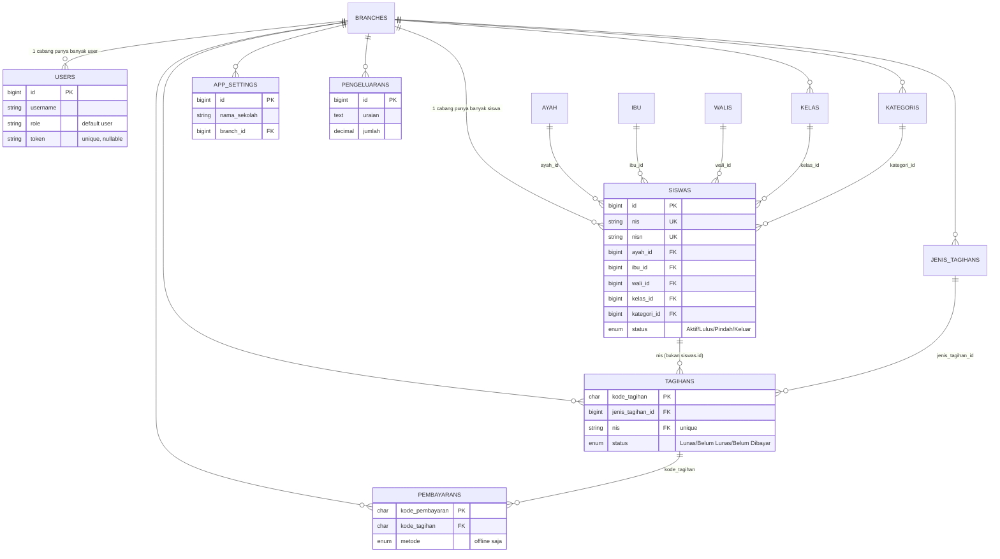

# Tracking Perubahan Sistem

**Rentang commit:** `37ff85a9` (Merge PR #10 dev-fio) → `de22f75` (HEAD, branch `v3-last-project`) + perubahan sesi berjalan yang belum di-commit (lihat Bagian 8)
**Periode:** 29 April 2026 – 18 Juli 2026
**Jumlah commit:** 43 commit (37 commit lama + 6 commit baru: `872f983`, `ae0501b`, `82a2a1f`, `57d732a`, `3ed89b4`, `de22f75`)

> Catatan metodologi: analisis dilakukan lewat `git log`/`git diff` pada rentang di atas, dikecualikan `graphify-out/`, lockfile (`composer.lock`, `package-lock.json`), dan artefak build. Diff mentah menunjukkan ~623 file berubah pada `backend/` dan `frontend-v2/` (di luar folder yang dikecualikan), sebagian besar merupakan penambahan modul baru. Bagian 8 & 9 didokumentasikan sebagai lampiran menyusul goal `/goal` tanggal 18 Juli 2026 ("update dokumen tracking + track perubahan sejak `37ff85a9` + komparasi visual database/ERD").

---

## 1. Fitur Baru

### 1.1 Midtrans Payment Gateway (pembayaran online)
> ⚠️ **Status vs proposal TA:** Sebagian di luar scope — inti pembayaran Midtrans sesuai rencana; dukungan batch payment (bayar banyak tagihan sekaligus) adalah tambahan di luar rencana.

Modul lengkap integrasi Midtrans Snap ditambahkan di `backend/app/Services/Midtrans/`: `MidtransClient`, `MidtransSnapClient`, `MidtransInitiationService`, `MidtransNotificationService`, `MidtransStatusSyncService`, `MidtransLogService`, `MidtransFeeService`, `SignatureVerifier`, `StatusMapper`, `StatusTransitionGuard`, `OrderIdGenerator`, plus DTO (`InitiationResult`, `MidtransStatusResponse`, `NotificationResult`, `SnapPayload`).
Controller: `MidtransAdminController`, `MidtransNotificationController` (webhook publik `POST /api/midtrans/notification` — sengaja tanpa auth), `MidtransTransactionController`.
Frontend: halaman admin `TransaksiMidtransPage`, `TransaksiMidtransDetailPage`, view `transaksi-midtrans.blade.php` & `transaksi-midtrans-detail.blade.php`.
Config baru: `backend/config/midtrans.php`. Dependency baru: `midtrans/midtrans-php` (`composer.json`).
Commit terkait: `a99177e` (checkpoint implementasi midtrans payment gateway), `0a990a2`, `6fae19f`.

### 1.2 Portal Web Siswa + Landing Page Publik
> ⚠️ **Status vs proposal TA:** Sebagian di luar scope — portal siswa sesuai rencana; landing page publik berbasis config + peta interaktif adalah tambahan di luar rencana.

Portal khusus siswa (Filament Panel terpisah) dengan halaman: `PortalBerandaPage`, `PortalProfilPage`, `PortalRiwayatPembayaranPage`, `PortalStatusPembayaranPage`, `PortalTagihanPage` (`frontend-v2/app/Filament/Portal/Pages/`), widget `PortalSiswaStatsWidget`, views `siswa-dashboard.blade.php`, `tagihan-siswa.blade.php`, `portal-siswa-pembayaran-table.blade.php`, `portal-siswa-tagihan-table.blade.php`.
Halaman publik (landing page) di `frontend-v2/resources/views/public/index.blade.php`, konten sepenuhnya dikonfigurasi lewat `frontend-v2/config/handayani-public.php` (dan `handayani.php` untuk branding). Route publik ditambahkan ke `frontend-v2/routes/web.php`.
Commit terkait: `1bfc236` (checkpoint public portal landing page), `333e098`/`833e8d0` (buat config semua konten halaman publik), `e495805` (penyesuaian konten & map interaktif), `7ceff1a` (fix semua periode di beranda portal).

### 1.3 RBAC Dinamis Penuh (Role/Permission berbasis Resource Key)
> ⚠️ **Status vs proposal TA:** Berubah/melampaui rencana — proposal hanya merencanakan RBAC Spatie standar; lapisan resource_key dinamis (binding via UI) jauh melampaui rancangan awal.

Implementasi besar di commit `075c7d7`: satu halaman admin (`RbacDashboard`) dengan tab **Permission CRUD**, **Role Assignment**, **Endpoint Mapping**, **Page Security (resource & action)**, dan **Panduan (dokumentasi)**.
Mekanisme baru: setiap resource/aksi diberi pointer `resource_key`, disimpan di database (tabel `permission_resources`, `permission_endpoints`, `page_permissions`) lalu di-bind ke permission via UI — menggantikan pengecekan permission hardcode dengan sistem berbasis binding yang fleksibel.
Backend: `RbacController`, dependency baru `spatie/laravel-permission` (`composer.json` backend) beserta config `backend/config/permission.php`.
Frontend: `RoleManagement.php`, `UserManagement.php`, `BranchManagement.php` sebagai halaman terpisah.
Iterasi perbaikan lanjutan: `9d76215`, `7f01950` (abstraksi proteksi halaman & visibilitas aksi yang belum sepenuhnya terimplementasi), `81c268a` (perbaiki bug resource key tidak sesuai + dropdown semua cabang untuk akses lebih tinggi — permission `view-all-branches`), `67a33fd` (fix bug log notifikasi terkait RBAC), `6cad146` (fix bug endpoint permission).

### 1.4 Notifikasi Email Workflow Approval Pengeluaran
> ⚠️ **Status vs proposal TA:** Sebagian di luar scope — notifikasi email & approval workflow sesuai rencana; auto-approval per cabang, retry notifikasi, email opt-out, dan kwitansi PDF adalah tambahan di luar rencana.

`WorkflowService`, `WorkflowNotificationService`, `AutoApprovalService`, `PengeluaranWorkflowNotification`, tabel `approval_logs`, `branch_approval_settings`, `notifications`, `notification_settings`, `notification_logs`, `email_opt_outs`, `notification_sent_records`.
Halaman baru: `PengeluaranRequestPage`, `NotificationLogPage` (log notifikasi — commit `8834588`), `NotificationSettingsPage` (pengaturan notifikasi), `BranchApprovalSettingsPage` (pengaturan approval per cabang).
Commit terkait: `b655de6` (notifikasi email pengeluaran approval workflow), `6cad146`, `8834588`, `eca3a15` (tambah halaman pengaturan notifikasi & approval).
Controller pendukung: `NotificationController`, `NotificationLogController`, `NotificationSettingController`, `EmailOptOutController`; service `Notifications\NotificationService`, `Notifications\RecipientResolver`, `Notifications\KwitansiPdfService`.

### 1.5 Detail Profil Siswa
> ⚠️ **Status vs proposal TA:** Tambahan di luar rencana — tidak disebut di proposal.

`DetailWali.php` (Filament page) + perbaikan bug badge/tombol verifikasi email yang overflow di profil siswa. Commit `f602d6a`.

### 1.6 Periode Tahun Ajaran / Kenaikan Kelas / Kelulusan / Auto-Create Akun Siswa
> ⚠️ **Status vs proposal TA:** Sepenuhnya di luar scope proposal TA — modul akademik yang tidak disebut sama sekali di proposal.

Backend: `TahunAjaranController`, `KenaikanKelasController`, `AkunSiswaController`, service `KenaikanKelasService`, `AkunSiswaService`. Tabel baru `tahun_ajarans`, `siswa_kelas`, `batch_promosis`, `batch_promosi_details`, kolom `tahun_ajaran_id` pada `tagihans`, `jenis_tagihans`, `pengeluarans`.
Frontend: `TahunAjaranManagement.php`, `KenaikanKelasPage.php`, `ManajemenAkunSiswa.php`, view `kenaikan-kelas.blade.php`, `kenaikan-kelas-batch-detail-table.blade.php`, partial `credentials-list/empty/modal.blade.php` (kredensial akun siswa auto-generate).
Commit: `05ba2e6` (checkpoint: tagihan-card-view, periode-tahun-ajaran, kenaikan-kelas-kelulusan, auto-create-akun-siswa).

### 1.7 Import/Export Data
> ⚠️ **Status vs proposal TA:** Sesuai rencana proposal.

Service baru `backend/app/Services/ImportExport/`: `ImportBatchService`, `TemplateService`, `SiswaImportService`, `SiswaExportService`, `TagihanImportService`, `TagihanExportService`, `PembayaranExportService`, `KasExportService`. Controller `ImportExportController`. Tabel baru `import_batches`, `export_jobs`, kolom `batch_reference` pada `siswas`/`tagihans`. Dependency baru `maatwebsite/excel` di `backend/composer.json`. Commit `a2b9298` (checkpoint: import/export).

### 1.8 Widget Dashboard Baru
> ⚠️ **Status vs proposal TA:** Sesuai rencana proposal (dashboard monitoring termasuk kebutuhan fungsional proposal).

`DashboardAllTimeStatsWidget`, `DashboardKasStatsWidget`, `DashboardStatsWidget`, `KasBulananChart`, `PembayaranBulananChart`, `PembayaranTerbaruWidget`, `StatusTagihanChart`, `TagihanJatuhTempoWidget`, `TopTunggakanWidget`, `TunggakanJenjangChart`, controller pendukung `DashboardController`, service `DashboardService`.

### 1.9 Tampilan Card untuk Tagihan/Pembayaran
> ⚠️ **Status vs proposal TA:** Penyempurnaan UI di luar detail proposal (proposal tidak menspesifikasikan bentuk tampilan).

`tagihan-card-view.blade.php` dan `pembayaran-card-view.blade.php` (mengganti tampilan tabel lama dengan card, terlihat dari penghapusan baris di `tagihan.blade.php`/`pembayaran.blade.php` dan file baru terkait). Commit `50e38cb` (penyesuaian fitur duplikat & perbaikan komponen yang belum menggunakan Filament).

### 1.10 Verifikasi Email Berbasis OTP (staff/admin & orang tua/wali)
> ⚠️ **Status vs proposal TA:** Tambahan di luar rencana — verifikasi email tidak disebut di proposal.

Verifikasi email dilakukan lewat **kode OTP 6 digit** (`random_int(100000, 999999)`), BUKAN link verifikasi. Implementasi di `backend/app/Http/Controllers/UserController.php`: `sendVerificationOtp()` (baris 233-278), `verifyEmailOtp()` (312-347), `sendWaliOtp()` (352-415), `verifyWaliOtp()` (420-476).
OTP disimpan di Cache 10 menit (key `email_otp_{user_id}_{email}` / `wali_otp_{parent_id}_{type}_{email}`); rate limit 3 request per 10 menit (counter di key terpisah `otp_rate_{user_id}` / `wali_otp_rate_{parent_id}_{type}`, respons HTTP 429 bila terlampaui); template email `backend/resources/views/emails/verification-otp.blade.php`.
Route (auth:sanctum): `POST /users/send-verification-otp`, `POST /users/verify-email-otp`, `POST /users/send-wali-otp`, `POST /users/verify-wali-otp`.
**Dua alur terpisah**: (1) verifikasi email user staff/admin sendiri — UI di `frontend-v2/app/Filament/Pages/Auth/EditProfile.php` (method `sendOtp()`/`verifyOtp()`); (2) verifikasi email orang tua/wali siswa (ayah/ibu/wali) — dipicu dari profil portal siswa `frontend-v2/app/Filament/Portal/Pages/PortalProfilPage.php` (baris 322 & 367).
Diperkenalkan commit `eca3a15`.

### 1.11 Manajemen & Keamanan Akun User (toggle aktif, lupa/ganti password, update email, preferensi notifikasi)
> ⚠️ **Status vs proposal TA:** Tambahan di luar rencana — mekanisme-mekanisme berikut tidak disebut di proposal.

1. **Toggle aktif/nonaktif akun staff/admin (`toggle-user`)** — `UserController::toggleActive()` (baris 482-505), route `PATCH /users/{id}/toggle-active` (middleware `endpoint.permission:users.toggle`). Saat dinonaktifkan, semua token Sanctum user dicabut; user nonaktif ditolak login di `AuthController` (baris 57). Kolom `is_active` dari migrasi `2026_05_26_200000_add_siswa_id_is_active_must_change_password_to_users_table.php` (commit `05ba2e6`). UI: `frontend-v2/app/Livewire/UserManagement.php` (baris 306-319). **Terpisah dari** mekanisme `toggle-akun-siswa` (`PATCH /akun-siswa/{id}/toggle-active`, halaman `ManajemenAkunSiswa`) yang khusus akun siswa.
2. **Forgot-password self-service (generik semua tipe user)** — `backend/app/Services/PasswordResetService.php`: `sendResetLink()` (baris 16-48) query `User::where('email', ...)->where('is_active', true)` TANPA filter role/siswa — berlaku untuk staff, admin, maupun siswa; `resetPassword()` (baris 67-95) set `must_change_password = false`, hapus semua token Sanctum, tandai token reset `used`. Route publik tanpa auth (`backend/routes/api.php` baris 37-40): `POST /forgot-password`, `GET /reset-password/{token}`, `POST /reset-password`. Tabel `password_reset_tokens` (migrasi `2026_05_26_210001`). Catatan koreksi: sebelumnya dokumen ini (section 3, poin "Auto-create akun siswa") mengesankan `PasswordResetService` hanya untuk akun siswa — yang khusus siswa sebenarnya `AkunSiswaController::resetPassword` (`POST /akun-siswa/{id}/reset-password`, reset oleh admin ke password default DDMMYYYY), sedangkan `PasswordResetService` adalah alur lupa-password mandiri via email+token untuk semua user.
3. **Ganti password mandiri + wajib ganti password generik** — `UserController::changePassword()` (baris 283-310, verifikasi `current_password` via `Hash::check`, set `must_change_password=false`), route `POST /users/change-password`, halaman `frontend-v2/app/Filament/Pages/ChangePassword.php`. Mekanisme `must_change_password` + redirect paksa ganti password saat login berlaku untuk SEMUA role (cek generik di `frontend-v2/app/Filament/Pages/Auth/Login.php` baris 101 & 107; `AuthController` baris 92), bukan hanya akun siswa.
4. **Update email mandiri & preferensi notifikasi per-user** — `UserController::updateEmail()` (baris 545-579, route `PATCH /users/current/email`, wajib `current_password`, validasi unik email per-cabang via `EmailValidationService`); `getNotificationPreferences()`/`updateNotificationPreferences()` (baris 584-663, route `GET`/`PUT /users/current/notification-preferences`, model `EmailOptOut`, tipe: `tagihan_baru`, `reminder`, `kwitansi`, `overdue`) — UI self-service di `frontend-v2/app/Filament/Portal/Pages/PortalProfilPage.php` (baris 134, 241, 300). Diperkenalkan commit `eca3a15`.

---

## 2. Perubahan Database

Semua migrasi berikut **baru ditambahkan** dalam rentang commit ini (`git diff --name-status 37ff85a9..HEAD -- backend/database/migrations`, status `A`):

**RBAC & Auth**
- `2026_05_01_234841_create_permission_tables.php` — tabel spatie/laravel-permission (`permissions`, `roles`, `model_has_permissions`, dll).
- `2026_05_01_235610_delete_role_on_users_table.php` — hapus kolom `role` lama di `users` (digantikan sistem role Spatie).
- `2026_05_02_000000_create_personal_access_tokens_table.php` — token Sanctum.
- `2026_05_02_010000_remove_token_column_from_users_table.php` — hapus kolom token lama.
- `2026_05_24_193811_add_name_column_to_users_table.php` — kolom `name` di `users`.
- `2026_05_26_200000_add_siswa_id_is_active_must_change_password_to_users_table.php` — kolom `siswa_id`, `is_active`, `must_change_password` di `users` (dukungan akun portal siswa).
- `2026_05_26_210000_add_email_column_to_users_table.php` — kolom `email` di `users`.
- `2026_05_26_210001_create_password_reset_tokens_table.php` — reset password.
- `2026_07_05_231916_add_email_verified_at_to_users_table.php` dan `2026_07_06_000000_add_email_verified_at_to_parents_tables.php` — verifikasi email untuk `users` dan tabel ortu (`ayahs`/`ibus`/`walis`).
- `2026_07_09_000001_create_permission_endpoints_table.php`, `2026_07_09_000002_create_permission_resources_table.php`, `2026_07_09_000006_create_page_permissions_table.php` — inti RBAC dinamis (resource_key).
- `2026_07_09_000003_add_group_to_permissions_table.php`, `2026_07_09_000004_add_audience_to_permissions_table.php`, `2026_07_09_000005_add_label_to_permissions_table.php`, `2026_07_09_000007_add_group_to_permission_resources_table.php`, `2026_07_09_000008_add_resource_key_to_page_permissions.php` — metadata tambahan permission (grouping, audience, label, resource_key).
- `2026_07_10_000001_simplify_rbac_to_pure_pointer.php`, `2026_07_10_000002_merge_resource_registry_into_page_permissions.php`, `2026_07_10_164859_update_permission_endpoints_add_resource_key.php` — penyederhanaan skema RBAC menjadi murni pointer `resource_key`.

**Tahun Ajaran / Kenaikan Kelas**
- `2026_05_25_100000_create_tahun_ajarans_table.php` — tabel tahun ajaran.
- `2026_05_25_100100_add_tahun_ajaran_id_to_tagihans_and_jenis_tagihans.php`.
- `2026_05_25_100200_create_siswa_kelas_table.php` — histori kelas siswa per tahun ajaran.
- `2026_05_25_100300_migrate_existing_data_to_tahun_ajaran.php` — migrasi data lama ke skema baru.
- `2026_05_25_100400_make_jenis_tagihans_tahun_ajaran_id_not_null.php`.
- `2026_05_25_100500_create_batch_promosis_table.php`, `2026_05_25_100600_create_batch_promosi_details_table.php` — batch kenaikan kelas/kelulusan.
- `2026_05_25_100700_add_tahun_ajaran_id_to_pengeluarans.php`.
- `2026_05_26_100000_add_level_column_to_kelas_table.php` — level jenjang kelas.

**Workflow Approval Pengeluaran & Notifikasi**
- `2026_05_26_220000_create_pengeluaran_requests_table.php`, `2026_05_26_220001_create_approval_logs_table.php`, `2026_05_26_220002_create_branch_approval_settings_table.php`, `2026_05_26_220004_add_pengeluaran_request_id_to_pengeluarans_table.php`.
- `2026_05_26_220003_create_notifications_table.php`, `2026_05_27_100100_create_notification_settings_table.php`, `2026_05_27_100200_create_notification_logs_table.php`, `2026_05_27_100300_create_email_opt_outs_table.php`, `2026_05_27_100400_create_notification_sent_records_table.php`.
- `2026_05_27_100000_add_email_to_parent_tables.php` — kolom email di tabel ortu.
- `2026_05_27_100500_create_jobs_table.php` — queue jobs (pengiriman email async).

**Import/Export**
- `2026_05_28_100000_add_batch_reference_to_siswas_and_tagihans.php`.
- `2026_05_28_100000_create_import_batches_table.php`, `2026_05_28_100100_create_export_jobs_table.php`.

**Midtrans**
- `2026_06_22_000001_create_midtrans_transactions_table.php`, `2026_06_22_000002_create_midtrans_transaction_logs_table.php`.
- `2026_06_22_000003_add_midtrans_columns_to_pembayarans_table.php` — kolom relasi Midtrans di `pembayarans`.
- `2026_06_23_000001_add_batch_items_to_midtrans_transactions_table.php` — dukungan pembayaran batch.

**Lain-lain**
- `2026_06_24_000000_create_filament_notifications_table.php` — notifikasi database Filament.

Selain itu, sejumlah migrasi lama (`create_users_table`, `create_ayahs_table`, `create_ibus_table`, `create_kategoris_table`, `create_kelas_table`, `create_walis_table`, `create_siswas_table`, `create_jenis_tagihans_table`, `create_tagihans_table`, `create_pembayarans_table`, `create_app_settings_table`, `create_pengeluarans_table`, `change_column_nis_on_tagihans_table_not_unique`, `alter_users_new_column_branch_id`) dimodifikasi (status `M`) — kemungkinan disesuaikan untuk konsistensi dengan skema baru (perlu ditelusuri per-file bila diperlukan detail kolom persisnya).

---

## 3. Perubahan Workflow/Alur Sistem

- **Alur pembayaran online**: siswa/ortu dapat membayar tagihan via Midtrans Snap (permission `pay-tagihan-online`); status pembayaran disinkron via webhook (`MidtransNotificationController`, publik tanpa auth by design) dan job sinkronisasi (`MidtransStatusSyncService`). Ada dukungan batch payment (`BatchPaymentRequest`, `PembayaranController@batchLunas`).
- **Alur approval pengeluaran**: `WorkflowService` mengatur transisi status pengajuan pengeluaran (submit → approve/reject → disburse), mencatat `ApprovalLog`, dan memicu `WorkflowNotificationService` untuk mengirim email pada setiap perubahan status. `AutoApprovalService` menambahkan auto-approve berdasarkan pengaturan `branch_approval_settings`.
- **Alur RBAC**: pengecekan izin akses tidak lagi murni berbasis nama permission Spatie, tapi diperantarai `resource_key` yang di-bind ke permission via halaman admin — memungkinkan admin mengatur ulang proteksi halaman/endpoint tanpa deploy kode (lihat commit `075c7d7`, `9d76215`, `7f01950`, `81c268a`).
- **Alur tahun ajaran**: proses kenaikan kelas/kelulusan dilakukan secara batch (`batch_promosis`/`batch_promosi_details`) via `KenaikanKelasService`, dengan opsi undo (`undo-kenaikan-kelas`). Data lama dimigrasikan otomatis ke struktur tahun ajaran (`migrate_existing_data_to_tahun_ajaran`).
- **Auto-create akun siswa**: `AkunSiswaService` men-generate akun/kredensial siswa secara otomatis, dengan halaman kredensial (`credentials-list/empty/modal.blade.php`) dan reset password oleh admin (`AkunSiswaController::resetPassword`); terpisah dari itu, tersedia alur lupa-password mandiri via email untuk semua tipe user (`PasswordResetService`/`PasswordResetController`, lihat 1.11).
- **Import/Export**: proses import siswa/tagihan dan export siswa/tagihan/kas/pembayaran dijalankan via `ImportBatchService` dengan histori batch (`import_batches`, `export_jobs`) yang bisa dilihat di `partials/import-history.blade.php`.
- **Halaman publik**: landing page & konten publik kini seluruhnya digerakkan oleh config (`frontend-v2/config/handayani-public.php`), bukan hardcode di view — perubahan konten cukup lewat config, tidak perlu ubah blade.
- **Portal siswa**: siswa login ke panel terpisah (`Filament/Portal`) untuk melihat tagihan, riwayat pembayaran, status pembayaran, dan profil sendiri, dibatasi dengan permission `view-own-billing`.
- **Penghapusan frontend lama**: direktori frontend lama dihapus sepenuhnya (commit `a19d947` "Hapus direktori frontend lama"), aplikasi kini murni `frontend-v2`.

---

## 4. Perubahan Permission/RBAC

File `backend/app/Enum/Permission.php` **baru dibuat dalam rentang ini** (tidak ada sebelumnya di `37ff85a9`), berisi seluruh daftar permission berikut (157 baris, per grup):

- **User**: `view-user`, `create-user`, `read-user`, `update-user`, `delete-user`, `toggle-user`
- **Siswa**: `view-siswa`, `create-siswa`, `read-siswa`, `update-siswa`, `delete-siswa`
- **Kelas**: `view-kelas`, `create-kelas`, `read-kelas`, `update-kelas`, `delete-kelas`
- **Kategori**: `view-kategori`, `create-kategori`, `read-kategori`, `update-kategori`, `delete-kategori`
- **Pembayaran**: `view-pembayaran`, `create-pembayaran`, `delete-pembayaran`, `print-kwitansi`
- **Jenis Tagihan**: `view-jenis-tagihan`, `create-jenis-tagihan`, `update-jenis-tagihan`, `delete-jenis-tagihan`
- **Tagihan**: `view-tagihan`, `create-tagihan`, `update-tagihan`, `delete-tagihan`
- **Laporan**: `view-kas-harian`, `detail-kas-harian`, `view-rekap-bulanan`, `detail-rekap-bulanan`, `export-laporan`
- **Tahun Ajaran**: `view-tahun-ajaran`, `create-tahun-ajaran`, `update-tahun-ajaran`, `delete-tahun-ajaran`, `toggle-tahun-ajaran`
- **Kenaikan Kelas**: `view-kenaikan-kelas`, `process-kenaikan-kelas`, `undo-kenaikan-kelas`, `view-detail-kenaikan`
- **Akun Siswa**: `view-akun-siswa`, `generate-akun-siswa`, `reset-akun-siswa-password`, `toggle-akun-siswa`, `view-akun-siswa-credentials`, `print-akun-siswa`
- **Import/Export**: `import-data`, `export-data`
- **Dashboard**: `view-dashboard`, `view-own-billing`
- **Pengeluaran**: `view-pengeluaran`, `create-pengeluaran`, `update-pengeluaran`, `delete-pengeluaran`, `approve-pengeluaran`, `disburse-pengeluaran`
- **Branch**: `view-branch`, `create-branch`, `read-branch`, `update-branch`, `delete-branch`, `view-all-branches` (akses lintas cabang, ditambahkan pada perbaikan `81c268a`)
- **Midtrans**: `pay-tagihan-online`, `view-midtrans-transactions`, `sync-midtrans-transactions`, `view-midtrans-config`, `update-midtrans-config`
- **App Setting**: `view-app-setting`, `update-app-setting`
- **Auto Approve**: `view-auto-approve-setting`, `update-auto-approve-setting`
- **Notifikasi**: `view-notification-setting`, `update-notification-setting`, `view-notification-logs`, `retry-notification`
- **RBAC Management**: `manage-rbac`, `toggle-active`, `bind-permission`, `view-endpoint-mapping`, `create-endpoint-mapping`, `update-endpoint-mapping`, `delete-endpoint-mapping`, `view-resource-registry`, `create-resource-registry`, `update-resource-registry`, `delete-resource-registry`, `view-permissions`, `create-permission`, `update-permission`, `delete-permission`, `attach-permission`
- **Role**: `view-roles`, `create-role`, `update-role`, `delete-role`, `attach-role`

Catatan: `toggle-user` (grup User) adalah mekanisme nonaktif/aktif akun staff/admin (lihat 1.11) — berbeda dari `toggle-akun-siswa` (grup Akun Siswa) untuk akun portal siswa, dan `toggle-active` (grup RBAC Management) untuk menonaktifkan resource RBAC.

Perubahan mekanisme (bukan sekadar daftar permission): sistem berpindah dari role string sederhana (`users.role`, dihapus oleh migrasi `2026_05_01_235610_delete_role_on_users_table.php`) ke **role-permission berbasis paket `spatie/laravel-permission`**, ditambah lapisan `resource_key` (tabel `permission_resources`, `permission_endpoints`, `page_permissions`) yang memetakan halaman/endpoint ke permission secara dinamis lewat UI (`RbacDashboard`, commit `075c7d7`). Skema ini disederhanakan dua kali (`2026_07_10_000001_simplify_rbac_to_pure_pointer.php`, `2026_07_10_000002_merge_resource_registry_into_page_permissions.php`) untuk menghapus duplikasi antara "resource registry" dan "page permissions" menjadi satu pointer murni.

---

## 5. Perubahan Dependensi

**backend/composer.json** — ditambahkan:
- `composer/ca-bundle` (^1.5)
- `maatwebsite/excel` (^3.1) — import/export Excel
- `midtrans/midtrans-php` (^2.5) — SDK Midtrans
- `spatie/laravel-permission` (^7.4) — RBAC

**frontend-v2/composer.json** — ditambahkan (dev):
- `giorgiosironi/eris` (`*`) — property-based testing (dipakai di `tests/Feature/*/*PropertyTest.php`, `ExportServicePropertyTest.php`)
- Script `composer create-project`/`post-create-project-cmd` disederhanakan: perintah `php artisan migrate --force`/`migrate --graceful` dihapus dari lifecycle scripts (migrasi kini murni tanggung jawab `backend`, sesuai arsitektur monorepo dua-app).

---

## 6. Perbaikan Bug

- `81c268a` — Perbaiki bug resource key tidak sesuai dan tambah dropdown semua cabang untuk akses lebih tinggi.
- `9d76215`, `7f01950` — Perbaiki bug dan abstraksi proteksi halaman dan visibilitas aksi yang belum sepenuhnya terimplementasi (RBAC).
- `f602d6a` — Perbaiki bug badge dan tombol verifikasi email overflow di profil siswa.
- `eca3a15` — Fix beberapa bug setelah automation testing (skenario testing di-generate untuk memverifikasi).
- `e495805` — Fix bug halaman manajemen role; hilangkan duplikat login page.
- `6cad146` — Fix bug endpoint permission.
- `a19d947` — Perbaikan terkait hasil blackbox test (beberapa aksi yang masih share permission diberi permission terpisah).
- `67a33fd` — Fix bug log notifikasi.
- `7ceff1a` — Fix bug semua periode di Beranda portal dan hilangkan opsi semua periode yang tidak seharusnya ada di dashboard admin.
- `5287510`, `0a7dc49` — checkpoint perbaikan bug dan layout.
- `c5799ae` — Testing modul 1 dan 2 (validasi hasil perbaikan).
- Property-based tests baru (`DashboardWidgetFallbackTest.php`, `TableComponentErrorHandlingTest.php`, `ExportServicePropertyTest.php`) menambah cakupan uji untuk fallback widget dashboard dan penanganan error tabel.

---

## 7. Penghapusan

- **Direktori frontend lama** dihapus sepenuhnya — commit `a19d947` ("Hapus direktori frontend lama"), menyusul migrasi penuh ke `frontend-v2`.
- **Kolom `role` di tabel `users`** dihapus (migrasi `2026_05_01_235610_delete_role_on_users_table.php`), digantikan sistem role Spatie.
- **Kolom token lama** di `users` dihapus (migrasi `2026_05_02_010000_remove_token_column_from_users_table.php`), digantikan `personal_access_tokens` (Sanctum).
- **Duplikat halaman login** dihilangkan (commit `e495805`).
- **Opsi "semua periode"** dihilangkan dari dashboard admin karena tidak relevan (commit `7ceff1a`).
- **Lifecycle migrate otomatis** dihapus dari `frontend-v2/composer.json` (`migrate --force`/`migrate --graceful`) karena migrasi kini eksklusif milik `backend`.
- **Skema RBAC "resource registry" terpisah** dilebur/dihapus dan digabung menjadi satu tabel `page_permissions` murni pointer (migrasi `2026_07_10_000002_merge_resource_registry_into_page_permissions.php`), menyederhanakan model data RBAC.
- Terakhir, commit `9da3f2e` dan `743799c` membersihkan folder/file yang tidak diperlukan lagi dan menambahkan graphify project.

---

## 8. Perubahan Setelah `743799c` (6 commit baru + sesi berjalan belum commit)

### 8.1 Commit `872f983` — Fix resource key + dokumentasi
- **Fix bug**: sinkronisasi ulang `resource_key` yang tidak konsisten (lanjutan dari `81c268a`/`6cad146`) — menyentuh `Settings.php` dan `PortalRiwayatPembayaranPage.php`.
- **Fix bug**: `MidtransInitiationService` — perbaikan pada pembentukan payload/fee (12 baris berubah), `backend/config/midtrans.php` disesuaikan.
- **Test case baru**: `backend/tests/Feature/KwitansiPdfServiceTest.php` (76 baris) — cakupan uji baru untuk `KwitansiPdfService`.
- **Dokumentasi**: update `.env.example` (backend & frontend-v2) untuk variabel konfigurasi terbaru.

### 8.2 Commit `de22f75` — Sinkronisasi resource key + tunneling frontend
- **Fix bug lanjutan resource key**: `Permission.php` (+5 baris), `PermissionResourceSeeder.php` (+4 baris), `PermissionHelper.php`, `RoleManagement.php`, `ManajemenAkunSiswa.php`, `PengeluaranRequestPage.php`, `KenaikanKelas.php`, `HasImportExport.php`, view `pembayaran-card-view.blade.php` — merapikan resource key yang belum sinkron di berbagai halaman/aksi.
- **Setup tunneling frontend**: `frontend-v2/bootstrap/app.php` (+6/-1 baris) — kemungkinan `trustProxies`/middleware untuk mendukung akses via ngrok/tunnel (konsisten dengan catatan sesi sebelumnya soal debug ngrok mobile payment).
- Commit `ae0501b`/`82a2a1f`/`57d732a`/`3ed89b4` hanya menyentuh `.gitignore` dan file tracking Git (`frontend-v2/artisan` mode-only, penghapusan `.idea/`/`.claude/settings.json` dari tracking) — tidak ada perubahan kode aplikasi.

### 8.3 Sesi Berjalan — Belum Di-*commit* (working tree per 18 Juli 2026)

> Catatan: bagian ini mendokumentasikan pekerjaan yang sudah selesai secara fungsional dan terverifikasi di environment dev, tapi **belum di-`git commit`** pada saat dokumen ini ditulis. `git status` menunjukkan 43 file modified + 1 file baru (`frontend-v2/boost.json`).

**a. Fitur baru — Tagihan mendukung seleksi multi-kelas & multi-kategori sekaligus**
> ⚠️ Status vs proposal TA: penyempurnaan fitur "Pembuatan tagihan SPP" yang sudah sesuai rencana — proposal tidak merinci granularitas seleksi, jadi ini peningkatan UX di dalam scope, bukan penyimpangan.

- `backend/app/Http/Requests/TagihanRequest.php` — `kelas_id`/`kategori_id` diubah dari scalar `exists:` menjadi `array|min:1` + validasi per-elemen (`kelas_id.*`/`kategori_id.*` → `integer|exists:...`).
- `backend/app/Http/Controllers/TagihanController.php` — query pencarian siswa target diubah dari `where()` tunggal menjadi `whereIn()` untuk kedua kolom, sehingga satu request bisa membuat tagihan untuk siswa di kombinasi (kelas manapun dari yang dipilih) × (kategori manapun dari yang dipilih).
- `frontend-v2/app/Livewire/TagihanCardView.php` — form modal "Tambah Tagihan": `Select::make('kelas_id')` dan `kategori_id` ditambah `->multiple()` + helper text; opsi dropdown tetap memakai cache master-data (`ApiService::cachedGet()`).
- `backend/tests/Feature/TagihanTest.php` — payload test lama disesuaikan ke format array; ditambah `test_create_tagihan_multi_kelas_kategori_success` (4 kombinasi kelas×kategori → 4 tagihan, siswa di luar seleksi tidak ikut terbuat) dan `test_create_tagihan_requires_at_least_one_kelas_and_kategori` (array kosong → HTTP 400).
- Diverifikasi langsung ke backend dev (curl): kombinasi kelas [3,4] × kategori [Yatim,Piatu] menghasilkan tepat 6 tagihan, dicocokkan independen lewat query siswa manual (bukan lewat kode yang sama, untuk hindari bias verifikasi). Validasi array kosong/format lama/id tidak valid seluruhnya ditolak HTTP 400 dengan pesan Indonesia. UI multi-select diverifikasi via browser (Playwright) — chip terpisah per kelas terpilih.

**b. Perbaikan test infrastructure**
- `backend/tests/TestCase.php::setUp()` — urutan `DB::delete()` pada cleanup antar-test diperbaiki: tabel anak (FK dependent seperti `tagihans`, `jenis_tagihans`, `pengeluarans`) kini dihapus sebelum tabel induk (`users`, `branches`) yang menjadi target FK-nya. Bug pre-existing (dikonfirmasi via `git stash`) yang membuat seluruh `TagihanTest.php` gagal karena FK constraint violation saat `delete from branches` dijalankan lebih dulu.
- Diketahui namun **tidak diperbaiki** (di luar scope): kolom `users.token` sudah di-drop oleh migrasi `2026_05_02_010000_remove_token_column_from_users_table.php`, tapi `UserFactory` dan banyak test masih insert/reference `token` — root cause rot test-infrastructure yang lebih dalam dan lebih luas dari fitur ini.

**c. Validasi input & bugfix render pesan error**
- Penambahan `min:1` pada field nominal uang di `BayarTidakLunasRequest`, `JenisTagihanRequest`, `PengeluaranRequest` (backend) — mencegah nilai 0/negatif lolos validasi.
- Frontend: field `minValue()` diubah menjadi `rules()` custom di `TagihanSiswa`/`TagihanCardView` (Filament) — sebelumnya pesan validasi custom tidak pernah tampil karena Filament hanya menjalankan validasi browser native untuk `minValue()`, bukan pesan Indonesia yang di-set.

**d. Performa — Redis cache & OPcache**
> ⚠️ Status vs proposal TA: di luar rencana — proposal tidak menyebut kebutuhan caching/optimasi performa; ini perbaikan operasional murni.

- `frontend-v2/app/Services/ApiService.php` — method baru `cachedGet()` (cache-aside via Redis, TTL dikonfigurasi lewat `config('handayani.cache.*')`), `bustDashboardCache()` (invalidasi versi), `dashboardOverviewSlice()`.
- `backend/app/Http/Controllers/DashboardController.php` — endpoint baru `overview()` (`GET /dashboard/overview`) menggabungkan 9 endpoint dashboard terpisah menjadi satu response, mengurangi round-trip HTTP dari 9x menjadi 1x.
- Redis dijalankan via Docker (`handayani-redis`, `predis/predis` — client pure-PHP, tidak butuh ekstensi C), `frontend-v2/.env`: `CACHE_STORE=redis`, `REDIS_CLIENT=predis`, `REDIS_CACHE_DB=1`.
- **Temuan terbesar**: PHP OPcache ternyata **nonaktif total** di environment dev Windows (`C:\php\php-8.4.18-Win32-vs17-x64\php.ini`) — diaktifkan (`opcache.enable=1`, `opcache.max_accelerated_files=65407`, `opcache.validate_timestamps=1`, `opcache.revalidate_freq=0`). Kombinasi Redis cache + endpoint merge + OPcache membawa waktu render dashboard dari ~8 detik menjadi ~700ms.
- Dropdown master-data (kelas/kategori/jenis-tagihan) di-cache app-wide via `ApiService::cachedGet()`, TTL dikonfigurasi di `frontend-v2/config/handayani.php` (`handayani.cache.master_data_ttl`, default 300 detik).

**e. Pembersihan kode mati — permission "jenjang"**
- Permission berbasis `resource_key` untuk jenjang (3 permission: enum + seeder) dihapus dari `backend/app/Enum/Permission.php` dan `PermissionResourceSeeder.php` — dikonfirmasi tidak pernah benar-benar dipanggil di manapun (kode mati peninggalan iterasi RBAC sebelumnya). Method terkait di `frontend-v2/app/Helpers/PermissionHelper.php` dan 3 test di `tests/Unit/PermissionHelperTest.php` ikut dihapus.

**f. Penghapusan tab "Panduan" RBAC Dashboard**
- `frontend-v2/app/Filament/Pages/RbacDashboard.php` kehilangan ~770 baris (method-method dokumentasi/guide statis) dan `rbac-dashboard.blade.php` kehilangan tab "Panduan". Konten dipindah utuh menjadi bagian baru "RBAC — Panduan Developer" di `README.md` (+507 baris) — dokumentasi tetap ada, hanya berpindah dari UI runtime ke dokumen developer.

---

## 9. Komparasi Visual Database (ERD): Baseline (`37ff85a9`) vs Saat Ini

Baseline diverifikasi dari migrasi bertanggal sebelum 29 April 2026 (s.d. `2025_12_28_120848_alter_users_new_column_branch_id.php`). Skema saat ini = baseline + seluruh migrasi baru di Bagian 2 (tidak ada migrasi yang dihapus/`down()`-dijalankan — pertumbuhan murni aditif kecuali kolom `users.role`/`users.token` yang di-drop, lihat Bagian 7).

### 9.1 ERD Baseline (14 tabel)



Sesi baseline: 1 role string sederhana di `users.role`, tanpa RBAC granular, tanpa tahun ajaran (siswa hanya punya 1 `kelas_id` tetap), tanpa payment gateway (`pembayarans.metode` cuma `offline`), tanpa approval workflow, tanpa notifikasi, tanpa import/export.

### 9.2 ERD Saat Ini — hanya modul baru (tabel lama tidak diulang, lihat 9.1)

```mermaid
erDiagram
    %% RBAC dinamis (spatie/laravel-permission + resource_key)
    PERMISSIONS ||--o{ ROLE_HAS_PERMISSIONS : ""
    ROLES ||--o{ ROLE_HAS_PERMISSIONS : ""
    ROLES ||--o{ MODEL_HAS_ROLES : ""
    PERMISSIONS ||--o{ MODEL_HAS_PERMISSIONS : ""
    PERMISSIONS ||--o{ PERMISSION_ENDPOINTS : "permission_id (nullable)"
    PERMISSIONS ||--o{ PAGE_PERMISSIONS : "permission_id (nullable, resource_key)"
    USERS ||--o{ PERSONAL_ACCESS_TOKENS : "Sanctum"
    USERS ||--o{ PASSWORD_RESET_TOKENS : "email"

    %% Tahun ajaran & kenaikan kelas
    BRANCHES ||--o{ TAHUN_AJARANS : ""
    TAHUN_AJARANS ||--o{ TAGIHANS : "tahun_ajaran_id"
    TAHUN_AJARANS ||--o{ JENIS_TAGIHANS : "tahun_ajaran_id (NOT NULL)"
    SISWAS ||--o{ SISWA_KELAS : "histori kelas per tahun ajaran"
    KELAS ||--o{ SISWA_KELAS : ""
    TAHUN_AJARANS ||--o{ SISWA_KELAS : ""
    BRANCHES ||--o{ BATCH_PROMOSIS : ""
    TAHUN_AJARANS ||--o{ BATCH_PROMOSIS : "source & target"
    USERS ||--o{ BATCH_PROMOSIS : "processed_by"
    BATCH_PROMOSIS ||--o{ BATCH_PROMOSI_DETAILS : ""
    SISWAS ||--o{ BATCH_PROMOSI_DETAILS : ""
    KELAS ||--o{ BATCH_PROMOSI_DETAILS : "source & target kelas"

    %% Akun siswa (users.siswa_id)
    SISWAS ||--o| USERS : "siswa_id (akun portal)"

    %% Approval pengeluaran & notifikasi
    USERS ||--o{ PENGELUARAN_REQUESTS : "requester_id"
    BRANCHES ||--o{ PENGELUARAN_REQUESTS : ""
    PENGELUARAN_REQUESTS ||--o{ PENGELUARANS : "pengeluaran_request_id"
    PENGELUARAN_REQUESTS ||--o{ APPROVAL_LOGS : ""
    USERS ||--o{ APPROVAL_LOGS : ""
    BRANCHES ||--o| BRANCH_APPROVAL_SETTINGS : "1:1 auto-approve config"
    USERS ||--o{ NOTIFICATIONS : ""
    BRANCHES ||--o| NOTIFICATION_SETTINGS : "1:1"
    BRANCHES ||--o{ NOTIFICATION_LOGS : ""

    %% Import/export
    USERS ||--o{ IMPORT_BATCHES : ""
    BRANCHES ||--o{ IMPORT_BATCHES : ""
    USERS ||--o{ EXPORT_JOBS : ""
    BRANCHES ||--o{ EXPORT_JOBS : ""

    %% Midtrans
    TAGIHANS ||--o{ MIDTRANS_TRANSACTIONS : "kode_tagihan"
    USERS ||--o{ MIDTRANS_TRANSACTIONS : "initiator_user_id"
    MIDTRANS_TRANSACTIONS ||--o{ MIDTRANS_TRANSACTION_LOGS : ""
    MIDTRANS_TRANSACTIONS ||--o| PEMBAYARANS : "kolom midtrans_* di pembayarans"

    PAGE_PERMISSIONS {
        bigint id PK
        string resource_key UK "pointer murni, pasca simplify_rbac"
        bigint permission_id FK
    }
    SISWA_KELAS {
        bigint id PK
        bigint siswa_id FK
        bigint kelas_id FK
        bigint tahun_ajaran_id FK
    }
    BATCH_PROMOSIS {
        bigint id PK
        bigint source_tahun_ajaran_id FK
        bigint target_tahun_ajaran_id FK
        bigint processed_by FK
        bigint branch_id FK
    }
    PENGELUARAN_REQUESTS {
        bigint id PK
        bigint requester_id FK
        bigint branch_id FK
        string status "submit/approve/reject/disburse"
    }
    MIDTRANS_TRANSACTIONS {
        bigint id PK
        char kode_tagihan FK
        bigint initiator_user_id FK
        json batch_items "dukungan bayar banyak tagihan"
    }
    USERS {
        bigint id PK
        bigint siswa_id FK "nullable, akun portal siswa"
        bigint branch_id FK
        boolean is_active
        boolean must_change_password
        timestamp email_verified_at
        string email UK
    }
```



### 9.3 Ringkasan Diff Skema (kuantitatif)

| Aspek | Baseline (`37ff85a9`) | Saat ini (HEAD `de22f75`) |
|---|---|---|
| Jumlah tabel aplikasi (di luar tabel framework Laravel: `sessions`, `cache`, `jobs`, dll) | 14 | ~35 |
| Mekanisme akses | 1 kolom `users.role` (string) | Spatie RBAC + `resource_key` dinamis (5 tabel: `permissions`, `roles`, `model_has_*`, `permission_endpoints`, `page_permissions`) |
| Auth token | `users.token` (kolom custom, unique, nullable) | Sanctum `personal_access_tokens` (kolom `token` lama di-drop) |
| Riwayat kelas siswa | Tidak ada — `siswas.kelas_id` statis | `siswa_kelas` (histori per `tahun_ajaran_id`) + `batch_promosis`/`batch_promosi_details` |
| Metode pembayaran | `offline` saja | `offline` + `online_midtrans`, 3 tabel baru (`midtrans_transactions`, `_logs`, kolom di `pembayarans`) |
| Approval pengeluaran | Tidak ada — `pengeluarans` langsung tercatat | `pengeluaran_requests` → `approval_logs` (submit→approve/reject→disburse) + `branch_approval_settings` (auto-approve) |
| Notifikasi | Tidak ada | 5 tabel (`notifications`, `notification_settings`, `notification_logs`, `email_opt_outs`, `notification_sent_records`) |
| Import/export | Tidak ada | `import_batches`, `export_jobs` + kolom `batch_reference` di `siswas`/`tagihans` |
| Verifikasi email & keamanan akun | Tidak ada | `email_verified_at` (users + tabel ortu), `password_reset_tokens`, kolom `is_active`/`must_change_password` di `users` |
| Multi-cabang | Sudah ada (`branches` + FK di 9 tabel) | Tidak berubah struktural, hanya bertambah FK `branch_id` di tabel-tabel baru |

---

## Lampiran: Daftar Lengkap Commit (37ff85a9..HEAD)

```
de22f75 - Update .gitignore - Sinkronisasi resource key - Setup tunneling frontend
3ed89b4 Update .gitignore
57d732a Update .gitignore
82a2a1f Update .gitignore
ae0501b Upadate .gitignore
872f983 - Update .env.example - Fix resource key yang tidak sinkron - Test case baru - Dokumentasi
743799c Clear unnecessary files/folders and graphify project
9da3f2e Clear unused folder and file
c5799ae Testing modul 1 dan 2
81c268a Perbaiki bug resource key tidak sesuai dan tambah dropdown semua cabang untuk akses lebih tinggi
9d76215 Perbaiki bug dan abstraksi proteksi halaman dan visibilitas aksi yang belum sepenuhnya terimplementasi
7f01950 Perbaiki bug dan abstraksi proteksi halaman dan visibilitas aksi yang belum sepenuhnya terimplementasi
075c7d7 Implementasi full dinamis RBAC - Menambahkan satu halaman khusus yang berisi tab "Permission CRUD", "Role Assignment", "Endpoint Mapping", "Page Security (resource & action)", dan "Panduan (dokumentasi)". - Mengubah cara kerja cek permission, sekarang menggunakan pointer berupa "resource_key", simpan di database kemudian di binding dengan permission melalui UI. Permission menjadi lebih fleksibel.
f602d6a - Tambah detail profil siswa - Perbaiki bug badge dan tombol verifikasi email overflow di profil siswa
eca3a15 - Tambah halaman pengaturan notifikasi - Tambah halaman pengaturan approval - Fix beberapa bug setelah automation testing - Generate beberapa skenario testing
e495805 - Fix bug halaman manajemen role - Hilangkan duplikat login page - List halaman log notifikasi ke navigasi - Ubah warna primary admin panel dan portal siswa - Penyesuaian konten halaman publik - Penyesuaian map interaktif
8834588 Menambahkan halaman log notifikasi
b655de6 Notifikasi email pengeluaran approval workflow
1fb0781 update repowiki
6cad146 Fix bug endpoint permission dan menambahkan notifikasi email approval workflow pengeluaran
9cd4010 Update repowiki
333e098 Buat config untuk semua konten di halaman publik
833e8d0 Buat config untuk semua konten di halaman publik
a19d947 - Menambah beberapa permission untuk aksi yang masih share permission, melakukan beberapa perubahan/perbaikan terkait hasil blackbox test. - Update repowiki - Hapus direktori frontend lama
67a33fd Fix bug log notifikasi
7ceff1a Fix bug semua periode di Beranda portal dan hilangkan opsi semua periode di dashboard admin
6ea437e Agents context and specs
1bfc236 checkpoint: public portal landing page
c61bed1 .
5287510 checkpoint: bug dan sebelum credit habis
0a7dc49 checkpoint: perbaikan bug dan layout
50e38cb checkpoint: penyesuaian fitur duplikat dan perbaikan komponen yang belum menggunakan filament
a99177e checkpoint: implementasi midtrans payment gateway
6fae19f .
0a990a2 checkpoint: before web portal & payment gateway
8de201c checkpoint: kembali ke kiro
5757a28 checkpoint: sebelum migrasi ke AG & setelah task di AG
a2b9298 checkpoint: import/export
dc047fb checkpoint: testing manual
8343b1c checkpoint: email-notifications
05ba2e6 checkpoint: tagihan-card-view, periode-tahun-ajaran, kenaikan-kelas-kelulusan, auto-create-akun-siswa
ebeb958 rbac-improvement-checkpoint
c33ee26 before vibe with kiro
```
